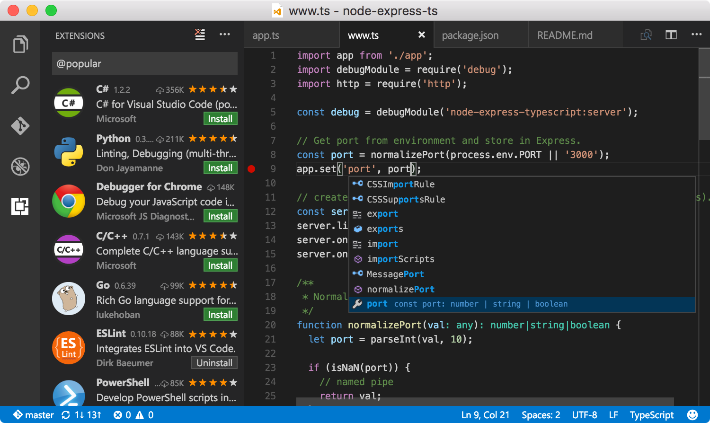

## Visual Studio Code

Visual Studio Code is a source code editor developed by Microsoft for Windows, Linux and macOS.
It includes support for debugging, embedded Git control, syntax highlighting,
intelligent code completion, snippets, and code refactoring.



### Recommended extensions

**[TSLint](https://marketplace.visualstudio.com/items?itemName=eg2.tslint)**

Integrates the tslint linter for the TypeScript language into VS Code.

Launch VS Code Quick Open (⌘+P), paste the following command, and press enter.

```sh
ext install tslint
```

**[ESLint](https://marketplace.visualstudio.com/items?itemName=dbaeumer.vscode-eslint)**

Integrates ESLint into VS Code. See [project page](https://marketplace.visualstudio.com/items?itemName=dbaeumer.vscode-eslint) for more details.

```sh
ext install vscode-eslint
```

**[EditorConfig](https://marketplace.visualstudio.com/items?itemName=EditorConfig.EditorConfig)**

EditorConfig Support for Visual Studio Code

```sh
ext install EditorConfig
```

### Hiding files

This step is optional.
In the code go to the `Preferences` -> `Workspace Settings` and paste the following settings into the opened file:

```json
{
    "files.exclude": {
        "**/.git": true,
        "**/.DS_Store": true
    }
}
```

You can extend the list with the files, extensions or directories based on your preferences.
