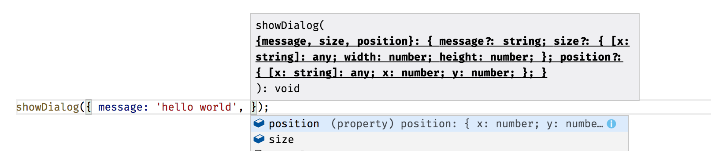

## Destructuring Assignment

ES6 provides a way to extract values out of the objects or collections into the separate variables to access them easier in the code.
That is often called "value unpacking" or "destructuring".

### Basic example

As an example, you can extract a subset of values from the collection using the following format:

```text
let [ <var1>, <var2> ] = <array>
```

Let's create an array of words and extract the first couple of them into separate variables "first" and "second" like in the code below:

```js
// ES6

let words = [ 'this', 'is', 'hello', 'world', 'example' ];
let [ first, second ] = words;

console.log(first);  // 'this'
console.log(second); // 'is'
```

As you can see from the example above, you can extract a subset of an array and split it into multiple variables.

Without destructuring your code might look like the following:

```js
// ES5

var words = [ 'this', 'is', 'hello', 'world', 'example' ];
var first = words[0];
var second = words[1];

console.log(first);  // 'this'
console.log(second); // 'is'
```

### Array destructuring

You have already seen some of the array destructuring examples earlier in the section.
We enclose variables in square brackets using the following syntax:

```text
let [ <var1>, <var2> ] = <array>
```

Please note that you can also apply the same destructuring technique to the function call results:

```js
// ES6

function getWords() {
    return [ 'this', 'is', 'hello', 'world', 'example' ];
}

let [ first, second ] = getWords();
console.log(`${first} ${second}`); // 'this is'
```

In addition to basic unpacking and variable assignment, several other things bring much value and reduce the code.

#### Value assignment

The destructuring syntax can be used to assign values to variables instead of extracting them.
Take a look at the following example: 

```js
// ES6

let first, second;

[ first, second ] = [ 'hello', 'world' ];

console.log(first);  // 'hello'
console.log(second); // 'world'
```

#### Default values

Another great feature of the array destructuring is default values.
There might be cases when the array has no values, and you want to provide some reasonable defaults.

The format of the syntax, in this case, is as follows:

```text
let [ <variable> = <value> ] = <array>
```

Let's see this feature in action:

```js
// ES6

let words = [ 'hello' ];
let [ first = 'hey', second = 'there' ] = words;

console.log(first);  // 'hello'
console.log(second); // 'there'
```

The array we got initially does not contain two words.
We are trying to extract first two variables from it, and set 'hey' as the default value for the first word, and 'there' as a default for the second one.
At the runtime however only second variable stays with the default value.

Default value assignment is a compelling feature that helps you reduce the code for variable initialization and safety checks.
Below is how the same code could look like in ES5:

```js
// ES5

var words = ['hello'];

var first = words[0];
if (!first) {
    first = 'hey';
}

var second = words[1];
if (!second) {
    second = 'there'
}

console.log(first);  // 'hello'
console.log(second); // 'there'
```

#### Swapping values

Traditionally to swap two variables, developers need a third temporary one to hold the value of either first or second variable.

```js
// ES5

var first = 'world';
var second = 'hello';

var temp = first;
first = second;
second = temp;

console.log(first + ' ' + second); // 'hello world'
```

With ES6 you can now reduce the code by using destructuring assignment syntax to swap variables in a single line like in the next example:

```js
// ES6

let first = 'world';
let second = 'hello';

[ first, second ] = [ second, first ];

console.log(`${first} ${second}`); // 'hello world'
```

This feature may be a great time saver when it comes to sorting functions.

#### Skipping values

We have been using examples that take the beginning of the array so far.  
The ES6 does not restrict you to that only scenario; it is also possible skipping values when unpacking or destructuring arrays.

```text
let [ <variable-1>, , , , <variable-X> ] = <array>
```

You can just put the commas instead of variables like in the example below:

```js
let words = [ 'this', 'is', 'hello', 'world', 'example' ];
let [ first, second, , , last ] = words;

console.log(`${first} ${second} ${last}`); // 'this is example'
```

#### Grouping tail values into a single variable

As you see, the ES6 allows you to unpack the head of the array into separate variables.
Sometimes you may want to access the tail of the array as a single variable as well.

For this particular case, there's a special syntax that utilizes ES6 "rest" parameters.

```text
let [ <variable1>, <variable2>, ...<restVariable> ] = <array>
```

We use "rest parameter" to define a variable to hold the tail of the array and below is an example of how to achieve this behavior:

```js
let command = [ 'greet', 'user1', 'user2', 'user3' ];
let [ action, ...users ] = command;

console.log(action); // 'greet'
console.log(users);  // [ 'user1', 'user2', 'user3' ] 
```

### Object destructuring

Besides arrays and collections, you can use destructuring assignment syntax with the object instances as well.  

We enclose variables in curly brackets using the following syntax:

```text
let { <var1>, <var2> } = <object>
```

#### Unpacking properties

ES6 allows you to extract properties by their names similar to how to unpack arrays.

Let's try to unpack a couple of properties from a user object:

```js
let obj = {
  id: 1,
  username: 'jdoe',
  firstName: 'John',
  lastName: 'Doe'
};

let { id, username } = obj;

console.log(id);        // '1'
console.log(username);  // 'jdoe'
```

#### Renaming properties

You can also give destructured property an alias if you want to use it as a variable with a different name.

The syntax, in this case, is going to be as follows:

```text
let { <property> : <alias> } = <object>;
```

Let's now rewrite our previous example to use custom property names.

```js
let obj = {
  id: 1,
  username: 'jdoe',
  firstName: 'John',
  lastName: 'Doe'
};

let { id: uid, username: login } = obj;

console.log(uid);    // '1'
console.log(login);  // 'jdoe'
```

We are using "uid" and "login" instead of "id" and "username" properties this time.

#### Default values

When applying property destructuring to the object properties, you can provide default values for missing properties.
That saves time for property checks and reduces coding efforts.

```text
let { <variable> : <value> } = <object>
```

For example, let's provide a default value for the "id" property and also unpack the property "role"
that does not exist for the given object, and set it to be "guest" by default.

```js
let obj = {
  id: 1,
  username: 'jdoe',
  firstName: 'John',
  lastName: 'Doe'
};

let { id = 0, role = 'guest' } = obj;

console.log(id);    // '1'
console.log(role);  // 'guest'
```

#### Unpacking methods

You can extract object methods into separate variables and use them as shortcuts:

```js
let { log } = console;
log('hello world');
```

The example above demonstrates a "console.log" method being extracted into the "log" variable and used separately.

We utilise the following syntax:

```text
let { <method> } = <object>
```

Next, let's create a custom class and export multiple methods:

```js
// ES6

class MyClass {

  sayHello(message) {
    console.log(`Hello, ${message}`);
  }

  sayBye(message) {
    console.log(`Bye, ${message}`);
  }

}

let myClass = new MyClass();
let { sayHello, sayBye } = myClass;

sayHello('how are you?');  // 'Hello, how are you?'
sayBye('see you soon.');   // 'Bye, see you soon'
```

#### Renaming methods

You can also rename destructured methods if needed. The following syntax should be used to give the unpacked method a custom name:

```text
let { <method> : <alias> } = <object>
```

Let's update the "MyClass" we used earlier and rename "sayHello" and "sayBye" methods to just "hello" and "bye":

```js
let myClass = new MyClass();
let { sayHello: hello, sayBye: bye } = myClass;

hello('how are you?');  // Hello, how are you?
bye('see you soon');    // Bye, see you soon
```

### Using with function parameters

The best scenario for using destructuring with objects and functions is default parameter values and options.

First, let's reproduce the most common use case for the "options" parameter passed to a function or object member:

```js
// ES5

function showDialog(options) {
  options = options || {};
  var message = options.message || 'Unknown message';
  var size = options.size || { width: 400, height: 400 };
  var position = options.position || { x: 200, y: 300 };

  console.log('message: ' + message);
  console.log('size: ' + size.width + ':' + size.height);
  console.log('position: ' + position.x + ':' + position.y);
}
```

Above is the simplified version of the custom options management that has been very popular for years.
We provide a JavaScript object as an "options" parameter, and function does parsing and detecting missing properties to initialize default values if needed.

Depending on the size of the options object there might be many checks just to set the default values for them.
Especially if there are nested objects with own properties, like "size" and "position" in our case.

Now, if you call the "showDialog" function with no parameters except the "message" value, the output should be similar to the following one:

```js
showDialog({ 
    message: 'hello world' 
});

// message: hello world
// size: 400:400
// position: 200:300
```

Next, try to call the same function with a partial set of options, for instance, the "size" settings:

```js
showDialog({
  message: 'hey there',
  size: { width: 200, height: 100 }
});

// message: hey there
// size: 200:100
// position: 200:300
```

Now you can rewrite the "showDialog" implementation to use destructuring with default values like in the next example:

```js
// ES6

function showDialog({ 
  message = 'Message', 
  size = { width: 400, height: 400 },
  position = { x: 200, y: 300 } }) {

  console.log(`message: ${message}`);
  console.log(`size: ${size.width}:${size.height}`);
  console.log(`position: ${position.x}:${position.y}`);
}
```

Notice how we use the destructuring assignment syntax to declare a function parameter. 

```js
showDialog({
  message: 'hey there',
  size: { width: 200, height: 100 }
});

// message: hey there
// size: 200:100
// position: 200:300
```

#### IDE support

Many modern IDEs already provide support for destructuring syntax within function or method parameters. [VS Code](https://code.visualstudio.com/), for instance, provides auto-completion both for function calls and for nested properties.


