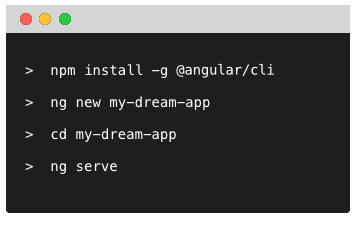

# Angular CLI

The [Angular CLI](https://cli.angular.io) is a command line interface for Angular.

As you might have noticed from the previous chapters, creating a project structure for a new web app may be a non-trivial task.
Working with multiple projects or frequently creating new ones may become extremely time-consuming
as you need configuring project structure again and again.

> The Angular CLI makes it easy to create an application that already works, right out of the box.
> It already follows our best practices!

This command line tool automates and simplifies many common scenarios, including:

- create new project structure from scratch with most optimal configuration out of the box
- scaffold common Angular building blocks using one of the various blueprints (components, directives, pipes, services and other)
- serving, watching and live reload
- code linting
- unit testing, code coverage reports, and end-to-end testing
- development and production builds
