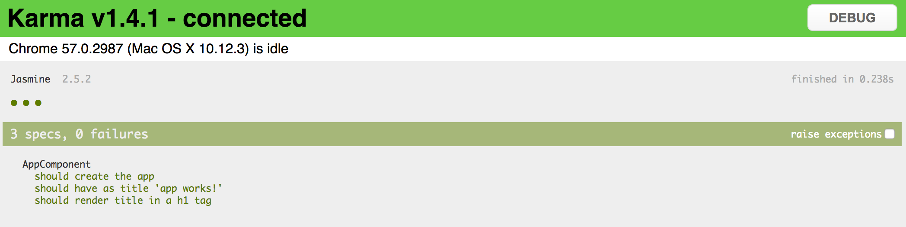
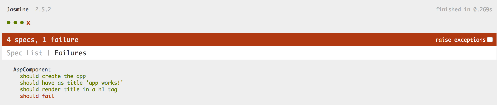

## Unit Tests

You get a predefined unit testing configuration with every generated project.
By default, you are going to use `Karma` runner with the `Jasmine` test framework.

```sh
ng test
```



Tests run in `watch` mode, meaning they automatically re-run upon code changes.

_Please note that out-of-box configuration requires Google Chrome browser to run tests,
via the `karma-chrome-launcher` plugin._

As per Angular code style guides, all the unit test files reside next to the components tested.
The Angular CLI generates three dummy tests in the `src/app/app.component.spec.ts`:

```ts
it('should create the app', async(() => {
  const fixture = TestBed.createComponent(AppComponent);
  const app = fixture.debugElement.componentInstance;
  
  expect(app).toBeTruthy();
}));

it(`should have as title 'app works!'`, async(() => {
  const fixture = TestBed.createComponent(AppComponent);
  const app = fixture.debugElement.componentInstance;
  
  expect(app.title).toEqual('app works!');
}));

it('should render title in a h1 tag', async(() => {
  const fixture = TestBed.createComponent(AppComponent);
  fixture.detectChanges();
  
  const compiled = fixture.debugElement.nativeElement;
  expect(compiled.querySelector('h1').textContent).toContain('app works!');
}));
```

Let's check what happens when a test fails.

Append the following code to the end of the "app.component.spec.ts":

```ts
it('should fail', () => {
  expect(true).toBe(false);
});
```

Now if you run `ng test` once again you should see the following report:


There are two tabs on the page: **Spec List** and **Failures**.
You should see **Failures** by default but if there's more than one unit test failed you can check them on the **Spec List** page:



If you do not plan to debug tests and just want to see a quick result of the test run just add `--single-run` switch to the `test` command:

```sh
ng test --single-run
```

Developers typically use single run configurations for continuous integration (CI) scenarios.
