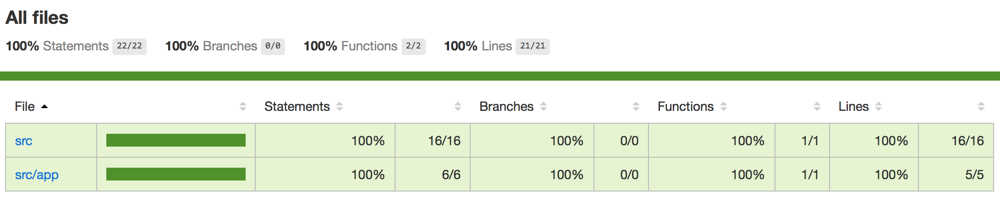
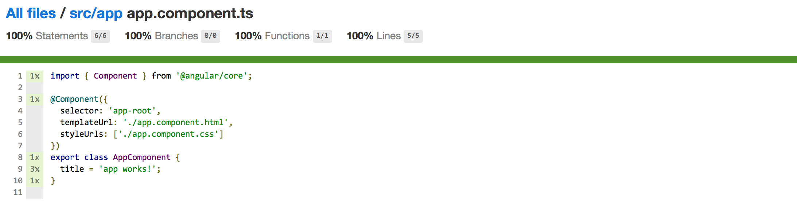

## Code Coverage

You can generate a coverage report for your unit tests by adding `--code-coverage` switch to the `test` command:

```sh
ng test --single-run --code-coverage
```

Under the hood the `ng` tool performs the following actions:

- compile the project with webpack, including TypeScript transpilation with source maps
- use Karma runner and Jasmine to execute unit tests
- remap code coverage report for JavaScript back to TypeScript
- generate HTML report within `coverage` folder

After testing finishes you can either open `coverage/index.html` with your favorite browser.

For example:

```sh
open ./coverage/index.html
```

The command above should serve your coverage report and automatically launches default browser with the main page.



Click the `src/app` and then `app.component.ts` to see TypeScript coverage:


