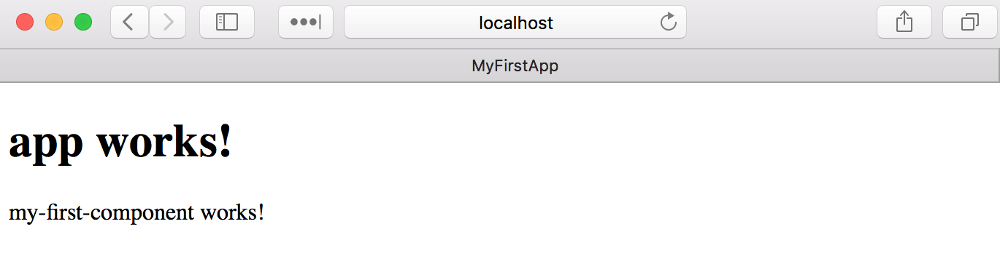
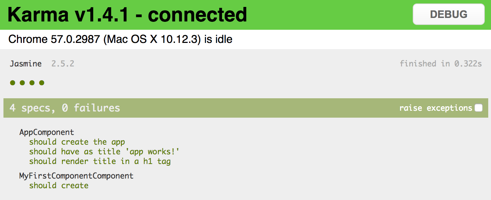

## Using blueprints

Besides generating new application project structure, the `ng` tool supports creating core Angular building blocks
be means of `generate` (or `g`) command and several `blueprints`.

```sh
ng generate <blueprint> <options...>
```

For the time being Angular CLI supports the following set of blueprints out-of-box:

| Blueprint name | Command line usage |
| --- | --- |
| Component | ng g component my-new-component |
| Directive | ng g directive my-new-directive |
| Pipe | ng g pipe my-new-pipe |
| Service | ng g service my-new-service |
| Class | ng g class my-new-class |
| Guard | ng g guard my-new-guard |
| Interface | ng g interface my-new-interface |
| Enum | ng g enum my-new-enum |
| Module | ng g module my-module |

Let's assume you have generated a new `my-first-app` like suggested below:

```sh
ng new my-first-app
cd my-first-app
```

Now to create a new component, you should be using  the following command:

```sh
ng g component my-first-component
```

The `ng` tool takes your current directory and creates all component related files:

```text
installing component
  create src/app/my-first-component/my-first-component.component.css
  create src/app/my-first-component/my-first-component.component.html
  create src/app/my-first-component/my-first-component.component.spec.ts
  create src/app/my-first-component/my-first-component.component.ts
  update src/app/app.module.ts
```

If you are running `ng generate` command (or `ng g` by alias) from the root of your project,
the CLI should automatically put content to `src/app/<feature>` folder like shown above.

You can also specify additional folder structure that should become relative to `src/app` during generation.
All missing directories get created automatically.

Run the following command from the root project folder:

```sh
ng g service services/simple-service
```

The `ng` tool creates `src/app/services` path and puts `simple-service` implementation there:

```text
installing service
  create src/app/services/simple-service.service.spec.ts
  create src/app/services/simple-service.service.ts
  WARNING Service is generated but not provided, it must be provided to be used
```

Finally, you can change current directory and generate Angular artifacts there:

```sh
mkdir src/app/directives
cd src/app/directives/
ng g directive my-first-directive
```

In this case, you should see get following output:

```text
installing directive
  create src/app/directives/my-first-directive.directive.spec.ts
  create src/app/directives/my-first-directive.directive.ts
  update src/app/app.module.ts
```

All blueprints follow common Angular code style guides.
You get a separate folder and all files one should expect when starting with a new Angular component:

- code file (`<component>.ts`)
- external template file (`<component>.html`)
- external css file (`<component>.css`)
- unit test file (`<component>.spec.ts`)

One of the best features of Angular CLI is that you do not get just placeholder files but a valid ready to use artefact and unit tests.
Let's peek inside `MyFirstComponent` component we have created earlier, and try integrating into the application.

```ts
import { Component, OnInit } from '@angular/core';

@Component({
  selector: 'app-my-first-component',
  templateUrl: './my-first-component.component.html',
  styleUrls: ['./my-first-component.component.css']
})
export class MyFirstComponentComponent implements OnInit {

  constructor() { }

  ngOnInit() {
  }

}
```

You get `app-my-first-component` selector, external template and style,
together with a constructor and `OnInit` placeholder to save your time.

The stylesheet file (**my-first-component.component.css**) is empty by default,
and template file (**my-first-component.component.html**) contains the following simple layout:

```html
<p>
  my-first-component works!
</p>
```

The CLI will even update `src/app/app.module.ts` to include your newly created component into the application module:

```ts
import { BrowserModule } from '@angular/platform-browser';
import { NgModule } from '@angular/core';
import { FormsModule } from '@angular/forms';
import { HttpModule } from '@angular/http';

import { AppComponent } from './app.component';
import { MyFirstComponentComponent } from './my-first-component/my-first-component.component';

@NgModule({
  declarations: [
    AppComponent,
    MyFirstComponentComponent
  ],
  imports: [
    BrowserModule,
    FormsModule,
    HttpModule
  ],
  providers: [],
  bootstrap: [AppComponent]
})
export class AppModule { }
```

To test the generated component you can use main application template:

```html
<h1>
  {{title}}
</h1>

<app-my-first-component>
</app-my-first-component>
```

Finally, you can run development server if it is not running already:

```sh
ng serve
```



As a starting point you also get a simple ready-to-run unit test for your component:

```ts
import { async, ComponentFixture, TestBed } from '@angular/core/testing';

import { MyFirstComponentComponent } from './my-first-component.component';

describe('MyFirstComponentComponent', () => {
  let component: MyFirstComponentComponent;
  let fixture: ComponentFixture<MyFirstComponentComponent>;

  beforeEach(async(() => {
    TestBed.configureTestingModule({
      declarations: [ MyFirstComponentComponent ]
    })
    .compileComponents();
  }));

  beforeEach(() => {
    fixture = TestBed.createComponent(MyFirstComponentComponent);
    component = fixture.componentInstance;
    fixture.detectChanges();
  });

  it('should create', () => {
    expect(component).toBeTruthy();
  });
});
```

As mentioned earlier you can run unit tests in `watch` mode with the help of `ng test` command:



If you have added your component to the `app.component.html` template, some unit tests may fail.
To fix them you should update test configuration in `app.component.spec.ts`
and include your component into the test module:

```ts
import { TestBed, async } from '@angular/core/testing';

import { AppComponent } from './app.component';
import { MyFirstComponentComponent } from './my-first-component/my-first-component.component';

describe('AppComponent', () => {
  beforeEach(async(() => {
    TestBed.configureTestingModule({
      declarations: [
        AppComponent,
        MyFirstComponentComponent
      ],
    }).compileComponents();
  }));

  ...
});
```
