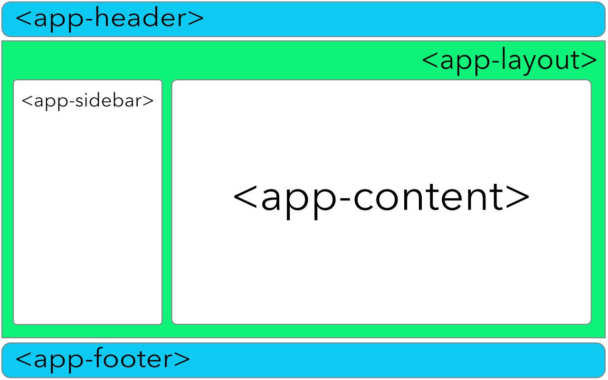

# Components

Components are the main building blocks in Angular.

A typical Angular application is represented by a tree of elements starting with a single root one.

```html
<app-root>

    <app-header title="My header">
        <!-- ... -->
    </app-header>

    <app-layout type="horizontal">

        <app-sidebar>
            <!-- ... -->
        </app-sidebar>

        <app-content>
            <!-- ... -->
        </app-content>

    </app-layout>

    <app-footer>
        <!-- ... -->
    </app-footer>

</app-root>
```

As you can see from the markup above, our main application template consists at least of the following six components:

- app-root
- app-header
- app-layout
- app-sidebar
- app-content
- app-footer

Schematically it should look similar to the following:


