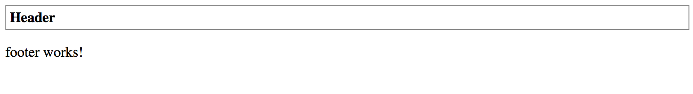

## Styles

Similar to the HTML templates, the `@Component` decorator also provides support for CSS styles in either inline or external form.

### Inline Styles

If your component is small and you decided to use inline HTML templates then high chances you may want to inline CSS styles as well.

The "styles" property of the `@Component` decorator is used to store an array of CSS styles that Angular applies to the component at runtime.

To test that in practice let's add a couple of class names to the HTM elements inside the component's template.

```ts
// src/app/components/header.component.ts

@Component({
    selector: 'app-header',
    template: `
        <div class="app-header">
            <div class="app-header-title">
                {{ title }}
            </div>
        </div>
    `
})
export class HeaderComponent { ... }
```

We just added "app-header" and "app-header-title" classes, and it is time to provide some CSS for those elements.

```ts
// src/app/components/header.component.ts

@Component({
    selector: 'app-header',
    template: `
        <div class="app-header">
            <div class="app-header-title">
                {{ title }}
            </div>
        </div>
    `,
    styles: [`
        .app-header {
            border: 1px solid gray;
            padding: 4px;
        }
        .app-header-title {
            font-weight: bold;
        }
    `]
})
export class HeaderComponent { ... }
```

Now if you compile and run your web application you should see a nice grey border around your Header component.
Also, the "Header" title should have the bold font style.



As with the inline templates, you may want to inline your style files only for the small components.

### External Styles

The CSS styles tend to grow over time even faster than HTML content.
So it is recommended to move them to the separate files at early stages.

Similar to external HTML templates Angular provides support for external CSS.
You can use "styleUrls" property to provide an array of the URLs with relative paths to corresponding files.

You already know how to use external HTML templates with your components.
Let's now extract the CSS into a separate file as well.
Typically the main style file is called after the parent component class, in our case, it becomes "header.component.css".

```css
/* src/app/components/header.component.css */

.app-header {
  border: 1px solid gray;
  padding: 4px;
}

.app-header-title {
  font-weight: bold;
}
```

You should now have "Header" component split into the three separate files:

- header.component.css
- header.component.html
- header.component.ts

With the changes to @Component decorator properties, the component implementation should now look like the following:

```ts
// src/app/components/header.component.ts

@Component({
  selector: 'app-header',
  templateUrl: './header.component.html',
  styleUrls: [
    './header.component.css'
  ]
})
export class HeaderComponent { ... }
```

Visually the component should look the same as with the inline CSS styles.
Once you compile and run your web application, the main page looks like on the screenshot below.


> **External files**
>
> External files are the most convenient and recommended way of storing your components' CSS stylesheets.
