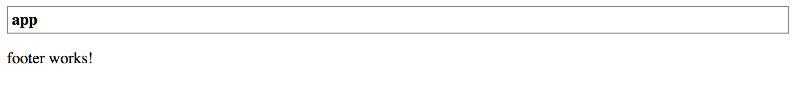

## Input properties

The `@Input` decorator is used to mark a class property that binds to incoming data.

Let's take a closer look at our Header component created earlier in this chapter.

The component exposes a "title" property of the "string" type and with the default value set to "Header".

```ts
@Component({...})
export class HeaderComponent {
  title: string = 'Header';
}
```

We have also provided an HTML template that binds to the underlying "title" property.

```html
<div class="app-header">
  <div class="app-header-title">{{ title }}</div>
</div>
```

As you can notice from the example above the major limitation of the Header component is that we cannot change the header title text from the outside.

The only way we can use it so far is by utilizing plain selector:

```html
<app-header></app-header>
<app-footer></app-footer>
```

Next, let's provide data-binding support for the "title" property using `@Input` decorator as following:

```ts
//src/app/components/header.component.ts

import { ..., Input } from '@angular/core';

@Component({ ... })
export class HeaderComponent {

  @Input()
  title: string = 'Header';
}
```

You can now use Header component with custom title values.
Set the value to "My Header" to test that in action.

```html
<app-header title="My Header"></app-header>
<app-footer></app-footer>
```

This time once your web application compiles and starts the Header should look like on the picture below:


You can also bind "title" property value to another property.
For example, imagine a scenario when main application component maintains global settings and initializes Header and Footer content.

```ts
// src/app/app.component.ts

@Component({ ... })
export class AppComponent {
  title = 'app';
}
```

In this case, you can bind the Header title like following:

```html
<app-header [title]="title"></app-header>
<app-footer></app-footer>
```

Reload the page, and you are going to see the header having now the "app" title as per main application component implementation.



> **Binding to expressions**
>
> Keep in mind that you are binding to JavaScript expressions when using square brackets with element attributes.
>
> The example above can also be changed to bind to a string or component class method.
> For example `<app-header [title]="getHeaderTitle()">` or `<app-header [title]="'Hello ' + 'world'">`.

By default, the `@Input` takes the name of the decorated property when setting up the bindings.
You can, however, change the name of the resulting HTML attribute.

@Input decorator accepts additional optional property alias "bindingPropertyName" to redefine the name to use in the template.
Let's change the binding name of the "title" property to the "title-text" value.

```ts
export class HeaderComponent {

    @Input('title-text')
    title: string = 'Header';

}
```

From now on you should be settings "title-text" attribute in HTML templates when using Header component with the custom title.

```html
<app-header title-text="My Title"></app-header>
<app-footer></app-footer>
```

Please note that you are going to deal with two different property names at the same time when using input aliases.
The component template still references property by the original name "title" while externally this property is known as "title-text":

```html
<div class="app-header">
  <div class="app-header-title">{{ title }}</div>
</div>
```

> **Avoid aliasing inputs and outputs**
>
> According to the Angular Style Guide ([Style 05-13](https://angular.io/guide/styleguide#style-05-13)),
> you should avoid using alias for `@Input` and `@Output` decorators except when is needed and serves an important purpose.
>
> Two names for the same property is confusing and may require additional documentation and maintenance over time.
