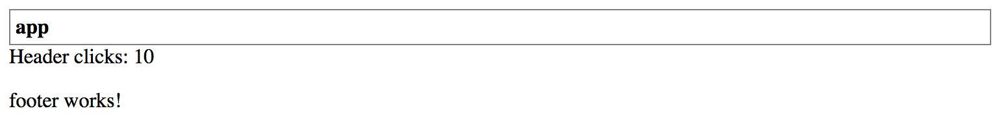

## Output Events

You use `@Output` decorator in combination with the `EventEmitter` type to create component events.

To better understand how events are used and work let's introduce and see a component event in action.

### Raising Events

We are going to extend our Header component with a "click" event.
Every time the header title gets clicked the component is going to raise a "titleClick" event.

```ts
// src/app/components/header.component.ts

import { ..., Output, EventEmitter } from '@angular/core';

@Component({...})
export class HeaderComponent {
    // ...

    @Output()
    titleClick = new EventEmitter();
}
```

Now to raise the newly introduced event from the component, we call its `next` method:

```ts
this.titleClick.next();
```

Next, we need to wire component template with the underlying method `handleTitleClick`.
The latter is going to be responsible for raising the corresponding `titleClick` event.

```html
<!-- src/app/components/header.component.html -->

<div class="app-header">
  <div class="app-header-title" (click)="handleTitleClick()">{{ title }}</div>
</div>
```

The `handleTitleClick` implementation can be as follows:

```ts
// src/app/components/header.component.ts

@Component({...})
export class HeaderComponent {
    ...

    @Output()
    titleClick = new EventEmitter();

    handleTitleClick() {
        this.titleClick.next();
    }
}
```

### Handling Events

We have extended our Header component to raise an event once a user clicks the title.
Now let's make our main application handle this event and display click counter on the page.

```html
<!-- src/app/app.component.html -->

<app-header
  [title]="title"
  (titleClick)="onTitleClicked()">
</app-header>

<div>
  Header clicks: {{ headerClicks }}
</div>

<app-footer></app-footer>
```

As you can see from the code above the main application component subscribes
to the `titleClick` event and uses `onTitleClicked` method as an event handler.

The component also displays the `headerClicks` property value for us to see the event handler works.
The final thing we need right now is incrementing the counter property like in the code below:

```ts
// src/app/app.component.ts

@Component({...})
export class AppComponent {

    headerClicks = 0;

    onTitleClicked() {
        this.headerClicks += 1;
    }

}
```

Now if you run the web application and click several times on the header text,
you should see the clicks counter increase in real time.



### Typed Events

The EventEmitter type we used for earlier is a generic type, and by default takes the type variable of `any`.

```text
EventEmitter<any>
```

In many cases, you may want to provide the additional event arguments to enable better handling of your component events.
For example, a "click" event may expose details on the mouse cursor position or a "textChanged" event that exposes old and new text values.

In the previous section, we have already created a Header component that raises generic "titleClick" event with no arguments.
To compare both approaches let's now update Footer component with the similar event but of a specific type.

The Footer is going to count the number of clicks itself and provide the value as part of the event.
The main application is no longer required to keep track on clicks as it is going to get exact values from the corresponding event arguments.

If you remember, we created a Footer component using the following Angular CLI command:

```sh
ng g component components/footer
```

First, create a `FooterClickedEvent` class to hold the clicks-related information for our `titleClicked` event:

```ts
// src/app/components/footer/footer-clicked.event.ts

export class FooterClickedEvent {

    constructor(public readonly totalClicks: number = 0) {
    }

}
```

For the sake of simplicity, we are going to create a class with a single read-only property `totalClicks`
we assign in the constructor, and that defaults to zero if not provided.

Next, edit your footer component and update its code with the following pieces
that add a `title` input property and `titleClicked` output event:

```ts
// src/app/components/footer/footer.component.ts

import { ..., Output, EventEmitter } from '@angular/core';
import { FooterClickedEvent } from './footer-clicked.event';

@Component({...})
export class FooterComponent {

    @Input()
    title = 'Footer';

    @Output()
    titleClick = new EventEmitter<FooterClickedEvent>();

}
```

As you can see above, we also declare a private property `totalClicks` to hold the overall clicks count.

Note how we use `EventEmitter` type this time.
Using `FooterClickedEvent` as an EventEmitter's type variable allows us now to create an instance of the given type and emit as an event.

```ts
// src/app/components/footer/footer.component.ts

@Component({...})
export class FooterComponent {
    ...

    private totalClicks = 0;

    handleTitleClick() {
        const event = new FooterClickedEvent(++this.totalClicks)
        this.titleClick.next(event);
    }

}
```

Now we can update the component template to display the title and handle mouse clicks:

```html
<!-- src/app/components/footer/footer.component.html -->

<p>
  <span (click)="handleTitleClick()">{{ title }}</span>
</p>
```

Every time user clicks the "title" element of the Footer, the component is going to increment clicks counter
and raise an event with its actual value.

### Accessing Event Parameters

Angular provides a way to access the original event by using a special `$event` variable that you can pass to your handlers.

```html
<app-footer
  title="My footer"
  (titleClick)="onHeaderClicked($event)">
</app-footer>
```

In our current case, we handle the `titleClick` event and pass original `FooterClickedEvent` to the `onHeaderClicked` handler inside application controller.
That provides access to the `totalClicks` property we created earlier.

> **DOM events**
>
> Please keep in mind that "$event" usage applies to all events, either custom or standard DOM ones.
> For instance, you can inspect "click", "hover", "input" and many other DOM events from within your class methods.

Let's now update our main application component to display the number of times the user clicked the Footer.

```ts
// src/app/app.component.ts
// ...
import { FooterClickedEvent } from './components/footer/footer-clicked.event';

@Component({...})
export class AppComponent {
    ...
    footerClicks = 0;

    onHeaderClicked(event: FooterClickedEvent) {
        this.footerClicks = event.totalClicks;
    }
}
```

As you can see in the example above, we now can import the `FooterClickedEvent` type and
use with the event handler parameters to get type checking and code completion support in your IDE.

Finally, let's update the main component template to display click counters for the Footer alongside the Header.

```html
<!-- src/app/app.component.html -->

<app-header
  [title]="title"
  (titleClick)="onTitleClicked()">
</app-header>

<div>Header clicks: {{ headerClicks }}</div>
<div>Footer clicks: {{ footerClicks }}</div>

<app-footer
  title="My footer"
  (titleClick)="onHeaderClicked($event)">
</app-footer>
```

You can now run your web application and make several clicks on Header and Footer components to see all event handlers in action.
You should see results similar to the following:


### Aliased Outputs

Similar to the `@Input` decorator the `@Output` one also supports custom aliases for event names
and takes the name of the decorated property as the default value.

In the previous examples, we used the `titleClick` for the output property name:

```ts
// src/app/components/footer/footer.component.ts

@Component({...})
export class FooterComponent {
    // ...

    @Output()
    titleClick = new EventEmitter<FooterClickedEvent>();
}
```

You could also provide the `title-click` alias for the event like below:

```ts
// src/app/components/footer/footer.component.ts

@Component({...})
export class FooterComponent {
    // ...

    @Output('title-click')
    titleClick = new EventEmitter<FooterClickedEvent>();
}
```

In this case the "official" (or public) event name for the Footer's `titleClick` component would be `title-click`, and not `titleClick`:

```html
<app-footer
  title="My footer"
  (title-click)="onHeaderClicked($event)">
</app-footer>
```

> **Avoid aliasing inputs and outputs**
>
> According to the Angular Style Guide ([Style 05-13](https://angular.io/guide/styleguide#style-05-13)),
> you should avoid using alias for the `@Input` and `@Output` decorators except when is needed and serves an important purpose.
>
> Two names for the same property is confusing and may require additional documentation and maintenance over time.
