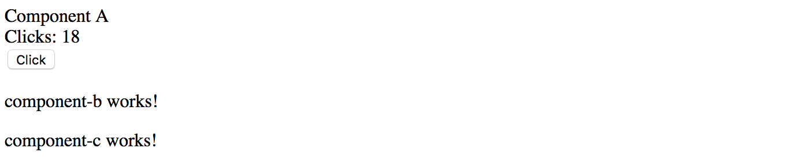

## Providers

Every Angular component can declare its own set of providers.
The use of local providers allows developers to replace global instances of services,
and register and use a new copy of the service for the given component and all child components.

Let's see how local component providers work in practice.
We are going to need a new service 'ClickCounterService' that you can generate with the following Angular CLI command:

```sh
ng g service click-counter
```

The service is going to keep track of the user clicks on the elements.
Our components should notify the service upon every click,
and also subscribe to the service events to get notifications on clicks from other components.

Add the `clicks` property to the service to hold total amount of clicks happened across the application.
Then, add the `clicked` event to allow components to subscribe and perform custom actions if needed.
Finally, implement the `click` method that increments the click counter and emits the corresponding event at the same time.

```ts
import { Injectable, EventEmitter } from '@angular/core';

@Injectable({ providedIn: 'root' })
export class ClickCounterService {

  clicks = 0;

  clicked = new EventEmitter<number>();

  click() {
    this.clicks += 1;
    this.clicked.emit(this.clicks);
  }

}
```

Let's register the newly created "ClickCounterService" service as part of the global providers, in the main application module.

> **Registering service**
>
> Given that developers can register services in different places,
> the Angular CLI does not perform default registration and does not modify "app.module.ts" file
> like it does for other Angular entities.

Please refer to the code below for an example of service registration:

```ts
// src/app/app.module.ts

// ...
import { ClickCounterService } from './click-counter.service';

@NgModule({
  ...
  providers: [
    ClickCounterService
  ],
  ...
})
export class AppModule { }
```

For the next step, we are going to need three simple components.
You can quickly generate them using the following Angular CLI commands:

```sh
ng g component componentA
ng g component componentB
ng g component componentC
```

Now, replace the content of the main application component template with the following code:

```html
<!-- src/app/app.component.html -->

<app-component-a></app-component-a>
<app-component-b></app-component-b>
<app-component-c></app-component-c>
```

Once you build and run the application, you should see the following content on the main page:

```text
component-a works!
component-b works!
component-c works!
```

Now, let's integrate one of the components with the "ClickCounterService" service we introduced earlier.

Our component is going to have an HTML button that invokes `onClick` method upon every click.
The component also subscribes to the service's "clicked" event to update the local `totalClicks` property and display it to the user.

```ts
// src/app/component-a/component-a.component.ts

import { Component, OnInit } from '@angular/core';
import { ClickCounterService } from '../click-counter.service';

@Component({
  selector: 'app-component-a',
  templateUrl: './component-a.component.html',
  styleUrls: ['./component-a.component.css']
})
export class ComponentAComponent implements OnInit {

  totalClicks = 0;

  constructor(private clickService: ClickCounterService) { }

  ngOnInit() {
    this.clickService.clicked.subscribe((clicks) => {
      this.totalClicks = clicks;
    });
  }

  onClick() {
    this.clickService.click();
  }

}
```

Also, replace the component template content with the following markup:

```html
<!-- src/app/component-a/component-a.component.html -->

Component A <br>
Clicks: {{ totalClicks }} <br>
<button (click)="onClick()">Click</button>
```

Run the application or switch to the running one. Click the component button multiple times to see the counter updates.



Repeat the same procedure for other two components we got.
All three components should display the total number of clicks fetched from the server, and have a button for the user to click.

Also, let's slightly improve the main application template and add dividers for better visibility:

```html
<!-- src/app/app.component.html -->

<app-component-a></app-component-a>
<hr>
<app-component-b></app-component-b>
<hr>
<app-component-c></app-component-c>
```

Switch to your running application and try clicking one of the buttons several times.
You should see that all click counters get updated automatically with the same value.
That is an expected behavior because all we got three components powered by the same instance of the "ClickCounterService" service.
Every time we click a button, the service notifies other components that update local counter properties and display labels.


Now, let's see what happens if one of the components, let it be the `Component B`, declares its own `providers` collection.
Import the "ClickCounterService" and declare it as in the example below:

```ts
// src/app/component-b.component.ts

// ...
import { ClickCounterService } from '../click-counter.service';

@Component({
  selector: 'app-component-b',
  templateUrl: './component-b.component.html',
  styleUrls: ['./component-b.component.css'],
  providers: [
    ClickCounterService
  ]
})
export class ComponentBComponent implements OnInit {
  // ...
}
```

If now you start clicking on the first component, only "Component A" and "Component C" are going to update the labels.
The "Component B" should remain with the zero value.


As you can see, the "Component B" declares its local instance of the service, so it does not react to the events raised by the global one.
Now if you click the "Component B" button several times, its counter label should update separately from other components.
Moreover, other components are not going to update on "Component B" clicks, as they are listening to the global service events.


The component-level provider is a great feature.
It allows you to have more than one instance of the service or to have custom service implementation
or replacement for a particular component and all child components that you use in its template.

> **Advanced feature**
>
> You should be very careful and use this feature only when it is necessary
> as it is quite easy to introduce an issue when creating multiple instances of the same service type.
> For example the Authentication Service. Typically you may want always to have only one instance,
> as the service might keep the authentication state or some other critical data,
> and having more than one service leads to application issues.

> **Source code**
>
> You can find the source code in the **[angular/components/component-providers](https://github.com/DenysVuika/developing-with-angular/blob/master/angular/components/component-providers)** folder.
