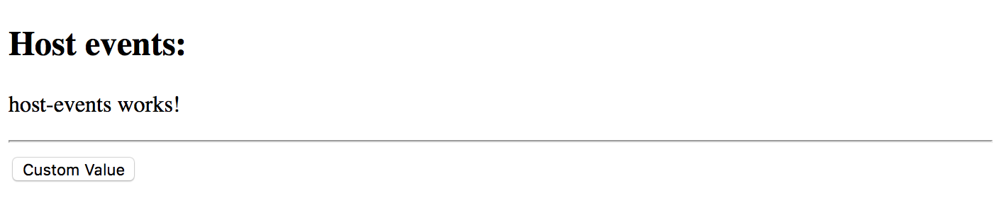

## Host

The host property is an object of a Map type and specifies the events, actions,
properties and attributes related to the resulting element.

Use the following Angular CLI command to generate a new `host-events` component for the tests:

```sh
ng g component host-events
```

Also, replace the content of the main application component template with your component declaration:

```html
<!-- src/app/app.component.html -->

<h2>Host events:</h2>
<app-host-events></app-host-events>
```

Run the application and ensure the main page looks similar to the following:


### CSS Class

Your component or directive can assign a class name to the corresponding DOM element that serves the root of the component.
For example setting the class name to the `host-events` value looks like the following:

```ts
// src/app/host-events/host-events.component.ts

@Component({
  selector: 'app-host-events',
  templateUrl: './host-events.component.html',
  styleUrls: ['./host-events.component.css'],
  host: {
    class: 'host-events'
  }
})
export class HostEventsComponent implements OnInit {
  //...
}
```

At runtime, if you use the "Inspect element" tool to view the compiled HTML output, it should look similar to the following:

```html
<app-host-events _ngcontent-c0="" class="host-events" _nghost-c1="">
    <p _ngcontent-c1="">
        host-events works!
    </p>
</app-host-events>
```

Note that the main `app-host-events` element has now the `host-events` class name associated with it.

You can also set multiple classes based on property values using the following format:

```text
host: {
    '[class.<className1>]': '<statement1>',
    '[class.<classNameN>]': '<statementN>'
}
```

Let's bind a couple of CSS class names to the component class properties:

```ts
// src/app/host-events/host-events.component.ts

@Component({
  selector: 'app-host-events',
  templateUrl: './host-events.component.html',
  styleUrls: ['./host-events.component.css'],
  host: {
    '[class.is-invalid]': 'isInvalid',
    '[class.is-readonly]': 'isReadonly'
  }
})
export class HostEventsComponent implements OnInit {
    // ...

    isInvalid: boolean = false;
    isReadonly: boolean = false;
}
```

The class values are toggled based on the corresponding property values.

For example, the `is-invalid` is appended to the class list of the DOM element as soon as the `isInvalid` property value turns to `true`,
also, is automatically removed from the class list if it has the value of `false`.

### Host Events

The component or directive you create can also use `host` metadata property to bind element events to the class methods.
The usage format, in this case, is as follows:

```text
host: {
    '(<event>)': '<statement>'
}
```

To test the event bindings in action let's wire the `mouseenter` and `mouseleave` DOM events
with the `onMouseEnter` and `onMouseLeave` methods that are going to change the `color` property value:

```ts
// src/app/host-events/host-events.component.ts

import { Component } from '@angular/core';

@Component({
  selector: 'app-host-events',
  templateUrl: './host-events.component.html',
  styleUrls: ['./host-events.component.css'],
  host: {
    class: 'host-events',
    '(mouseenter)': 'onMouseEnter()',
    '(mouseleave)': 'onMouseLeave()'
  }
})
export class HostEventsComponent {

  color = 'black';

  onMouseEnter() {
    this.color = 'red';
  }

  onMouseLeave() {
    this.color = 'black';
  }

}
```

Finally, update the component template to use the `color` property like in the example below:

```html
<!-- src/app/host-events/host-events.component.html -->

<p [style.color]="color">
  host-events works!
</p>
```

Now, switch to the running application and try moving the mouse cursor over the component text.
You should see the colour of the text changing automatically upon mouse events.


Your component can also listen to global events using the following format:

```text
host: {
    '(<target>:<event>)': '<statement>'
}
```

Where 'target' can be of one the following values:

- window
- document
- body

For example, the component can listen to 'window.resize' events and adapt the layout accordingly:

```ts
// src/app/host-events/host-events.component.ts
// ...

@Component({
  // ...
  
  host: {
    class: 'host-events',
    '(mouseenter)': 'onMouseEnter()',
    '(mouseleave)': 'onMouseLeave()',
    '(window:resize)': 'onWindowResize()'
  }
})
export class HostEventsComponent {

  // ...

  onWindowResize() {
    console.log('Window resized');
  }

}
```

If you run the developer tools in your browser and try resizing the browser window,
you should notice the component reacts on that and writes corresponding messages to the console log.

### Host Attributes

The Angular framework allows you to map multiple HTML attributes to the class properties or static string values.
Let's set the `role` and `aria-label` attributes from within the host metadata:

```ts
// src/app/host-events/host-events.component.ts
// ...

@Component({
  // ...
  
  host: {
    class: 'host-events',
    '(mouseenter)': 'onMouseEnter()',
    '(mouseleave)': 'onMouseLeave()',
    '(window:resize)': 'onWindowResize()',
    'role': 'button',
    'aria-label': 'Demo button'
  }
})
export class HostEventsComponent {
  // ...
}
```

As soon as the page gets rendered, you can inspect the compiled HTML layout to check the element attributes.
The `app-host-events` element now contains the expected attributes:

```html
<app-host-events _ngcontent-c0="" aria-label="Demo button" class="host-events" role="button" _nghost-c1="">
    <p _ngcontent-c1="" style="color: black;">
        host-events works!
    </p>
</app-host-events>
```

### Host Properties

Finally, you can bind component properties to element properties.
That might be useful when developing Angular directives.

For example, a directive that automatically changes the button value based on one of its properties can look like the following:

```ts
// src/app/host-properties.directive.ts

import { Directive } from '@angular/core';

@Directive({
  selector: '[appHostProperties]',
  host: {
    '[innerHTML]': 'value'
  }
})
export class HostPropertiesDirective {

  value = 'Custom Value';

}
```

Now, let's define a simple button and see the directive in action:

```html
<!-- src/app/app.component.html -->

<h2>Host events:</h2>
<app-host-events></app-host-events>

<hr>
<button appHostProperties>Click me</button>
```

Note that we provided the button text in the HTML template.
Switch back to the browser window and ensure the button value got changed by the directive as per the host metadata settings.



Similar to the CSS classes, you can provide values for multiple attributes of the decorated DOM element using the following syntax:

```text
host: {
    '[attr.<name1>]': '<statement1>',
    '[attr.<nameN>]': '<statementN>',
}
```

Let's bind a "custom1" attribute to the "attrValue" property of the class to check how that feature works.

```ts
import { Directive } from '@angular/core';

@Directive({
  selector: '[appHostProperties]',
  host: {
    '[innerHTML]': 'value',
    '[attr.custom1]': 'attrValue'
  }
})
export class HostPropertiesDirective {

  value = 'Custom Value';
  attrValue = 'some attribute value';
}

```

If you remember, we got a button element declared in the main application template like below:

```html
<button appHostProperties>Click me</button>
```

At the runtime, the element gets a custom attribute from the directive:

```html
<button _ngcontent-c0="" apphostproperties="" custom1="some attribute value">Custom Value</button>
```

> **Source code**
>
> You can find the source code as an Angular CLI project in the **[angular/components/component-host](https://github.com/DenysVuika/developing-with-angular/tree/master/angular/components/component-host)** folder.
