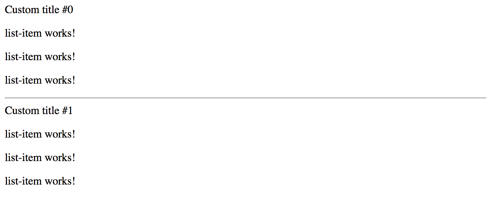

## Queries

There may be scenarios when you need accessing child components from your current component that contains them.
That becomes useful when you need calling public methods or change properties of the children.

> **Source code**
>
> You can find the source code as an Angular CLI project in the **[angular/components/component-queries](https://github.com/DenysVuika/developing-with-angular/tree/master/angular/components/component-queries)** folder.

### Preparing the Project

Let's start by creating a new Angular project with the help of Angular CLI, and creating two components `List` and `ListItem` to experiment.

```sh
ng g component list
ng g component list-item
```

Extend the generated List component with an extra property `title` marked with the `@Input` decorator.

```ts
// src/app/list/list.component.ts

import { /*...,*/ Input } from '@angular/core';

@Component({/*...*/})
export class ListComponent implements OnInit {

  @Input()
  title = 'List Title';

  // ...
}
```

Next, update the component HTML template to display the `title` value,
and also the `ng-content` component to render any other components or HTML elements the end developers provide:

```html
<!-- src/app/list/list.component.html -->

<div>{{ title }} </div>
<ng-content></ng-content>
```

Now you can declare a List element in the main application component template, and also put several ListItem components inside its tags:

```html
<!-- src/app/app.component.html -->

<app-list>
  <app-list-item></app-list-item>
  <app-list-item></app-list-item>
  <app-list-item></app-list-item>
</app-list>
```

At runtime, the code above should give you the following output on the main page:


### @ViewChild

The `@ViewChild` decorator allows you to retrieve and reference the component or directive from the current component View.

For example, the main application component can gain access to the List component we have defined in its HTML template,
and modify properties of the component instance from the code.

To do that we need to use a `@ViewChild` decorator with the target type.

You can access the property decorated with the `@ViewChild` only after component's View initializes.
The `AfterViewInit` interface and corresponding method is the most appropriate place for that.

```ts
// src/app/app.component.ts

import { /*...,*/ ViewChild, AfterViewInit } from '@angular/core';
import { ListComponent } from './list/list.component';

@Component({...})
export class AppComponent implements AfterViewInit {

  @ViewChild(ListComponent)
  list: ListComponent;

  ngAfterViewInit() {
    this.list.title = 'custom list title';
  }
}
```

In the code snippet above, we change the title of the child List component from code.
Switch to the browser running your application, and you should see the following:


The component query is not limited to the target type reference.
You can also use local references and use string identifiers, for example, mark the List with the "myList" id:

```html
<!-- src/app/app.component.html -->

<app-list #myList>
  <!-- ... -->
</app-list>
```

Now you can use this id with the `@ViewChild` decorator if needed:

```ts
// src/app/app.component.ts

@Component({/*...*/})
export class AppComponent implements AfterViewInit {

  @ViewChild('myList')
  list: ListComponent;

  // ...
}
```

### @ViewChildren

If you declare more than one List component, you should notice that every time only the first instance is fetched.
To get a reference to all the child instances of the particular component type you need to use a `@ViewChildren` decorator.

Let's have two List components separated by a horizontal line like in the example below:

```html
<!-- src/app/app.component.html -->

<app-list>
  <app-list-item></app-list-item>
  <app-list-item></app-list-item>
  <app-list-item></app-list-item>
</app-list>

<hr>

<app-list>
  <app-list-item></app-list-item>
  <app-list-item></app-list-item>
  <app-list-item></app-list-item>
</app-list>
```

Now create a `lists` property in the underlying component class to reference all "ListComponent" instances after View gets initialized:

```ts
// src/app/app.component.ts

import { /*...,*/ QueryList, ViewChildren } from '@angular/core';
import { ListComponent } from './list/list.component';

@Component({/*...*/})
export class AppComponent implements AfterViewInit {

  @ViewChild(ListComponent)
  list: ListComponent;

  @ViewChildren(ListComponent)
  lists: QueryList<ListComponent>;

  // ...
}
```

For the next step, we are going to update the `title` property of every List component in the View:

```ts
// src/app/app.component.ts

import { /*...,*/ AfterViewInit, QueryList, ViewChildren } from '@angular/core';
import { ListComponent } from './list/list.component';

@Component({/*...*/})
export class AppComponent implements AfterViewInit {
  // ...

  @ViewChildren(ListComponent)
  lists: QueryList<ListComponent>;

  ngAfterViewInit() {
    let i = 0;
    this.lists.forEach(l => {
      l.title = 'Custom title #' + (i++);
    });
  }
}
```

Switch back to the browser and once the application compiles and restarts you should see the following:



### @ContentChild

The `@ViewChild` provides access only to components and directives that are part of the view but not inside the `ng-content` tags.
You need to use `@ContentChild` decorator to work with the elements inside `ng-content` container.

If you remember, the List component template already features the `ng-template`:

```html
<!-- src/app/list/list.component.html -->

<div>{{ title }} </div>
<ng-content></ng-content>
```

Update the ListItemComponent component class with the "title" property like in the following example:

```ts
// src/app/list-item/list-item.component.ts
// ...

@Component({/*...*/})
export class ListItemComponent {

  title = 'list-item works!';

}
```

For the sake of simplicity just replace the content of the ListItem component template with the next block of HTML:

```html
<!-- src/app/list-item/list-item.component.html -->

<p>
  {{ title }}
</p>
```

For a start, let's access the very first entry of the List content collection
by introducing a `firstListItem` property decorated with the `@ContentChild`.

As soon as component content gets initialized, we are going to update the title of the referenced item.

```ts
// src/app/list/list.component.ts

import { /*...,*/ ContentChild, AfterContentInit } from '@angular/core';
import { ListItemComponent } from '../list-item/list-item.component';

@Component({/*...*/})
export class ListComponent implements AfterContentInit {
  ...

  @ContentChild(ListItemComponent)
  firstListItem: ListItemComponent;

  ngAfterContentInit() {
    this.firstListItem.title = 'first item';
  }
}
```

Note that your component now needs to implement the `AfterContentInit` interface
and have the corresponding `ngAfterContentInit` method implementation.
That is the most recommended place to work with the elements provided using the `@ContentChild` decorator.

Switch to the browser, and you should now look the following on the main page:


### @ContentChildren

Similar to the `@ViewChild`, the `@ContentChild` decorator always returns the first found element
if there are more than one declared in the Component View.

You are going to need a `@ContentChildren` decorator if you intend working with all the instances.

```ts
// src/app/list/list.component.ts

import { /*...,*/ ContentChildren, QueryList } from '@angular/core';
import { ListItemComponent } from '../list-item/list-item.component';

@Component({/*...*/})
export class ListComponent implements AfterContentInit {
  // ...

  @ContentChildren(ListItemComponent)
  listItems: QueryList<ListItemComponent>;

  ngAfterContentInit() {
    this.listItems.forEach(item => {
      item.title = item.title + ' (' + new Date().toLocaleDateString() + ')';
    });
  }
}
```

The example above should already be familiar to you.
We have just updated every item in the list by changing its title.
The main page in the browser should be looking similar to the following one:


### Listening for View and Content Changes

So with `@ContentChild`, `@ContentChildren`, `@ViewChild` and `@ViewChildren` decorators we can import
and manipulate elements and components in the controller class.

But what if developer applies conditional visibility to the layout entries like in the example below?

```html
<app-list>
  <app-list-item *ngIf="showFirstItem"></app-list-item>
  <app-list-item></app-list-item>
  <app-list-item></app-list-item>
</app-list>
```

As we already know, based on the "ngIf state", the Angular will remove a corresponding element from the DOM, or add it back.
There are many scenarios, however, when your component controller needs to know about such changes.
For example, imagine a "DataTable" component that uses child components to define column structure,
but then turns developer-defined view or content elements to some internal representation.
The component must always know what is the "visible" part of the layout to work with.

Let's now extend our previous "ViewChildren" example with an extra flag to toggle visibility of the first list entry.
We will add a "showFirstItem" property, and a button that changes the property value on each click.

```ts
// src/app/app.component.ts

export class AppComponent implements AfterViewInit {

  showFirstItem = true;

  // ...
}
```

Next, append the following block to the component template:

```html
<!-- src/app/app.component.html -->

<hr>

<button (click)="showFirstItem = !showFirstItem">
  Toggle first item
</button>
```

We have declared two List components in the previous examples.
Let's now wire the first entry of each of the components with the `showFirstItem` condition like in the example below:

```html
<!-- src/app/app.component.html -->

<app-list>
  <app-list-item *ngIf="showFirstItem"></app-list-item>
  <app-list-item></app-list-item>
  <app-list-item></app-list-item>
</app-list>

<hr>

<app-list>
  <app-list-item *ngIf="showFirstItem"></app-list-item>
  <app-list-item></app-list-item>
  <app-list-item></app-list-item>
</app-list>

<hr>

<button (click)="showFirstItem = !showFirstItem">
  Toggle first item
</button>
```

If you run the application now, you will see every first item appear and disappear from the list each time you click the "Toggle first item" buttons.
We have just emulated the situation when layout changes based on the external criteria.
But how does the component now react on those changes?

The "QueryList" class exposes a special "changes" property of the `Observable<any>`
type that can help us watch for the layout changes and achieve the desired behavior.

Now you can update the ListComponent implementation and add a simple change tracking code like in the following example:

```ts
// src/app/list/list.component.ts

@Component({/*...*/})
export class ListComponent implements AfterContentInit {

  // ...

  ngAfterContentInit() {
    // ...

    this.listItems.changes.subscribe(() => {
      console.log(
        `List content changed and has now ${this.listItems.length} items.`
      );
    });
  }
}
```

Please run the application once again and click the "Toggle first item" button a few times.
Alongside the element being added to and removed from the page, you will see the following console output:

```text
List content changed and has now 2 items.
List content changed and has now 2 items.
List content changed and has now 3 items.
List content changed and has now 3 items.
List content changed and has now 2 items.
List content changed and has now 2 items.
```

We have two instances of the ListComponent declared in the application component template.
And both lists have its first element wired with conditional visibility expression.
That is why you will see messages from both components in the browser console output window.

As you can see, subscribing and listening to `QueryList<T>.change` events gives you an ability
to react on layout changes and perform extra behaviors at the component level.
