## Component Lifecycle

Angular supports multiple lifecycle events for components, directives and services.

For the Components, the Angular invokes the following methods at runtime, in the order of execution:

- ngOnChanges
- ngOnInit
- ngDoCheck
- ngAfterContentInit
- ngAfterContentChecked
- ngAfterViewInit
- ngAfterViewChecked
- ngOnDestroy

As Directives do not have UI templates, they get the following set of lifecycle methods supported out of the box:

- ngOnChanges
- ngOnInit
- ngDoCheck
- ngOnDestroy

Finally, the Services get the next methods:

- ngOnDestroy

Every method represents a separate interface in the `@angular/core` namespace and contains a `ng` prefix appended to the interface name.

For example, the `OnInit` interface declares a `ngOnInit` method, and so on.
We are going to dive deeper into details on each method and interface below.

Technically, the interfaces for the lifecycle events are optional.
The Angular is going to call those events in any case, and if the corresponding methods are present, they get automatically invoked.
It is a good practice, however, to still expose those interfaces in your classes to enable static checks by TypeScript.

You can find additional information on the lifecycle events in the following official docs: [Lifecycle Hooks](https://angular.io/guide/lifecycle-hooks#component-lifecycle-hooks-overview)

> **Source code**
>
> You can find the source code as an Angular CLI project in the **[angular/components/lifecycle](https://github.com/DenysVuika/developing-with-angular/tree/master/angular/components/lifecycle)** folder.

### ngOnChanges

The `ngOnChanges` method is related to the `OnChanges` hook.
Angular calls it every time an input property of the component or directive gets changed.

You can find the code of the interface below:

```ts
interface OnChanges {
    ngOnChanges(changes: SimpleChanges): void;
}
```

Let's create a new Angular CLI project and generate an `on-changes-demo` component to see the `OnChanges` hook in action.

```sh
ng g component on-changes-demo
```

To visualize the property change, we need two properties to store the current and old values.

The `text` property stores current string value and is decorated with the `@Input`
to enable two-way bindings with template components, or external input.

The `previous` property provides the one-way binding support to display the old string.

```ts
// src/app/on-changes-demo/on-changes-demo.component.ts

import { Component, Input } from '@angular/core';

@Component({
  selector: 'app-on-changes-demo',
  templateUrl: './on-changes-demo.component.html',
  styleUrls: ['./on-changes-demo.component.css']
})
export class OnChangesDemoComponent {

  @Input()
  text = 'hello world';

  previous: string;

}
```

Now that we have a code defined, the minimal component implementation can look like in the following example:

```html
<!-- src/app/on-changes-demo/on-changes-demo.component.html -->

<p>
  Text: {{ text }}
  <br>
  Previous: {{ previous }}
</p>
```

At this point, we are ready to implement the `OnChanges` interface from the `@angular/core` package.
Your `ngOnChanges` method can look like the next one:

```ts
// src/app/on-changes-demo/on-changes-demo.component.ts
import { /*...,*/ OnChanges, SimpleChanges } from '@angular/core';

@Component({...})
export class OnChangesDemoComponent implements OnChanges {

  @Input()
  text = 'hello world';

  previous: string;

  ngOnChanges(changes: SimpleChanges) {
    if (changes.text) {
      this.previous = changes.text.previousValue;
    }
  }

}
```

As you already know, the Angular keeps track of all property changes.

In our current case, the framework collects the changes made to the `OnChangesDemoComponent` component properties and,
wraps into a special `SimpleChanges` map and passes to the corresponding hook method.

```ts
interface SimpleChanges {
    [propName: string]: SimpleChange;
}
```

Every value of the `SimpleChanges` map implements a `SimpleChange` interface with at least the following properties and methods:

- previousValue: any;
- currentValue: any;
- firstChange: boolean;
- isFirstChange(): boolean;

As you can see the `SimpleChange` API allows you to inspect the current and previous values,
as well as to check whether this is the first time the particular property gets changed.
The `firstChange` property allows you to distinguish between setting default property
value within the class initializer as opposed to the changes caused by user interaction or runtime changes.

Now let's use our newly created component with the main application one.
The simple way to test value changes is to bind an input element to the "text" property like in the example below:

```html
<!-- src/app/app.component.html -->

<input [(ngModel)]="text">
<app-on-changes-demo [text]="text"></app-on-changes-demo>
```

Note that you are going to need an extra `text` property for the application component controller class:

```ts
// src/app/app.component.ts

import { Component, Input } from '@angular/core';

@Component({
  selector: 'app-root',
  templateUrl: './app.component.html',
  styleUrls: ['./app.component.css']
})
export class AppComponent {

  @Input()
  text: string;

}
```

Run the application with the `ng serve --open` command and try typing text in the main page.
Notice that our component displays both old and new values as you type them into the input element.

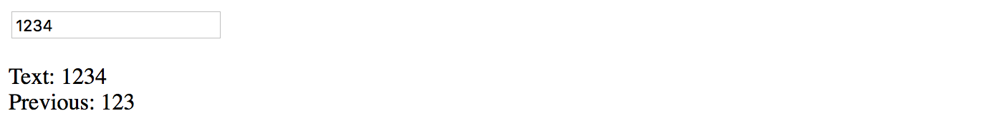

### ngOnInit

The `OnInit` is the most common lifecycle hook. You are probably going to use it a lot in your custom components.

It is a good practice to perform component initialization in the `ngOnInit` method and not in the constructor.
Angular invokes the "ngOnInit" after the construction and once all input properties set,
so you can setup your component based on the property values from the outside.

You can find the code of the interface below:

```ts
interface OnInit {
    ngOnInit(): void;
}
```

In the same project, we created earlier, generate a new "on-init-demo" component with the following command:

```sh
ng g component on-init-demo
```

Next, define a property `currentDate` of the `Date` type, and set its value in the `ngOnInit` method like in the following example:

```ts
// src/app/on-init-demo/on-init-demo.component.ts

import { Component, OnInit } from '@angular/core';

@Component({
  selector: 'app-on-init-demo',
  templateUrl: './on-init-demo.component.html',
  styleUrls: ['./on-init-demo.component.css']
})
export class OnInitDemoComponent implements OnInit {

  currentDate: Date;

  constructor() { }

  ngOnInit() {
    this.currentDate = new Date();
  }

}
```

Update the component template to render the value of the `currentDate`:

```html
<!-- src/app/on-init-demo/on-init-demo.component.html -->

<p>
  Date: {{ currentDate }}
</p>
```

Given that we do not have any input properties, the main application component template can contain just the empty tag.

Append the following code to the existing template HTML:

```html
<!-- src/app/app.component.html -->
<!-- ... -->

<hr>
<h2>ngOnInit</h2>

<app-on-init-demo></app-on-init-demo>
```

If you run the application right now, you should see current date and time with default string formatting:


Let's now try creating the component multiple times on the fly to see the `ngOnInit` method calls in practice.
We can wrap our custom `OnInitDemoComponent` with the `ng-container` element decorated by the `ngIf` directive.

Add a new `showNgOnInit` property of the `boolean` type to the component controller class,
and bind the checkbox to toggle component at runtime:

```ts
// src/app/app.component.ts

@Component({...)
export class AppComponent {

  // ...

  showNgOnInit = true;

}
```

Update the application controller template to look like the following code:

```html
<!-- src/app/app.component.html -->
<!-- ... -->

<hr>
<h2>ngOnInit</h2>

<label>
  <input type="checkbox" [(ngModel)]="showNgOnInit">
  Toggle ngOnInit demo
</label>

<ng-container *ngIf="showNgOnInit">
  <app-on-init-demo></app-on-init-demo>
</ng-container>
```

> **ngModel**
>
> Don't forget that you need to import `FormsModule` to your root application module so that you can use the `ngModel` with components.

Now, every time you tick the checkbox element a new `OnInitDemoComponent` is created and displayed,
and a new date value assigned by the `ngOnInit` method.

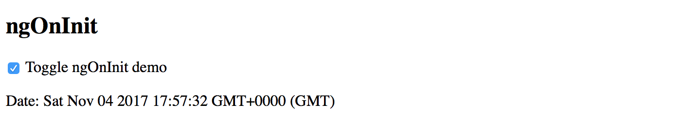

As you can imagine, we used a pretty basic scenario for component setup.
In real life, your `ngOnInit` content might be more complex.

### ngDoCheck

The `DoCheck` hook allows you to integrate into the change detection cycle and find changes within the objects references
or any areas where Angular did not detect changes automatically.

You can find the code of the interface below:

```ts
interface DoCheck {
    ngDoCheck(): void;
}
```

> **Performance Penalty**
>
> Please keep in mind that, depending on the component tree size and complexity,
> the "ngDoCheck" method is going to execute enormous amount of times
> and may become a performance bottleneck if you poorly implement the code.
> Avoid using "ngDoCheck" method unless necessary.

When using properties of the object type, the Angular is going to watch the changes by value reference,
meaning detects the change of the entire value, but not the changes in the child properties.
That is the case where we are going to use `DoCheck` lifecycle hook and detect changes in the object.

For the next exercise, we need a new component called "DoCheckDemoComponent" that you can generate using the following command:

```sh
ng g component do-check-demo
```

Let's integrate it into the main application template now to save the time later.
Append the next HTML snippet to the content of the component template:

```html
<!-- src/app/app.component.html -->
<!-- ... -->
<hr>
<h2>ngDoCheck</h2>
<app-do-check-demo></app-do-check-demo>
```

Next, we need an object value and custom properties.
For the sake of simplicity let's create a "User" object featuring first and last names as separate properties.

The component should have the `current` and `previous` values to facilitate property checks.

```ts
// src/app/do-check-demo/do-check-demo.component.ts

import { Component, Input, DoCheck } from '@angular/core';

@Component({
  selector: 'app-do-check-demo',
  templateUrl: './do-check-demo.component.html',
  styleUrls: ['./do-check-demo.component.css']
})
export class DoCheckDemoComponent implements DoCheck {

  currentUser = {
    firstName: 'John',
    lastName: 'Doe'
  };

  previousUser = {
    firstName: '',
    lastName: ''
  };

  ngDoCheck() {
  }

}
```

For the first iteration leave the `ngDoCheck` method empty and switch to the component template.
Our component needs to display values for both current and previous property values.

```html
<!-- src/app/do-check-demo/do-check-demo.component.html -->

<p>
  Current user: {{ currentUser.firstName + ' ' + currentUser.lastName }}
  <br>
  Previous user: {{ previousUser.firstName + ' ' + previousUser.lastName }}
</p>
```

You can run the application and check that component works as expected.
The main page should contain the full name of the user stored in the `currentUser` property.
The text for the `previousUser` property should be empty because we have not yet changed anything.

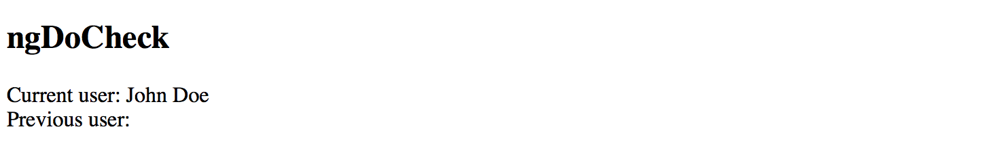

As mentioned earlier, Angular calls `DoCheck` many times based on the change detection cycle.

To see that in practice, let's introduce a new field `checks` that should hold a count of checks performed for our component.
We are going to increment this field every time the `ngDoCheck` get called.

Next, we create a field `updates` to hold a count of the `currentUser` updates detected by our custom `ngDoCheck` implementation.
The method checks both `firstName` and `lastName` property values and updates the counter,
in addition to setting a new instance of the `previousUser` value.

Finally, let's introduce an "Update user" button that changes the value of the current user
and so triggers the change detection cycle and our custom checks. The button calls `updateUser` method upon every click.

Below is the implementation of all the mentioned class members and behavior:

```ts
// src/app/do-check-demo/do-check-demo.component.ts

@Component({/*...*/})
export class DoCheckDemoComponent implements DoCheck {

  currentUser = {
    firstName: 'John',
    lastName: 'Doe'
  };

  previousUser = {
    firstName: '',
    lastName: ''
  };

  checks = 0;
  updates = 0;

  updateUser() {
    this.currentUser = {
      firstName: 'James',
      lastName: 'Bond'
    };
  }

  ngDoCheck() {
    this.checks ++;
    
    if (
      this.previousUser.firstName !== this.currentUser.firstName
      || this.previousUser.lastName !== this.currentUser.lastName
    ) {
      this.updates ++;
      this.previousUser = Object.assign({}, this.currentUser);
    }
  }

}
```

Now, edit the component HTML template to add necessary labels and a button to update the underlying user.

```html
<!-- src/app/do-check-demo/do-check-demo.component.html -->

<p>
  Current user: {{ currentUser.firstName + ' ' + currentUser.lastName }}
  <br>
  Previous user: {{ previousUser.firstName + ' ' + previousUser.lastName }}
</p>

<p>
  Checks: {{ checks }} <br>
  Updates: {{ updates }} <br>
  <button (click)="updateUser()">Update user</button>
</p>
```

Run the application or switch to the corresponding browser tab if it is already running.
You should see something like the following:

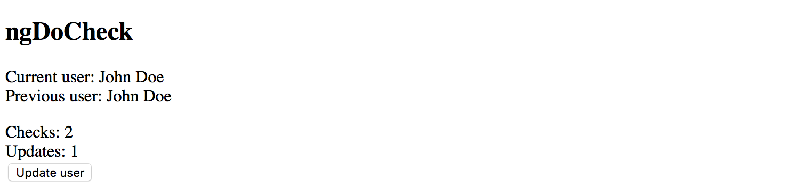

Now click the "Update user" button one time and check that both counters got incremented.

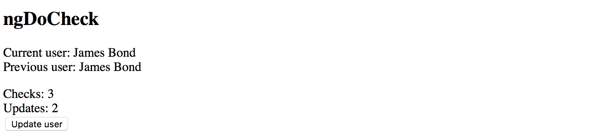

If you continue clicking the button, you should notice that the `checked` counter keeps incrementing.
Note that it increments even if you click some other buttons or clickable Angular components.
That demonstrates that our custom component reacts on change detection cycle managed by Angular, and increments the counter as designed.

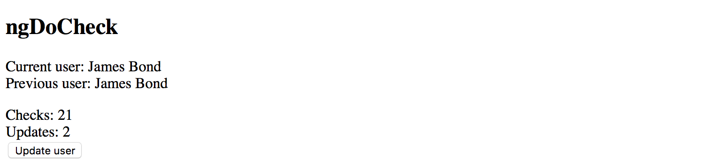

The `update` counter, however, should remain the same.
That is obvious as we change the values of the user only once.

### ngAfterContentInit

The `ngAfterContentInit` method belongs to the `AfterContentInit` hook in Angular,
and is part of the "Content Projection" feature.

Angular raises `AfterContentInit` every time an injected child component gets initialized
and is ready for use and access from the code if needed.

> **Content Projection**
>
> Content projection is the process of injection of the external HTML content and other Angular components into the body of your component template.
> You can get more information in the [Content Projection](#ng-content-projection) section later in this chapter.

You can find the code of the interface below:

```ts
interface AfterContentInit {
  ngAfterContentInit(): void;
}
```

As all in all previous cases, let's start by generating a separate component to experiment with the hook:

```sh
ng g component after-content-init-demo
```

For our exercise, we do not need a "constructor" and the `OnInit` implementation.
You can clean the component class and replace with the `AfterContentInit` interface implementation.

```ts
// src/app/after-content-init-demo/after-content-init-demo.component.ts

import { Component, AfterContentInit } from '@angular/core';

@Component({/*...*/})
export class AfterContentInitDemoComponent implements AfterContentInit {

  ngAfterContentInit() {
  }

}
```

The `ng-content` element is going to be an injection point for external content.
Update the component template to look like the following markup:

```html
<!-- src/app/after-content-init-demo/after-content-init-demo.component.html -->

Projected content below:
<div>
  <ng-content></ng-content>
</div>
```

We now need to generate a second component to test the Angular lifecycle hook.

```sh
ng g component after-content-init-child
```

You can clean the component class code as we need just a default implementation.

```ts
// src/app/after-content-init-child/after-content-init-child.component.ts

import { Component } from '@angular/core';

@Component({
  selector: 'app-after-content-init-child',
  templateUrl: './after-content-init-child.component.html',
  styleUrls: ['./after-content-init-child.component.css']
})
export class AfterContentInitChildComponent {
}
```

Also, the default component template should work fine as well.
The Angular CLI usually generates a `<component> works!` label out of the box.

```html
<!-- src/app/after-content-init-child/after-content-init-child.component.html -->

<p>
  after-content-init-child works!
</p>
```

Finally, let's extend the main application template with the testing parent-child hierarchy with our newly introduced components.
Just append the following HTML snippet to existing template markup.

```html
<!-- src/app/app.component.html -->
<!-- ... -->

<hr>
<h2>ngAfterContentInit</h2>

<app-after-content-init-demo>

    <app-after-content-init-child>
    </app-after-content-init-child>

</app-after-content-init-demo>
```

Serve the application with the `ng serve --open` command or switch to a running one in the browser.
You should see the next layout at the bottom of your page:

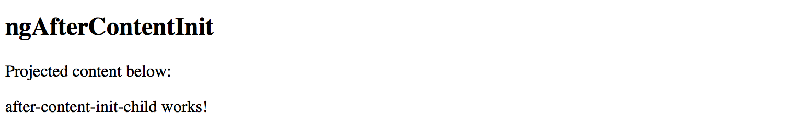

Typically you are going to use `AfterContentInit` hook with the `@ContentChild` decorator.
While we use the `ngAfterContentInit` to detect when an injected component finished initializing,
the `ContentChild` allows getting references to the component instance.

Please refer to the example below to get a better understanding of how both APIs work together.

```ts
// src/app/after-content-init-demo/after-content-init-demo.component.ts
import { Component, OnInit, AfterContentInit, ContentChild } from '@angular/core';
import { AfterContentInitChildComponent } from '../after-content-init-child/after-content-init-child.component';

@Component({/*...*/})
export class AfterContentInitDemoComponent implements AfterContentInit {

  @ContentChild(AfterContentInitChildComponent)
  child: AfterContentInitChildComponent;

  ngAfterContentInit() {
    console.log('AfterContentInit:', this.child);
  }

}
```

Once you run your application and open the developer tools,
you should see the following content in the browser console output:

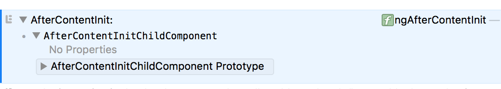

At this point, your parent component can perform additional setup for the child one,
like changing properties, subscribing to events or calling methods.

### ngAfterContentChecked

The `ngAfterContentChecked` method belongs to the `AfterContentChecked` interface in Angular, and is part of the "Content Projection" feature.

The `AfterContentChecked` lifecycle hook allows you to provide a custom mechanism for checking changes in the projected components.
The behavior is similar to the `DoCheck` but applied to the components that are part of the `ng-content` container.

> **Content Projection**
>
> Content projection is the process of injection of the external HTML content and other Angular components into the body of your component template.
> You can get more information in the [Content Projection](#ng-content-projection) section later in this chapter.

You can find the code of the interface below:

```ts
interface AfterContentChecked {
  ngAfterContentChecked(): void;
}
```

Let's use the same `AfterContentInitDemoComponent` we created earlier.
For the sake of simplicity, we are going to add the `checked` counter field and update it on every change detection cycle.

```ts
// src/app/after-content-init-demo/after-content-init-demo.component.ts
import { /*...,*/ AfterContentChecked } from '@angular/core';
...

@Component({/*...*/})
export class AfterContentInitDemoComponent implements AfterContentInit, AfterContentChecked {

  checked = 0;

  // ...

  ngAfterContentChecked() {
    this.checked ++;
  }

}
```

Update the component template to also display the `checked` counter after the projected content.

```html
<!-- src/app/after-content-init-demo/after-content-init-demo.component.html -->

Projected content below:
<div>
  <ng-content></ng-content>
</div>
<div>
  Checked (times): {{ checked }}
</div>
```

Once your application starts or reloads, the bottom of the page should look similar to the following:

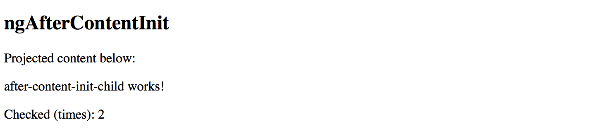

Please note that the counter is going to update multiple times even if you interact with some other components or elements on the page.
You should keep the code inside `ngAfterContentChecked` method body fast and small not to introduce a performance bottleneck for the entire application.

### ngAfterViewInit

Angular invokes the `ngAfterViewInit` hook once the view of the component is ready.
That also includes the child components that may be part of the template.

You can access child instance members and perform additional tasks in the code,
for example changing properties or subscribing to events.

Check out the code of the interface below:

```ts
interface AfterViewInit {
  ngAfterViewInit(): void;
}
```

Let's introduce a basic scenario that requires us to access view elements and update their properties.
We are going to have two buttons in the component template that have no text,
and once the view gets initialized our component should update the text of each button.

We need a separate `AfterViewInitDemoComponent` component that gets generated with the next Angular CLI command:

```sh
ng g component after-view-init-demo
```

Import and implement the `AfterViewInit` interface from the `@angular/core` package.
The `ngAfterViewInit` method can be blank for now, and we are going to implement it shortly.

```ts
// src/app/after-view-init-demo/after-view-init-demo.component.ts

import { Component, OnInit, AfterViewInit } from '@angular/core';

@Component({
  selector: 'app-after-view-init-demo',
  templateUrl: './after-view-init-demo.component.html',
  styleUrls: ['./after-view-init-demo.component.css']
})
export class AfterViewInitDemoComponent implements AfterViewInit {

  ngAfterViewInit() {
  }

}
```

Next, add two buttons to the template.
Each of the button needs to have a template reference id
so that our component class can access each button using the `prevPageButton` and `nextPageButton` id values.

```html
<!-- src/app/after-view-init-demo/after-view-init-demo.component.html -->

<div>
  after-view-init-demo works!
  <div>
      <button #prevPageButton></button>
      <button #nextPageButton></button>
  </div>
</div>
```

As a next step, declare the newly generated component within the main application template
by appending the following code to the existing markup:

```html
<!-- src/app/app.component.html -->
<!-- ... -->

<hr>
<h2>ngAfterViewInit</h2>
<app-after-view-init-demo></app-after-view-init-demo>
```

Serve the application right now and ensure the component renders its template with a default label
and two buttons with missing labels as in the picture below:

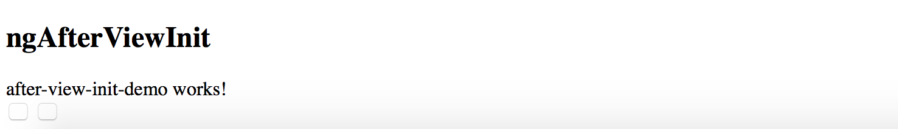

You also need importing the `ViewChild` decorator type.
This decorator is used to get a reference to the native element of the component template.

Also, create two separate properties `prevButton` and `nextButton` of the `ElementRef` type.
Every instance of the `ElementRef` exposes a `nativeElement` property that you can use to access the DOM element,
in our case HTML button inputs.

The component sets the `innerText` values for both buttons inside the `ngAfterViewInit` method body like in the next example:

```ts
// src/app/after-view-init-demo/after-view-init-demo.component.ts

import { /*...,*/ ViewChild, ElementRef } from '@angular/core';

@Component({...})
export class AfterViewInitDemoComponent implements AfterViewInit {

  @ViewChild('prevPageButton')
  prevButton: ElementRef;

  @ViewChild('nextPageButton')
  nextButton: ElementRef;

  ngAfterViewInit() {
    this.prevButton.nativeElement.innerText = 'Left Page';
    this.nextButton.nativeElement.innerText = 'Right Page';
  }

}
```

This time, when you run the application, both buttons should have correct labels:

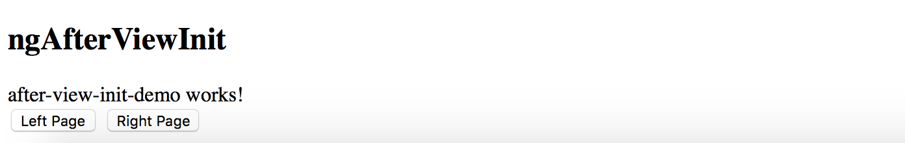

The `AfterViewInit` is usually used to modify the behavior of the view elements once the corresponding component is ready.

### ngAfterViewChecked

The `ngAfterViewChecked` method represents the `AfterViewChecked` lifecycle hook and interface.
It allows you to provide custom change tracking that is not handled by Angular due to some reason.
The behavior is similar to the `AfterContentChecked` hook but applies to the view template children rather than projected content.

You can find the code of the interface below:

```ts
interface AfterViewChecked {
  ngAfterViewChecked(): void;
}
```

As with previous examples, let's introduce a "checked" field to hold the number of checks,
and use the previous component with two buttons to demonstrate the lifecycle hook in practice.

```ts
// src/app/after-view-init-demo/after-view-init-demo.component.ts

import { /*...,*/ AfterViewChecked } from '@angular/core';

@Component({/*...*/})
export class AfterViewInitDemoComponent implements AfterViewInit, AfterViewChecked {

  checked = 0;

  // ...

  ngAfterViewChecked() {
    this.checked ++;
  }

}
```

Don't forget to update the component template by appending the label like in the next snippet:

```html
<!-- src/app/after-view-init-demo/after-view-init-demo.component.html -->
<!-- ... -->

<div>
  Checked (times): {{ checked }}
</div>
```

Now run the application and try clicking the buttons.
You should notice that the counter updates every time you interact with the button inside the component template,
or any other Angular component on the page.

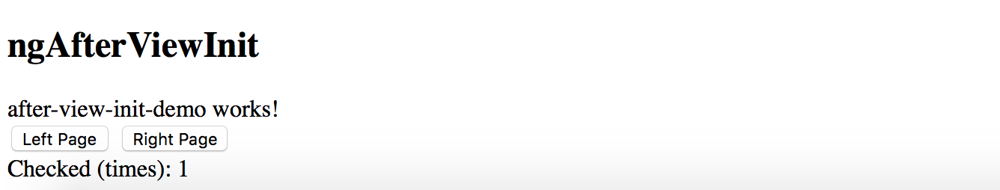

Needless to say that your custom change tracking code should be highly optimized and run fast.
Otherwise, you risk getting a performance bottleneck.

### ngOnDestroy

The `OnDestroy` lifecycle hook provides you with a way to run cleanup operations for your component,
directive or service to reduce resources and avoid potential memory leaks.

If your component controller subscribes to various event handlers,
the `ngOnDestroy` method is the most appropriate place to tear down all event subscriptions.

You can find the code of the interface below:

```ts
interface OnDestroy {
  ngOnDestroy(): void;
}
```

Let's generate a new component to see how `OnDestroy` hook works in practice.
We are going to produce two log entries for the browser console log,
one during the `OnInit` call and one for the `OnDestroy`.

```sh
ng g component on-destroy-demo
```

```ts
// src/app/on-destroy-demo/on-destroy-demo.component.ts

import { Component, OnInit, OnDestroy } from '@angular/core';

@Component({
  selector: 'app-on-destroy-demo',
  templateUrl: './on-destroy-demo.component.html',
  styleUrls: ['./on-destroy-demo.component.css']
})
export class OnDestroyDemoComponent implements OnInit, OnDestroy {

  constructor() { }

  ngOnInit() {
    console.log('OnInit');
  }

  ngOnDestroy() {
    console.log('OnDestroy');
  }

}
```

Next, declare a `showNgOnDestroy` property for the main application component class
to control the visibility of our generated component.

```ts
// src/app/app.component.ts

@Component({/*...*/})
export class AppComponent {
  // ...

  showNgOnDestroy = true;

}
```

For the last step, declare a checkbox with the label to control the value of the `showNgOnDestroy` property,
and a `ng-container` element that wraps the `app-on-destroy-demo`.

```html
<!-- src/app/app.component.html -->
<!-- ... -->

<hr>
<h2>ngOnDestroy</h2>
<label>
  <input type="checkbox" [(ngModel)]="showNgOnDestroy">
  Toggle ngOnDestroy demo
</label>

<ng-container *ngIf="showNgOnDestroy">
  <app-on-destroy-demo></app-on-destroy-demo>
</ng-container>
```

At runtime, the component should look like the following once the application starts:

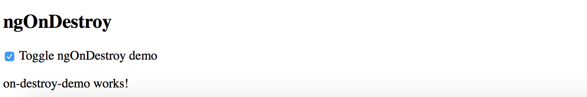

As soon as you untick the checkbox, the Angular is going to tear down the component
that should no longer be on the page and call the "ngOnDestroy" method.

Open the development tools for your current browser and try clicking the checkbox multiple times.
The console output should look like the one below:

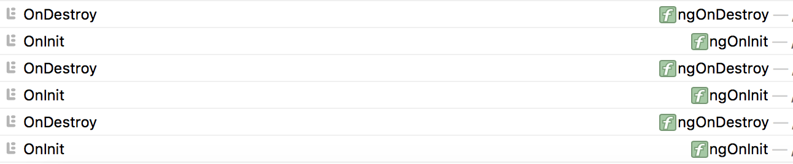

#### Cleaning up subscriptions

Also, the `OnDestroy` event is also used to cleanup subscriptions to external service or component events.
It is very important to unsubscribe from all the events to prevent memory leaks and performance degradation.

Let's take an example of a service that exposes multiple events.

```ts
// src/app/on-destroy-demo/simple.service.ts

import { Injectable } from '@angular/core';
import { Subject } from 'rxjs/Subject';

@Injectable()
export class SimpleService {

  loaded = new Subject();
  changed = new Subject();
  somethingElse = new Subject();

}
```

We use dependency injection to get an instance of this service injected into the component constructor.
And we use the `OnInit` hook to set up the event handlers.

```ts
// src/app/on-destroy-demo/on-destroy-demo.component.ts

@Component({/*...*/})
export class OnDestroyDemoComponent implements OnInit, OnDestroy {

  constructor(private service: SimpleService) {}

  ngOnInit() {
    this.service.loaded.subscribe(() => {/*...*/});
    this.service.changed.subscribe(() => {/*...*/});
  }

  ngOnDestroy() {/*...*/}
}
```

It is sometimes difficult to spot the problem in such an approach, but we may get a memory leak with the code above.

The issue is that the service we inject is a singleton one, and Angular keeps its instance somewhere.
It also means that now service instance will keep a reference to our component alive due to the event handler and subscription.
That is why we need to clean all subscriptions during destroy phase.

When using Observables, you get an instance of the Subscription each time you call `subscribe` method of the `Observable` or `Subject`.

> **Subscription**
>
> Represents a disposable resource, such as the execution of an Observable.
> Subscription has one important method, `unsubscribe`, that takes no argument and just disposes the resource held by the subscription.

The easiest way to process multiple subscriptions is to use them in bulk, wrapping into a private array variable.
That saves a lot of time and prevents issues related to missed variables or `unsubscribe` calls.

First, let's create a private property `subscriptions` of the array type that will hold all our subscriptions to external events.

```ts
@Component({/*...*/})
export class OnDestroyDemoComponent implements OnInit, OnDestroy {

  private subscriptions: Subscription[] = [];

}
```

Now you can push multiple subscriptions into the array like in the next example:

```ts
@Component({/*...*/})
export class OnDestroyDemoComponent implements OnInit, OnDestroy {

  private subscriptions: Subscription[] = [];

  constructor(private service: SimpleService) {}

  ngOnInit() {
    this.subscriptions.push(
      this.service.loaded.subscribe(() => {/*...*/}),
      this.service.changed.subscribe(() => {/*...*/}),
      this.service.somethingElse.subscribe(() => {{/*...*/})
    );
  }

  ngOnDestroy() {/*...*/}

}
```

Keeping all subscriptions in one place makes it easy to cleanup them in bulk when Angular invokes `ngOnDestroy` life-cycle hook.

```ts
@Component({/*...*/})
export class OnDestroyDemoComponent implements OnInit, OnDestroy {

  private subscriptions: Subscription[] = [];

  constructor(private service: SimpleService) {}

  ngOnInit() {/*...*/}

  ngOnDestroy() {
    this.subscriptions.forEach(s => s.unsubscribe());
    this.subscriptions = [];
  }

}
```

Do not forget about the technique above when dealing with subscriptions.
It should prevent memory leaks and performance issues when the component is re-created or gets destroyed.
