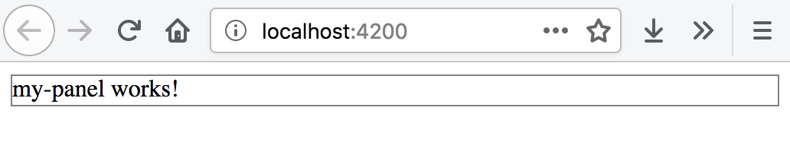
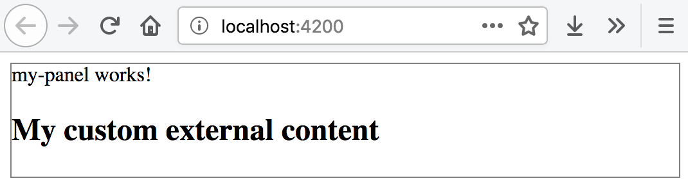
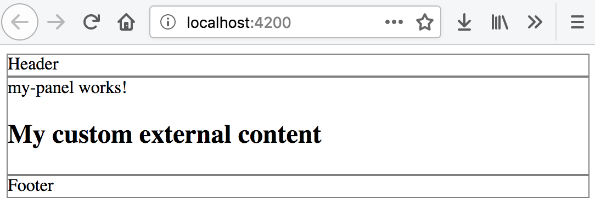
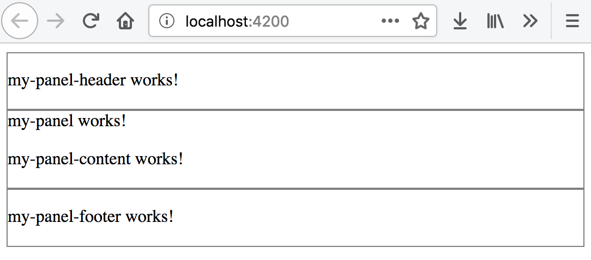
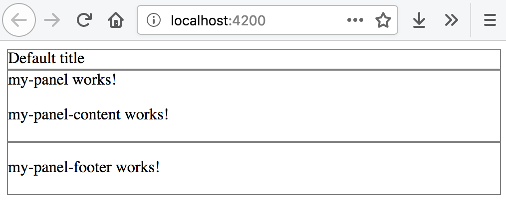
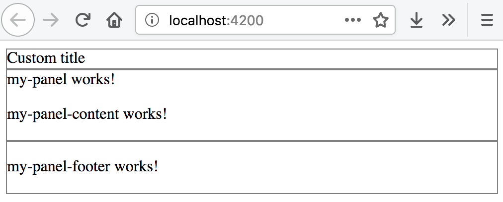

## Content Projection

The process of adding custom content into the existing components without rebuilding them is often called content projection.

### ng-container directive

In most cases when using structural directives or components you are dealing with an extra DOM element that serves as a root one.
There are scenarios, however, when you will want to have raw content emitted at run-time, with no wrapping elements.

The `ng-container` directive allows you to group single or multiple elements and components producing no HTML output.

```html
<ng-container>
  <!-- Your content comes here -->
</ng-container>
```

Let's take a simple repeater example and render a sequence of strings wrapped with a div element
and compare the same solution with `ng-container` use case.

First, take any existing, or generate a new Angular application using Angular CLI tools.
Create an `items` property with a set of strings values so you can use that property with the `*ngFor` directive.

```ts
// src/app/app.component.ts

import { Component } from '@angular/core';

@Component({/*...*/})
export class AppComponent  {

  items = ['One', 'Two', 'Three', 'Four'];

}
```

Next, update the component template and append the following code:

```html
<!-- src/app/app.component.html -->

<h2>Using container element</h2>

<div *ngFor="let item of items">
  {{ item }}
</div>
```

Once you run the application, the main page should contain a header element and a list of strings like following:

```text
Using container element

One
Two
Three
Four
```

If you now look at the generated HTML (right-clicking on the list and using "Inspect Element" menu item),
you will see something like in the following example:

```html
<h2 _ngcontent-c69="">Using container element</h2>
<!--bindings={
  "ng-reflect-ng-for-of": "One,Two,Three,Four"
}-->
<div _ngcontent-c69="">
  One
</div><div _ngcontent-c69="">
  Two
</div><div _ngcontent-c69="">
  Three
</div><div _ngcontent-c69="">
  Four
</div>
```

Note that every string is wrapped with the "div" element.
That is what we will now try to avoid by using ng-container directive.

For comparison, let's leave the exiting layout as it is now,
and append a new block at the bottom with the following code.

```html
<!-- src/app/app.component.html -->

<h2>Using ng-container</h2>

<ng-container *ngFor="let item of items">
  {{ item }}
</ng-container>
```

That is the same code, but we replaced "div" element with the "ng-container" one.
At run-time, however, the result should look different.

```text
Using ng-container

One Two Three Four
```

Note that repeated values are now forming a string rather than a vertical list.
If you now check the source code, you will see that there are no additional elements on the page.
Angular replaces them with the HTML comments instead.

```html
<h2 _ngcontent-c69="">Using ng-container</h2>
<!--bindings={
  "ng-reflect-ng-for-of": "One,Two,Three,Four"
}--><!---->
  One
<!---->
  Two
<!---->
  Three
<!---->
  Four
```

Angular does not restrict you to the `ngFor` directive only.

You can use the `ng-container` in any parts of the template where you need to have a "virtual" container element,
or there's a need to group multiple elements without introducing an extra content in the DOM.

Most times using `ng-container` should also simplify layout and CSS maintenance.

> **Source Code and Demo**
>
> You can find the source code and the [live demo](https://stackblitz.com/edit/dwa-ng-container?file=app%2Fapp.component.html) on Stackblitz.

### Projecting Single Entity

A good example of the custom content projection is container components.
You can have a panel-like component with some predefined content and styles.
At the same time the component can host external elements in panel body implementation.

Let's now create a panel component to see content projection in action.
Use the following Angular CLI command to get started:

```sh
ng g component my-panel
```

Next, you should edit the main application template and replace its contents with the following HTML block:

```html
<app-my-panel></app-my-panel>
```

For demonstration and testing purposes, let's update the generated panel component.
First, replace the "p" element with the "div".

```html
<!-- src/app/my-panel/my-panel.component.html -->

<div>
  my-panel works!
</div>
```

Then you can update its stylesheet, add the border to all the "div" children of the root component layout.

```css
/* src/app/my-panel/my-panel.component.css */

:host > div {
  border: 1px solid gray;
}
```

Run the application and should see the main page with the panel component looking like on the picture below.



#### Supporting External Content

To provide a basic support for external content projection, add the `ng-content` element somewhere in the panel template layout.

```html
<!-- src/app/my-panel/my-panel.component.html -->

<div>
  my-panel works!
  <ng-content></ng-content>
</div>
```

Now your panel component can receive custom HTML elements and Angular components inside its selector tags.
Update the main application template with a header element inside the panel to see that in practice.

```html
<!-- src/app/app.component.html -->

<app-my-panel>
  <h2>My custom external content</h2>
</app-my-panel>
```

Once your application restarts, the main page should now look similar to the next picture:



Note you can see both the native panel content presented by the `my-panel works!` and the external "h2" element from the application level.

For your custom Angular components, treat the `ng-content` element as a placeholder for something that comes from the outside.

### Projecting Multiple Entities

We got support for a single entity projection so far,
but there are many scenarios when you will need to fill multiple placeholders in your Angular component template.

You can achieve that by using the `selector` support that `ng-content` container exposes.
It allows you to match placeholders using HTML selectors, for example CSS class names, or DOM element names.

The usage format is as follows:

```html
<ng-content select="<selector>"></ng-content>
```

#### Projecting with CSS selectors

For the first step, provide support for injecting Header, Content and Footer content for our panel component,
and see CSS class name selectors in action.

You should start by adding three new content placeholders that point to unique class names.

```html
<!-- src/app/my-panel/my-panel.component.html -->

<div>
  <ng-content select=".my-panel-header"></ng-content>
</div>
<div>
  my-panel works!
  <ng-content select=".my-panel-content"></ng-content>
</div>
<div>
  <ng-content select=".my-panel-footer"></ng-content>
</div>
```

To populate those placeholders, you components or DOM elements now need to declare corresponding CSS class names.

```html
<!-- src/app/app.component.html -->

<app-my-panel>
  <div class="my-panel-header">
      Header
  </div>
  <h2 class="my-panel-content">
    My custom external content
  </h2>
  <div class="my-panel-footer">
    Footer
  </div>
</app-my-panel>
```

At runtime, the main application page should now look like the following:



You have projected custom content for panel's Header, Content and Footer areas.

#### Projecting with Component Selectors

When dealing with CSS class name-based selectors, things may get complicated once your layout grows.
Header and Footer content might need own complex layout, styling, effects or conditional rendering.

The best approach for handling application growth is to introduce separate components
that encapsulate the logic and presentation for panel primitives.

You can practice better separation of concerns by introducing three granular components to compose the panel.

```sh
ng g component my-panel/my-panel-header
ng g component my-panel/my-panel-content
ng g component my-panel/my-panel-footer
```

Note that by default, Angular CLI generates "app-" prefixes for the component selectors.
So "MyPanelHeaderComponent" will have "app-my-panel-header" selector. Same for other components we create.

Now update the panel template to reference the DOM element selectors instead of the CSS class names like in the example below:

```html
<!-- src/app/my-panel/my-panel.component.html -->

<div>
  <ng-content select="app-my-panel-header"></ng-content>
</div>

<div>
  my-panel works!
  <ng-content select="app-my-panel-content"></ng-content>
</div>

<div>
  <ng-content select="app-my-panel-footer"></ng-content>
</div>
```

That allows us to refactor the main page and use Angular components instead of the DOM elements with class names:

```html
<!-- src/app/app.component.html -->

<app-my-panel>
  <app-my-panel-header></app-my-panel-header>
  <app-my-panel-content></app-my-panel-content>
  <app-my-panel-footer></app-my-panel-footer>
</app-my-panel>
```

Run the web application again and ensure that all content is on the expected places.



The main benefit for using Angular components over the DOM elements is that your components can have own content projection support.
Besides that components can hide the complexity of the layout and expose different input properties and output events.

##### Fallback content

You can further improve coding experience for the developers that reuse your panel component.
It is possible to provide a default fallback content to support the cases when custom projection is missing.
Also, the panel may provide shortcuts for common features, like providing a simple string value for the Header
via the input property, in case developer does not need complex layout.

Importing the references to content children of the component into the code can further help
reuse them in the template and building conditional visibility expressions for other elements.

Let's import the `MyPanelHeaderComponent` component and also introduce the optional `title` shortcut property.

```ts
// src/app/my-panel/my-panel.component.ts

import { Input, Component, ContentChild,  } from '@angular/core';
import { MyPanelHeaderComponent } from './my-panel-header/my-panel-header.component';

@Component({
  selector: 'app-my-panel',
  templateUrl: './my-panel.component.html',
  styleUrls: ['./my-panel.component.css']
})
export class MyPanelComponent {

  @Input()
  title = 'Default title';

  @ContentChild(MyPanelHeaderComponent)
  header: MyPanelHeaderComponent;

}
```

Now update the panel template, if there is no `header` element provided
and there is a `title` input property defined, we display the value of the `title`.

```html
<!-- src/app/my-panel/my-panel.component.html -->

<div>
  <ng-container *ngIf="!header && title">{{ title }}</ng-container>
  <ng-content select="app-my-panel-header"></ng-content>
</div>

<div>
  my-panel works!
  <ng-content select="app-my-panel-content"></ng-content>
</div>

<div>
  <ng-content select="app-my-panel-footer"></ng-content>
</div>
```

If you want to test new functionality, comment out the header tags in the main page template and reload the application.

```html
<app-my-panel>
  <!-- <app-my-panel-header></app-my-panel-header> -->
  <app-my-panel-content></app-my-panel-content>
  <app-my-panel-footer></app-my-panel-footer>
</app-my-panel>
```

We have set the default title value to "Default title", that is the text you should now see rendered.



Now set custom value for the "title" attribute to test that fallback content works as we expect:

```html
<app-my-panel title="Custom title">
  <!-- <app-my-panel-header></app-my-panel-header> -->
  <app-my-panel-content></app-my-panel-content>
  <app-my-panel-footer></app-my-panel-footer>
</app-my-panel>
```

The panel should reflect your changes and web application should now render the "Custom title" value in the Header area.



The dual rendering approach we have just tried helps a lot when you need to provide default layout portions,
but still want to allow developers replacing them on demand.

Imagine a dialog with the toolbar, for instance, where developers can project a new toolbar implementation,
but can also have a predefined set of buttons.

> **Source Code and Demo**
>
> You can find the source code and the
>[live demo](https://stackblitz.com/github/DenysVuika/dwa-content-projection?file=src%2Fapp%2Fapp.component.html) on Stackblitz.
