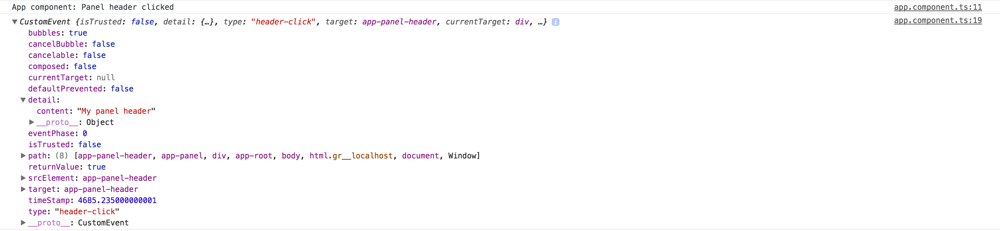

## DOM Events

With multiple levels of nesting, the re-raising of child events quickly turns into a challenging and time-consuming process.
Like with our previous Panel example, to wrap it with another Angular component
developers may have to watch for panel events and raise them for the own implementation.
That is where native DOM events with bubbling support come to the rescue.

If set to bubble, a DOM event gets raised for every element up against the parent hierarchy.
Developers get an opportunity reacting on events that occur in deeply nested components.

> **Creating and triggering events**
>
> You can get more details and examples on how to build and dispatch DOM events in the following article:
> [Creating and triggering events](https://developer.mozilla.org/en-US/docs/Web/Guide/Events/Creating_and_triggering_events)

First, to raise a custom DOM event we need to get access to a native element of the component.
You can achieve that by injecting an `ElementRef` instance in the component constructor,
and saving as a private property called `elementRef`.

```ts
// src/app/panel-header/panel-header.component.ts

import { /*...,*/ ElementRef } from '@angular/core';

@Component({/*...*/})
export class PanelHeaderComponent {

    // ...

    constructor(private elementRef: ElementRef) {
    }

}
```

Next, we need updating the `onContentClicked` handler to raise an additional event.
You can leave the code to raise the `contentClick` event, so that component supports raising two types of the events at the same time.

Let's introduce a new `header-click` custom event that is set to bubble and contains clicked content in the `details` section.

```ts
// src/app/panel-header/panel-header.component.ts

@Component({/*...*/})
export class PanelHeaderComponent {

  // ...

  onContentClicked() {
    this.contentClick.next();

    this.elementRef.nativeElement.dispatchEvent(
      new CustomEvent('header-click', {
        detail: {
          content: this.content
        },
        bubbles: true
      })
    );
  }

}
```

We are now ready to see the newly introduced event in practice.

Let's update the main application component template with a top-most `div` element that is going to listen to the `header-click` event.
That is a good case to test event handling and see how event bubbles up to non-Angular elements.

```html
<!-- src/app/app.component.html -->

<div (header-click)="onDomHeaderClick($event)">
  <app-panel
    (headerClick)="onHeaderClicked()"
    (footerClick)="onFooterClicked()">
  </app-panel>
</div>
```

For testing purposes, we are going just to log the event details to the browser console.

```ts
@Component({/*...*/})
export class AppComponent {

  // ...

  onDomHeaderClick(event) {
    console.log(event);
  }

}
```

Finally, if you run your web application at this point, and click the panel header content,
the following content should appear in the browser console output:



As you can see from the picture above you can access all data in the custom event
including the "detail" object we have created earlier, and that contains our component-specific information.

Dispatching the custom DOM events is an excellent option if you want to allow developers to wrap your components,
or you are using composite components and trying to avoid re-throwing multiple events.
