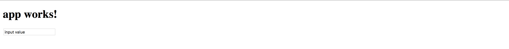
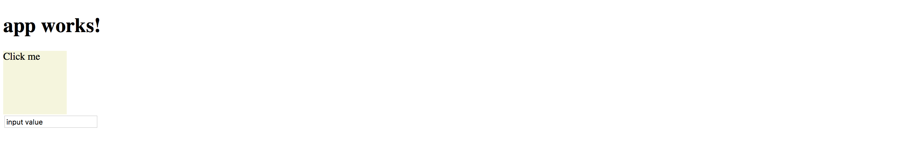
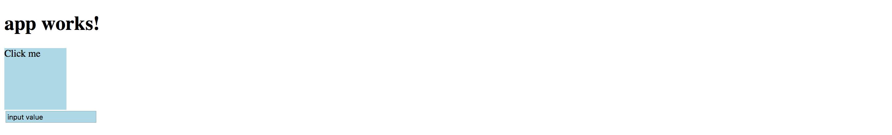
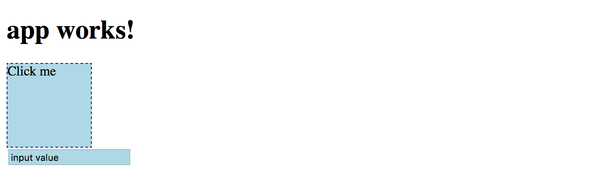
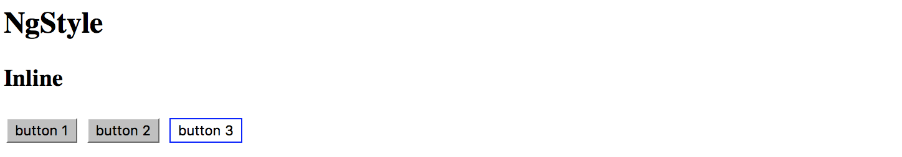
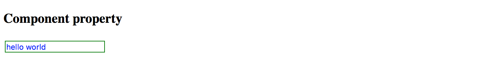

## Attribute Directives

Attribute directives change appearance or behavior of a host DOM element.
Usually, they look like regular HTML element attributes.

Let's create a simple clickable directive and call it `Clickme`.

```sh
ng g directive directives/clickme
```

Angular CLI generates directive with unit test and updates main application module:

```sh
installing directive
  create src/app/directives/clickme.directive.spec.ts
  create src/app/directives/clickme.directive.ts
  update src/app/app.module.ts
```

Initial implementation should look like the following one:

```ts
// src/app/directives/clickme.directive.ts

import { Directive } from '@angular/core';

@Directive({
  selector: '[appClickme]'
})
export class ClickmeDirective {

  constructor() { }

}
```

Directives can interact with the host by listening to events and setting properties of the target element.

### Handling host events

Your newly created directive can listen to events with the help of the `HostListener` decorator.
Angular invokes decorated method when the host element emits a corresponding event.

The format of the `HostListener` decorator and metadata is as following:

```ts
interface HostListener {

  eventName : string
  args : string[]

}
```

You can use it to decorate class methods like shown below:

```ts
// src/app/directives/clickme.directive.ts

@HostListener('domEvent', ['$event'])
onEvent(event) {
  // ...
}
```

Angular should be listening for the 'domEvent' event (if supported by host element)
and invoke `onEvent` method of the directive controller.

The event handler is also going to get a reference to the original DOM event,
as we instruct Angular to map specific `$event` argument to the `event` parameter.
That means directive can inspect properties of the original event
and even prevent default behavior or event bubbling if necessary.

The easiest way to demonstrate `HostListener` in action is by wiring a standard `click` event.

```ts
// src/app/directives/clickme.directive.ts

import { /*...,*/ HostListener } from '@angular/core';

...
export class ClickmeDirective {
    // ...
    
    @HostListener('click', ['$event'])
    onClicked(e: Event) {
        console.log(e);
        alert('Clicked');
    }
}
```

Next put a `div` element to the `app.component.html` and decorate it with your `appHighlight` directive:

```html
<!-- src/app/app.component.html -->

<h1>
  {{title}}
</h1>

<div class="click-area" appClickme>
  Click me
</div>
```

You also need to have some space to click on; this is what we are going to use `highlight-area` CSS class for:

```css
/* src/app/app.component.css */

.click-area {
  width: 100px;
  height: 100px;
  background-color: beige;
}
```

Below is how the main page looks like after your changes:


You get the default 'app works!' label generated by the Angular CLI, and coloured `div` element.
Now if you click anywhere on the beige area the browser should display an alert: 


So as you can see in the example above, with the help of `HostListener`, you can listen to any event emitted by host element.
We have added `appClickme` directive as an attribute of the `div`, 
and every click on the `div` automatically triggers `onClicked` method in the `ClickmeDirective`.

You can use any target for the directive, for example:

```html
<!-- src/app/app.component.html -->

<button appClickme>Click me</button>
<span appClickme>Click me</span>
<input type="text" appClickme>
```

### Host members binding

Angular also provides a way for a directive to change host properties by using a `HostBinding` decorator.

During change detection cycle Angular checks all property bindings and updates host element of the directive if bound value changes.

The format of the HostBinding decorator and metadata is as following:

```ts
interface HostBinding {

  hostPropertyName : string

}
```

You can use this decorator to change:

- attributes (applies to all elements)

    `@HostBinding('attr.text)`

- properties (corresponding properties must exist)

    `@HostBinding('title')`

- style values (applies to all elements)

    `@HostBinding('style.background-color')`

- class names (applies to all elements)

    `@HostBinding('class.some-class-name')`

#### Binding element attributes

If you want your directive to change element attributes, you can use this decorator with class methods like below:

```ts
// src/app/directives/clickme.directive.ts

export class ClickmeDirective {

    @HostBinding('attr.propertyName')
    myProperty: string = 'hello world';

}
```

For example, if you apply directive to a `div` element, the property binding should cause the following attributes rendering at run time:

```html
<!-- src/app/app.component.html -->

<div appclickme="" propertyName="hello world"></div>
```

Please note that if host property name parameter is not defined, then a class property name should be taken as a fallback value.

```ts
@HostBinding()
title: string = 'element title';
```

This time, if you apply the directive to the `input` element, for instance, you should see the `title` property name as an attribute of the host:

```ts
<input appclickme="" type="text" title="element title">
```

#### Binding element properties

Keep in mind that in this case, the property should exist for a given element.
Angular should throw an error if you try to bind a missing property.

Let's try to bind a `value` property to demonstrate this behavior.

```ts
// src/app/directives/clickme.directive.ts
// ...
export class ClickmeDirective {

  @HostBinding()
  value: string = 'input value';

  // ...
}
```

You may still have a click area example on the main page, or you can do it once again:

```html
<div class="click-area" appClickme>
```

Angular should produce an error when page compiles and reloads:

```text
Error: Uncaught (in promise): Error: Template parse errors:
Can't bind to 'value' since it isn't a known property of 'div'.

[ERROR ->]<div class="click-area" appClickme>
  Click me
</div>
```

However, if you replace `div` with an `input` element that natively supports `value` property, you should get it rendered properly:

 

You can, however, fix the issue and provide compatibility with all HTML elements by utilizing `attr.value` instead of `value` for the property binding:

```ts
// src/app/directives/clickme.directive.ts
// ...
export class ClickmeDirective {

  @HostBinding('attr.value')
  value: string = 'input value';

  // ...
}
```

In this case you are going to get the following HTML when both `<input>` and `<div>` are present on the page:

```html
<!-- src/app/app.component.html -->

<div appclickme="" class="click-area" value="input value">
  Click me
</div>

<input appclickme="" type="text" value="input value">
```

Your main application component page should now render without errors.



#### Binding style attributes

You bind single style attribute values using `@HostBinding('style.<attribute>)` format,
where `<attribute>` is a valid name of the CSS style attribute.

```ts
// src/app/directives/clickme.directive.ts
// ...
export class ClickmeDirective {
    // ...
    
    @HostBinding('style.background-color')
    background: string = 'lightblue';
}
```

Now the directive is painting its host element's background into light-blue.



This is how the rendered HTML looks like:

```html
<!-- src/app/app.component.html -->

<div appclickme="" class="click-area" value="input value" 
     style="background-color: rgb(173, 216, 230);">
  Click me
</div>
```

#### Binding Class Names

Instead of binding single style attributes, you may want to operate CSS class names,
to be able providing external themes, or separating presentation layer from directive implementation.
It can be achieved by utilizing `@HostBinding('class.<class-name>')` where `<class-name>` is the name of the CSS class.

Note that having corresponding CSS class implementation is optional if you directive is not enforcing styles directly.
Developers can choose whether to implement or override the class, or leave defaults.

You can bind class names to the `boolean` values or expressions.
Angular appends provided CSS class name to the host element if the resulting value is `true`, and automatically removes it if value changes back to `false`.

```ts
// src/app/directives/clickme.directive.ts
// ...

export class ClickmeDirective {
    // ...

    @HostBinding('class.is-selected')
    isSelected: boolean = true;
}
```

This is the initial template we have been using:

```html
<!-- src/app/app.component.html -->

<div class="click-area" appClickme>
  Click me
</div>
```

So this is how Angular renders component at run time.
Note the `class` value now has both `click-area` we defined manually, and `is-selected` class provided by the directive controller.

```html
<!-- src/app/app.component.html -->

<div appclickme="" class="click-area is-selected" value="input value" 
     style="background-color: rgb(173, 216, 230);">
  Click me
</div>
```

Typically you are going to apply or change CSS classes of the host element as a response to the host events wired by `HostBinding` decorators.

For example, the directive can listen to mouse events and toggle `hovered` styles:

```ts
// src/app/directives/clickme.directive.ts
// ...

export class ClickmeDirective { 
    // ...

    @HostBinding('class.is-hovered')
    isHovered: boolean = false;

    @HostListener('mouseenter')
    onMouseEnter() {
        this.isHovered = true;
        // other code if needed
    }

    @HostListener('mouseleave')
    onMouseLeave() {
        this.isHovered = false;
        // other code if needed
    }
}
```

Our directive toggles the `isHovered` property value upon mouse enter and leave,
but it does not directly change the way its host element looks.
Instead, you or developers that use your directive can optionally add a custom `is-hovered` CSS class
to alter how the element looks and behaves on mouse interaction.

The example below adds a thin dashed border to the element when a user hovers it:

```css
/* src/app/app.component.css */

.is-hovered {
  border: 1px dashed darkblue;
}
```

You can now run the application and move the mouse cursor in and out of the click area.



Of course, you can control hover styles in pure CSS.
The code above is more a simple demonstration of capabilities to give you more ideas
on what is possible with `HostListener` and `HostBinding` combined.

> **Source Code**
>
> You can find the source code in the **[angular/directives/directive-example](https://github.com/DenysVuika/developing-with-angular/tree/master/angular/directives/directive-example)** folder.

### Built-in Attribute Directives

Angular comes with the following ready-to-use attribute directives:

- [NgStyle](#ngstyle), updates an HTML element styles
- [NgClass](#ngclass), adds and removes CSS classes on an HTML element
- **NgModel**, provides two-way binding to Form elements, see **Forms** chapter for more details
- [NgNonBindable](#ngnonbindable), prevents content from being evaluated and compiled in templates

#### NgStyle

The `NgStyle` directive is used to modify CSS style attributes of the host element or component.

```html
<element [ngStyle]="OPTIONS">
    ...
</element>
```

Where `OPTIONS` is an object literal `NgStyle` that binds and maps properties to style attributes.
Object keys should represent style names with an optional `.<unit>` suffix, for example, `width.px`, `font-style.em`.

```html
<button [ngStyle]="{ 'border-width': '1px' }">button 1</button>
<button [ngStyle]="{ 'border-width.px': '1' }">button 2</button>
<button [ngStyle]="{
  'background-color': 'white',
  'border': '1px blue solid'
}">button 3</button>
```

You should see three buttons with custom styles once you run the application:



It is also possible to bind `ngStyle` to the component property.

```html
<input type="text" value="hello world" [ngStyle]="inputStyle">
```

In this case, you declare object literal within the component class implementation, for example:

```ts
// src/app/app.component.ts
// ...

export class AppComponent {
    // ...
    
    inputStyle = {
        'border': '1px green solid',
        'background-color': 'white',
        'color': 'blue'
    };
}
```

That allows you to compose styles based on some other conditions dynamically.



> **Source Code**
>
> You can find the source code in the **[angular/directives/attribute-directives](https://github.com/DenysVuika/developing-with-angular/tree/master/angular/directives/attribute-directives)** folder.

#### NgClass

The `NgClass` directive allows binding CSS class names on an HTML element.

```html
<element [ngClass]="OPTIONS">
  <!-- ... -->
</element>
```

Where the `OPTIONS` value can take one of the following formats:

- string expression (single or `space` delimited)
- object literal
- array

##### Binding to String Expression (single)

With this format you specify a string expression that corresponds to a CSS class name:

```html
<element [ngClass]="'class1'">
  <!-- ... -->
</element>
```

##### Binding to String Expression (space delimited)

You can also provide multiple class names per single `space` delimited string expression:

```html
<element [ngClass]="'class1 class2 class3'">
  <!-- ... -->
</element>
```

##### Binding to Object Literal

This format is very similar to that of `NgStyle` one.
All object keys are CSS class names and get added to host element only if value evaluates to a truthy value.
In a case of a non-truthy value, Angular removes class names from the host.

```html
<element [ngClass]="{
    'class1': true,
    'class2': false,
    'class3': true }">
    <!-- ... -->
</element>
```

##### Binding to Array

Finally you can bind the `NgClass` directive to an array of class names:

```html
<element [ngClass]="['class1', 'class2', 'class3']">
  <!-- ... -->
</element>
```

In all the cases described above you can also bind directive options to underlying controller properties or methods:

```html
<!-- src/app/app.component.html -->

<element [ngClass]="currentClass"><!-- ... --></element>
<element [ngClass]="getClassObj()"><!-- ... --></element>
<element [ngClass]="getClassArr()"><!-- ... --></element>
```

```ts
// src/app/app.component.ts

export class MyComponent {

    currentClass: string = 'class1';

    getClassObj(): any {
      return {
        'class2': true,
        'class3': true
      };
    }

    getClassArr(): string[] {
      return [
        'class4',
        'class5'
      ];
    }
}
```

> **Source Code**
>
> You can find the source code in the **[angular/directives/attribute-directives](https://github.com/DenysVuika/developing-with-angular/tree/master/angular/directives/attribute-directives)** folder.

#### NgNonBindable

You use `NgNonBindable` directive to switch off Angular evaluating code or binding values for a particular element and its content.

For example if you want displaying source code:

```html
<h2>NgNonBindable</h2>
<pre>
  You can bind <strong>title</strong> property like following:
  <code ngNonBindable>
    &lt;div&gt;{{title}}&lt;/div&gt;
  </code>
</pre>
```

Which renders to the following if you run the application:


Please note that the `NgNonBindable` is a very specific directive, and typically you are not going to use it often, if at all.

> **Source Code**
>
> You can find the source code in the "[angular/directives/attribute-directives](https://github.com/DenysVuika/developing-with-angular/tree/master/angular/directives/attribute-directives)" folder.
