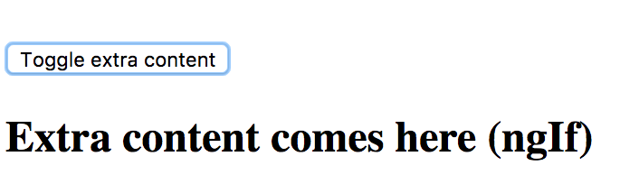
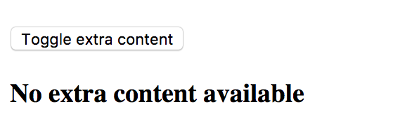
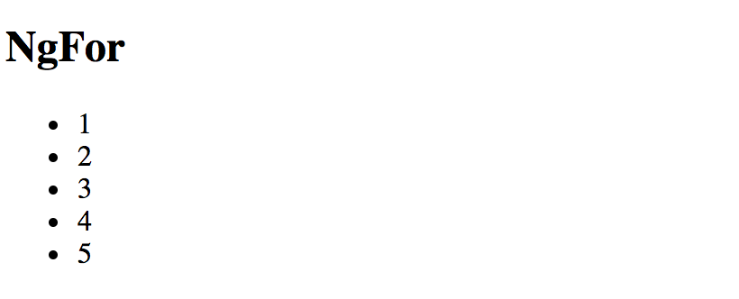
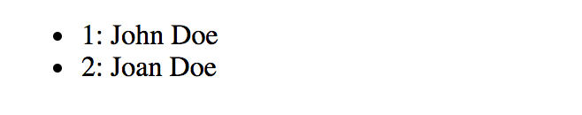
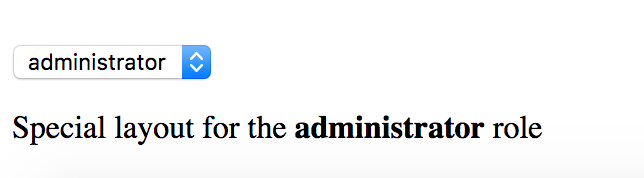
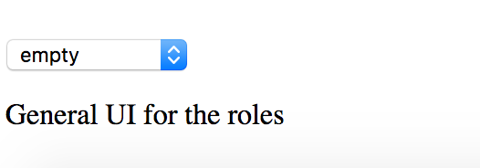

## Structural Directives

Structural directives allow you to control how element renders at run time.

### Built-in structural directives

Angular provides a few built-in directives you are going to use very often:

- NgIf
- NgFor
- NgSwitch

#### NgIf

You are going to use `NgIf` directive when you want to display or hide decorated element based on condition.

The most common usage format for this directive is

```html
<element *ngIf="<condition>">
  <!-- ... -->
</element>
```

where `<condition>` is a valid JavaScript expression.

Let's build an example demonstrating conditional inclusion of the template.
Add a boolean property `extraContent` to your `AppComponent` component controller class implementation:

```ts
// src/app/app.component.ts

export class AppComponent {
  extraContent = false;
}
```

Next, put a `<button>` element to the component template, this button should toggle the `extraContent` value on each click.

```html
<!-- src/app/app.component.html -->

<button (click)="extraContent = !extraContent">
  Toggle extra content
</button>
```

Finally, let's add some content that should be displayed only when `extraContent` property value gets set to `true`

```html
<!-- src/app/app.component.html -->

<div *ngIf="extraContent">
  <h2>Extra content comes here (ngIf)</h2>
</div>
```

Now if you run the application you should be able to toggle additional content by clicking the button multiple times.



Very often you may need two different templates within the component based on the condition evaluation.
Traditionally developers are using separate `NgIf` directives assigned to `truthy` and `falsy` results of the same expression:

```html
<element *ngIf="condition">main content</element>
<element *ngIf="!condition">alternative content</element>
```

The NgIf directive also supports `else` blocks for showing alternative content when the condition expression evaluates to a falsy value.
In this case, you need to provide a reference to a separate `ng-template`:

```html
<element *ngIf="condition; else alternative">
  Main template (condition is truthy)
</element>

<ng-template #alternative>
  Alternative template (condition is falsy)
</ng-template>
```

To see that on practice return to the project created earlier and add the additional template:

```html
<!-- src/app/app.component.html -->

<ng-template #emptyView>
  <h3>No extra content available</h3>
</ng-template>
```

Template above can be referenced by `emptyView` id.
Now update the main element to utilize the newly created template:

```html
<!-- src/app/app.component.html -->

<div *ngIf="extraContent; else emptyView">
  <h2>Extra content comes here (ngIf)</h2>
</div>
```

If you run the application right now and click the `Toggle extra content` button, you should see the content of the `emptyView` template.



It is possible to store both templates as external references.
By default, Angular treats inline template as a `then` block, but you can define it explicitly using the following syntax:

```html
<element *ngIf="condition; then thenBlock else elseBlock"></element>
```

Now if updated our example can look like the following:

```html
<!-- src/app/app.component.html -->

<button (click)="extraContent = !extraContent">
  Toggle extra content
</button>
<div *ngIf="extraContent; then mainView else emptyView"></div>

<ng-template #mainView>
  <h2>Extra content comes here (ngIf)</h2>
</ng-template>

<ng-template #emptyView>
  <h3>No extra content available</h3>
</ng-template>
```

> **Source Code**
>
> You can find the source code in the **[angular/directives/structural-directives](https://github.com/DenysVuika/developing-with-angular/tree/master/angular/directives/structural-directives)** folder.

#### NgFor

The main purpose of `NgFor` directive is to display iterable collections by utilizing a custom HTML template for each entry.

##### Binding to arrays

Let's start with a simple example that best demonstrates `NgFor` directive in action.

```html
<!-- src/app/app.component.html -->

<ul>
    <li *ngFor="let num of [1,2,3,4,5]">
        <span>{{num}}</span>
    </li>
</ul>
```

In the example above we are using `NgFor` directive with a collection of five numbers to render an unordered (bulleted) list.
Angular treats the content of the list item as a template and repeatedly applies to each array entry.

You should see the following HTML once application compiles and restarts:



If you inspect the source code of the page you should see the structure similar to the one below:

```html
<ul>
    <li>
        <span>1</span>
    </li>
    <li>
        <span>2</span>
    </li>
    <li>
        <span>3</span>
    </li>
    <li>
        <span>4</span>
    </li>
    <li>
        <span>5</span>
    </li>
</ul>
```

##### Binding to class properties or functions

It is also possible to bind `NgFor` to class properties or functions.

```ts
// src/app/app.component.ts

export class AppComponent {
    // ...

    users = [
        {
            id: 10,
            firstName: 'John',
            lastName: 'Doe'
        },
        {
            id: 20,
            firstName: 'Joan',
            lastName: 'Doe'
        }
    ];
}
```

We are going to have two objects in the `users` collection.
The list entry template should now look like the next one:

```html
<!-- src/app/app.component.html -->

<ul>
    <li *ngFor="let user of users">
        <div>{{user.firstName + ' ' + user.lastName}}</div>
    </li>
</ul>
```

Once your project and compiled and reloaded you should see a list of full user names:


##### Using exported variables

The `NgFor`directives exports several values that you can map to the the local template variables:

- `index: number` holds the numeric position of the current array item
- `first: boolean` indicates whether the current array item is the first one
- `last: boolean` indicates whether the current array item is the last one
- `even: boolean` indicates whether current array item's position index is even
- `odd: boolean` indicates whether current array item's position index is odd

You can use these additional values to improve the user interface.
For example, let's add row numbers to the user list:

```html
<!-- src/app/app.component.html -->

<ul>
    <li *ngFor="let user of users; let i = index">
        <div>
            <span>{{i + 1}}: </span>
            <span>{{user.firstName + ' ' + user.lastName}}</span>
        </div>
    </li>
</ul>
```

Note the use of `let i = index`, this is where you bind `index` property to a local template variable `i`.
That allows you displaying it via `<span>{{i + 1}}: </span>`



You can use all local variables for conditional styling and layout.
For example, you may want drawing a table or a list with stripes based on `even` and `odd` value,
rendering some header or footer for the `first` and `last` items.

It is possible to use all variables at the same time separating them by semicolons:

```html
<!-- src/app/app.component.html -->

<ul>
    <li *ngFor="let user of users; let isFirst = first; let isLast = last;">
        <span>{{user.firstName + ' ' + user.lastName}}</span>
        <span *ngIf="isFirst">(this is the first item)</span>
        <span *ngIf="isLast">(this is the last item)</span>
  </li>
</ul>
```

When running the application, you should notice that first and last items in the list get different text appended to them based on the condition expression.


##### Improving performance with `trackBy`

Every time a collection changes Angular drops existing DOM elements and the renders entire set of new ones.
That is fine when you are dealing with static collections.
However, you may see significant performance drops when using frequently changed arrays,
for example when using dynamic editing or populating collections from the server.
The complexity of item templates can also slow down rendering and affect overall application performance.

Angular provides a special `trackBy` feature that allows you to track underlying objects by unique `id` values
and to rebuild DOM elements only for the entries that change.
For many scenarios that often ends up with a huge performance boosts as large portions of the DOM remain unchanged.

The `trackBy` value should go after the main `ngFor` expression and must be separated by a semicolon:

```html
<!-- src/app/app.component.html -->

<ul>
    <li *ngFor="let user of users; trackBy: trackByUserId">
        <span>{{user.firstName + ' ' + user.lastName}}</span>
    </li>
</ul>
```

The `trackBy` always binds to a component method having a numeric `index` and a current collection object as parameters:

```ts
// src/app/app.component.ts

trackByUserId(index: number, user: any) {
  return user.id;
}
```

In the example above we tell Angular to keep track of users in the list based on the `id` property value
so that it can better detect what item has been added or removed.

#### NgSwitch

The `NgSwitch` directive is used for conditional rendering of element templates depending on the expression value.
You can treat it as an advanced `NgIf` directive with multiple `else` clauses.

You need three separate directives to make `NgSwitch` work:

- `NgSwitch`: an attribute directive holding main expression body
- `NgSwitchCase`: a structural directive, renders corresponding template if its condition matches that of the `NgSwitch` one
- `NgSwitchDefault`: a structural directive, works like a fallback mechanism and renders a template if none of the `NgSwitchCase` values matches the `NgSwitch` one

Here's the basic example of the `NgSwitch` format:

```html
<element [ngSwitch]="expression">
    <element *ngSwitchCase="condition1">...</element>
    <element *ngSwitchCase="condition2">...</element>
    <element *ngSwitchDefault>...</element>
</element>
```

To check how `NgSwitch` operates in practice let's build a simple component that displays different UI layouts based on the selected role of the user.
Open the `app.component.ts` and add the `roles` and `selectedRole` properties like below:

```ts
// src/app/app.component.ts

roles = [
    { id: 0, name: 'empty' },
    { id: 1, name: 'unknown' },
    { id: 2, name: 'user' },
    { id: 3, name: 'guest' },
    { id: 4, name: 'administrator' }
];

selectedRole = 'empty';
```

Next place a `<select>` element to be able to select a role from the dropdown list:

```html
<!-- src/app/app.component.html -->

<select [(ngModel)]="selectedRole">
    <option *ngFor="let role of roles">{{role.name}}</option>
</select>
```

Finally we are going to build our simple role template selector:

```html
<!-- src/app/app.component.html -->

<div [ngSwitch]="selectedRole">

    <div *ngSwitchCase="'administrator'">
        Special layout for the <strong>administrator</strong> role
    </div>

    <div *ngSwitchCase="'guest'">
        Special layout for the <strong>guest</strong> role
    </div>

    <div *ngSwitchDefault>
        General UI for the roles
    </div>

</div>
```

As a result, we are going to use dedicated UI templates for `administrator` and `guest` roles:



The rest of the roles should receive a generic template.



As you can see from the examples above, the `NgSwitch` directive is a powerful and flexible way for conditional element rendering in Angular.

### Creating a Structural Directive

Let's create a simple structural directive called `RepeatDirective` that is going to repeat specified HTML template certain number of times.
You can use Angular CLI to generate a working directive skeleton quickly.

```sh
ng g directive repeat
```

The command above gives you a basic `RepeatDirective` implementation and a simple unit test.
It also modifies the main application module `app.module.ts` to register new directive within module declarations.

```text
installing directive
  create src/app/repeat.directive.spec.ts
  create src/app/repeat.directive.ts
  update src/app/app.module.ts
```

Here's the content of the `repeat.directive.ts` we are going to work with:

```ts
// src/app/repeat.directive.ts

import { Directive } from '@angular/core';

@Directive({
  selector: '[appRepeat]'
})
export class RangeDirective {

  constructor() { }

}
```

Note that Angular CLI automatically prepends default `app` prefix to the directive selector value.
This helps us to avoid name conflicts with the existing directives from either standard Angular or third party libraries.

You can use your new directive with any HTML element like the following:

```html
<element *appRepeat>...</element>
```

It is also possible to use the plain format without Angular syntactic sugar:

```html
<ng-template [appRepeat]><!--...--></ng-template>
```

Now let's update our directive to repeat the content.

```ts
// src/app/repeat.directive.ts

import { Directive, TemplateRef, ViewContainerRef, Input } from '@angular/core';

@Directive({
  selector: '[appRepeat]'
})
export class RepeatDirective {

  constructor(private templateRef: TemplateRef<any>,
              private viewContainer: ViewContainerRef) { }

  @Input()
  set appRepeat(times: number) {
    for (let i = 0; i < times; i++) {
      this.viewContainer.createEmbeddedView(this.templateRef);
    }
  }

}
```

First of all, you get access to the underlying template by injecting `TemplateRef` instance and using it as a local reference.
You also save a reference to the `ViewContainerRef` instance as you need it to turn the template reference to a real HTML element.

As a second step, we define an `appRepeat` setter that is going to receive configuration settings from the directive value.
Note that to map an attribute value to a function parameter the directive setter must have the same name as the HTML selector value.
In our case, it is `appRepeat` one. That gives you the possibility using the `*directive="expression"` format similar to the one below:

```html
<element *appRepeat="5">...</element>
```

The child content of the decorated element gets treated as a template. 
With the help of `ViewContainer` and `Template` references we turn it into the HTML DOM multiple times:

```ts
for (let i = 0; i < times; i++) {
  this.viewContainer.createEmbeddedView(this.templateRef);
}
```

You can test the directive with the following layout:

```html
<div *appRepeat="5">
    <div>Hello</div>
</div>
```

It is going to render the following output once the application runs:

```html
Hello
Hello
Hello
Hello
Hello
```

The `Hello` template is rendered 5 times as we expect it.
However, rendering HTML elements without data context is not very useful.
Let's extend our directive with a custom context set to the position index of the element:

```ts
for (let i = 0; i < times; i++) {
  this.viewContainer.createEmbeddedView(this.templateRef, {
    $implicit: i
  });
}
```

Now you can define a local variable for your template bound to the data context:

```html
<div *appRepeat="5; let idx">
  <div>Hello {{idx}}</div>
</div>
```

You can also change example able to be like the next one:

```html
<ng-template [appRepeat]="5" let-idx>
  <div>Hello {{idx}}</div>
</ng-template>
```

This time the application output when using any of these formats is going to be as following:

```html
Hello 0
Hello 1
Hello 2
Hello 3
Hello 4
```

Let's get back to the data context again. Any local variable that has no value defined is going to point to the default `$implicit` value.
You can define as many variables as needed within your directive implementation.
For example, try to expose `first` and `last` variables similar to those of the `NgFor` directive:

```ts
for (let i = 0; i < times; i++) {
    this.viewContainer.createEmbeddedView(this.templateRef, {
        $implicit: i,
        first: i === 0,
        last: i === times - 1
    });
}
```

Next you can wire newly created local variables and reuse them within the template:

```html
<!-- src/app/app.component.html -->

<div *appRepeat="5; let idx; let isFirst = first; let isLast = last;">
    <div>
      Hello {{idx}}
      <span *ngIf="isFirst">(first)</span>
      <span *ngIf="isLast">(last)</span>
    </div>
</div>
```

Once the application compiles and runs you should see the following result:

```html
Hello 0 (first)
Hello 1
Hello 2
Hello 3
Hello 4 (last)
```

You can keep enhancing your directive with more complex layout and behavior.
