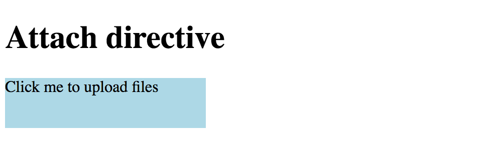
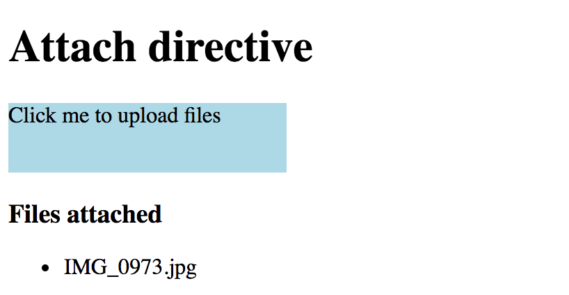
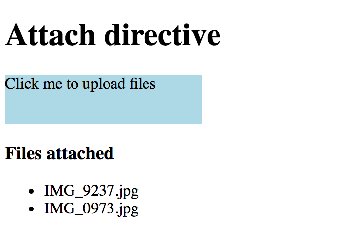

## Modifying Host Element Layout

Directives can extend or modify host element layout at run time.
Let's create an `AttachDirective` directive that invokes an open file dialogue, once the user clicks the host element.

Due to security reasons, modern browsers do not allow invoking file dialogues from code,
unless caused by a user action, like clicking a button or hyperlink.
Traditionally developers use a hidden `<input type="file">` element to trigger its native behavior programmatically.
So as part of its implementation, our directive is going to create an additional `<input>` element and interact with it from code.

Using Angular CLI create a new project to develop and test the directive.

```sh
ng new app-attach-directive
cd app-attach-directive/
ng g directive attach
```

The commands above result in a new `app-attach-directive` project containing `attach.directive.ts`
and `attach.directive.spec.ts` in the `src/app` folder.
You can see the content of the new `AttachDirective` below:

```ts
// src/app/attach.directive.ts

import { Directive } from '@angular/core';

@Directive({
  selector: '[appAttach]'
})
export class AttachDirective {

  constructor() { }

}
```

Angular CLI automatically prepended the name with the default `app` prefix to avoid naming conflicts,
so you are going to use `appAttach` in HTML.

Before implementing the directive let's prepare the testing environment.
We are going to use main application component to see all the changes in action.

```ts
// src/app/app.component.ts

export class AppComponent {
  title = 'Attach directive';
}
```

Add the following block to the application component's template:

```html
<!-- src/app/app.component.html -->

<div appAttach class="attach-area">
    <div>
        Click me to upload files
    </div>
</div>
```

For demonstration and testing purposes we also provide some basic styling via `attach-area` CSS class.
The light blue box on the page shows the 'clickable' area wired with the `appAttach` directive.

```css
/* src/app/app.component.css */

.attach-area {
  width: 200px;
  height: 50px;
  background-color: lightblue;
  cursor: pointer;
}
```

Now you can run the app with

```sh
ng serve --open
```

The application compiles and runs inside your default browser.



You can leave the terminal running in the background.
Angular CLI keeps watching for files and automatically recompiles and reloads application upon any changes.

Now provide the initial directive implementation like the following:

```ts
// src/app/attach.directive.ts

import { Directive, OnInit, ElementRef, Renderer, HostListener } from '@angular/core';

@Directive({
  selector: '[appAttach]'
})
export class AttachDirective implements OnInit {
    private upload: HTMLInputElement;

    constructor(
        private el: ElementRef, 
        private renderer: Renderer) {
    }

    ngOnInit(): void {
        this.upload = this.renderer.createElement(
            this.el.nativeElement.parentNode, 'input') 
            as HTMLInputElement;

        this.upload.type = 'file';
        this.upload.style.display = 'none';
    }
}
```

First of all, you reserve a private property `upload` to store reference on the original `<input>` element.
The directive also needs a reference to its host element and an instance of the `Renderer` class, to modify HTML layout.
We inject both in the constructor and store as private properties `el` and `renderer`.

Once directive gets initialized it creates a new hidden `<input type="file">` HTML element next to the host one.
You can invoke its methods from the code, for example, a `click` event that causes a file dialogue to appear.
Let's listen to the host's `click` event and redirect it to the hidden input element like below:

```ts
// src/app/attach.directive.ts

@HostListener('click', ['$event'])
onClick(event: Event) {
    if (this.upload) {
        event.preventDefault();
        this.upload.click();
    }
}
```

Once the user selects a file in the dialogue, our directive should know about that.
We can achieve that by listening to the `change` event of the input element and accessing the file list as soon as the event occur.

```ts
// src/app/attach.directive.ts

ngOnInit(): void {
    // ...
    this.upload.addEventListener('change', e => this.onAttachFiles(e));
}

private onAttachFiles(e: Event): void {
    const input = (<HTMLInputElement>e.currentTarget);
    const files = this.getFiles(input.files);
    this.raiseEvent(files);
}
```

Inside the handler, you extract the list of File objects from the event using the `getFiles` method with the following implementation:

```ts
// src/app/attach.directive.ts

private getFiles(fileList: FileList): File[] {
    const result: File[] = [];

    if (fileList && fileList.length > 0) {
        for (let i = 0; i < fileList.length; i++) {
            result.push(fileList[i]);
        }
    }
    
    return result;
}
```

Typically you may want to create an array of Model classes based on the File instances, or wrapping files into some other components.
For the sake of simplicity let's just return File objects as they are.

There can be multiple approaches to handling file uploads.
The directive might be doing all the upload work itself, it could be triggering some application service,
or it can raise DOM events for other components react on them.
We are going to take the latter approach and raise a custom `attach-files` event.

The `raiseEvent` method receives an array of `File` instances and raises `attach-files` event like below:

```ts
// src/app/attach.directive.ts

private raiseEvent(files: File[]): void {
    if (files.length > 0) {
        const event = new CustomEvent('attach-files', {
            detail: {
                sender: this,
                files: files
            },
            bubbles: true
        });

        this.el.nativeElement.dispatchEvent(event);
    }
}
```

You can now handle this custom event from either host element or any other HTML element up against the parent hierarchy.
Let's create a list of files the user attaches using our directive.

```html
<!-- src/app/app.component.html -->

<div class="attach-area" appAttach 
    (attach-files)="onAttachFiles($event)">
    <div>
        Click me to upload files
    </div>
</div>

<h3>Files attached</h3>
<ul>
    <li *ngFor="let file of files">
        {{file.name}}
    </li>
</ul>
```

As you can see from the layout above, we wire `attach-files` event with the `onAttachFiles`
method of main application component class and are going to store attached files in the `files` collection.

```ts
// src/app/app.component.ts

export class AppComponent {
    title = 'Attach directive';

    files: File[];

    onAttachFiles(e: CustomEvent) {
        this.files = e.detail.files || [];
    }
}
```

Once application recompiles and reloads you can to test new behavior by attaching a file to see its name appear in the list:



Another feature you may want to add to the directive is the ability to toggle single and multiple file selection support.
The standard `<input type="file">` element allows this via the `multiple` HTML attribute.

We can introduce the same property for the directive and propagate its value to the enclosed `upload` element like this:

```ts
// src/app/attach.directive.ts
// ...

export class AttachDirective implements OnInit {
    // ...

    @Input()
    multiple: boolean;

    ngOnInit(): void {
        // ...
        
        if (this.multiple) {
            this.upload.setAttribute('multiple', '');
        }
    }
}
```

That allows us binding to or setting `[multiple]` property value on an HTML element alongside `appAttach` directive.

```html
<!-- src/app/app.component.html -->

<div class="attach-area" appAttach [multiple]="true" 
    (attach-files)="onAttachFiles($event)">
    <!-- ... -->
</div>
```

Now if you run the application you should be able to select multiple files in the file dialogue.
The list at the bottom should display names for all of them.



So we got a directive that attaches to an HTML element, alters its behavior
and even redirects user events to an additional hidden content.
You can keep extending the implementation if needed, for example adding new properties,
or controlling the types of files to be selected.

> **Source Code**
>
> You can find the source code in the
> **[angular/directives/app-attach-directive](https://github.com/DenysVuika/developing-with-angular/tree/master/angular/directives/app-attach-directive)** folder.
