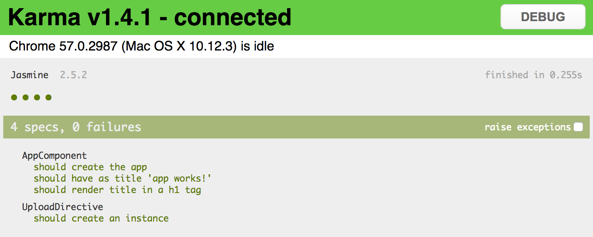
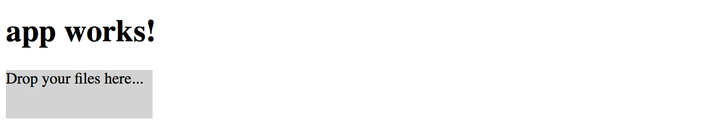
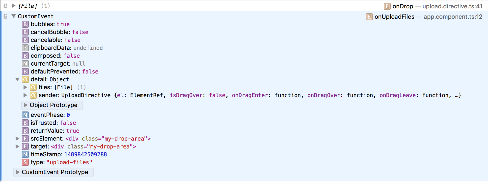
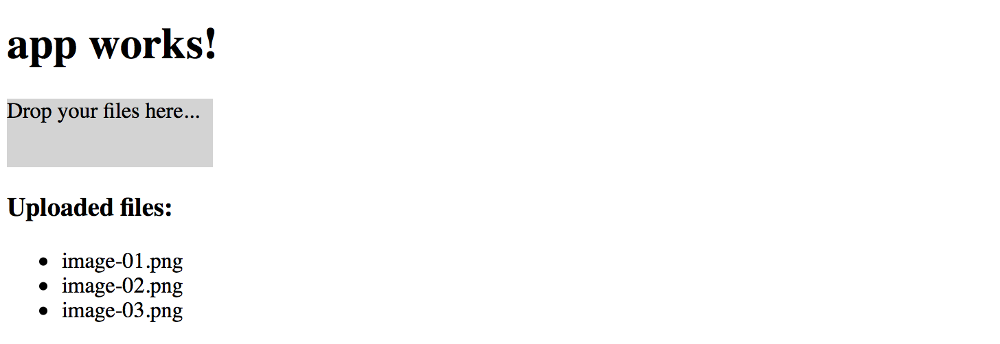

## Walkthrough: Upload Directive

In this walkthrough, we are going to create a directive that turns its host element into a drop target for files.

Our directive itself does not upload files to a server, but instead,
it is going to be responsible for detecting dropped Files and raising special DOM events.
Other parts of the application (components, directives, services) can then react on those events
and perform additional actions if needed.

Let's start by generating a new application and calling it `app-upload-directive`:

```sh
ng new app-upload-directive
cd app-upload-directive/
```

You can test application was created successfully by running it with the default browser:

```sh
ng serve --open
```

Now let's create an `upload` directive from the Angular CLI blueprint:

```sh
ng g directive directives/upload
```

The `ng` tool should put the code and unit tests into the `src/app/directives` folder,
and should also update main application module.

```text
installing directive
  create src/app/directives/upload.directive.spec.ts
  create src/app/directives/upload.directive.ts
  update src/app/app.module.ts
```

Angular CLI generates the following code for the new directive:

```ts
// upload.directive.ts

import { Directive } from '@angular/core';

@Directive({
  selector: '[appUpload]'
})
export class UploadDirective {

  constructor() { }

}
```

All application and directive tests should be working properly

```sh
ng test
```

There should be an additional test for UploadDirective class: `should create an instance`.
This test is a good starting point for unit testing your future directive.



We are going to decorate a simple `<div>` element and turn it into a file drop area.

```html
<!-- app.component.html -->

<h1>
  {{title}}
</h1>

<div class="my-drop-area">
  <span>Drop your files here...</span>
</div>
```

As it is a `<div>` element let's add some style to be able distinguishing it.
Setting fixed size and background colour should be more than enough for now.

```css
/* app.component.css */

.my-drop-area {
  width: 150px;
  height: 50px;
  background-color: lightgray;
}
```

The main application page now should look like the following:



```ts
// upload.directive.ts

import { /*...,*/ HostBinding, HostListener } from '@angular/core';

export class UploadDirective {

    @HostBinding('class.app-upload__dragover')
    isDragOver: boolean;    

}
```

Every time `isDragOver` becomes `true` the host element gets a CSS class `app-upload__dragover` applied to it.
Once it is set back to `false` the CSS class is automatically removed.

Now add the following code to the directive implementation:

```ts
// upload.directive.ts

@HostListener('dragenter')
onDragEnter() {
  this.isDragOver = true;
}

@HostListener('dragover', ['$event'])
onDragOver(event: Event) {
  if (event) {
    event.preventDefault();
  }
  this.isDragOver = true;
}

@HostListener('dragleave')
onDragLeave() {
  this.isDragOver = false;
}
```

The code above performs a simple drag management to update `isDragOver` state and so host element style.
For `dragenter` and `dragover` events we are going to enable additional styles, and disable on `dragleave`.

In order to turn host element into a drop zone you also need handling `drop` event:

```ts
// upload.directive.ts

@HostListener('drop', ['$event'])
onDrop(event: DragEvent) {
  event.preventDefault();
  event.stopPropagation();
  this.isDragOver = false;
}
```

Keep in mind that directive only adds `app-upload__dragover` class to the host element,
it does not modify element's style attributes directly.
Developers that are using your directive should be able to define look and feel of the decorated element at the application level.

Traditionally file drop areas use dashed borders when being dragged over,
let's make our element draw a thin blue border and also change background colour:  

```css
/* app.component.css */

.app-upload__dragover {
  border: 1px dashed blue;
  background-color: white;
}
```

And you need decorating `div` element with the directive to see it in action:

```html
<!-- app.component.html -->

<div class="my-drop-area" appUpload>
  <span>Drop your files here...</span>
</div>
```

The element should be changing the style when you drag a file over its area:


Now that we have `drag` events wired with element styles, it is time to implement `drop` handling.
Find the `onDrop` method we have introduced earlier and replace with the following code:

```ts
// upload.directive.ts

@HostListener('drop', ['$event'])
onDrop(event: DragEvent) {
  event.preventDefault();
  event.stopPropagation();
  this.isDragOver = false;

  const files = this.collectFiles(event.dataTransfer);
  console.log(files);
  this.onFilesDropped(files);
}
```

Once user drops files on the host element, the directive is going extract information on files from the DataTransfer instance (`collectFiles`),
and pass discovered files to the `onFilesDropped` method to raise corresponding DOM events.

> **DataTransfer**
>
> The DataTransfer object is used to hold the data that is being dragged during a drag and drop operation.
> It may hold one or more data items, each of one or more data types.
>
> For more information see [DataTransfer](https://developer.mozilla.org/en-US/docs/Web/API/DataTransfer) article.

Essentially we need to extract `File` objects into a separate collection in a safe manner:

```ts
// upload.directive.ts

private collectFiles(dataTransfer: DataTransfer): File[] {
    const result: File[] = [];

    if (dataTransfer) {
      const items: FileList = dataTransfer.files;

      if (items && items.length > 0) {
        for (let i = 0; i < items.length; i++) {
          result.push(items[i]);
        }
      }
    }

    return result;
}
```

Finally, we need to raise an `upload-files` event to allow other components handling it.
We are going to create an instance of the `CustomEvent` for that purpose.

> **CustomEvent**
>
> The CustomEvent interface represents events initialized by an application for any purpose.
>
> For more information see [CustomEvent](https://developer.mozilla.org/en-US/docs/Web/API/CustomEvent) article.

The directive also needs access to the native DOM element of the host to raise a custom event,
so importing `ElementRef` instance for the constructor is required.
Reference to the native HTML element should be injected as a constructor parameter and used as private property `el`.

```ts
// upload.directive.ts

import { /*...,*/ ElementRef } from '@angular/core';

export class UploadDirective {
    // ...

    constructor(private el: ElementRef) {}

    // ...
}
```

You need using `Element.dispatchEvent()` to raise the `upload-files` event.
As part of the `CustomEvent` interface, we can define custom `detail` value,
so that external event handlers can get additional information.

We are going to provide an object containing a list of files (`files`) the user has dropped on the host element,
and reference to the directive (`sender`) instance that raised the event.

```ts
// upload.directive.ts
private onFilesDropped(files: File[]) {
    if (files && files.length > 0) {
        this.el.nativeElement.dispatchEvent(
            new CustomEvent('upload-files', {
                detail: {
                    sender: this,
                    files: files
                },
                bubbles: true
            })
        );
    }
}
```

Note the `bubbles` property being set to `true` to enable event bubbling.
It indicates whether the given event bubbles up through the DOM or not.
In our case we allow any HTML element up the visual tree handle this event or stop its propagation.

You can get more details on custom events in the article [Creating and triggering events](https://developer.mozilla.org/en-US/docs/Web/Guide/Events/Creating_and_triggering_events).

Now it is time to handle `upload-files` event at the application level.
Open the `app.component.html` file and add `onUploadFiles` event handler like shown below:

```html
<!-- app.component.html -->

<div class="my-drop-area" appUpload (upload-files)="onUploadFiles($event)">
  <span>Drop your files here...</span>
</div>
```

Given that our event supports bubbling any element in the parent hierarchy can handle it.
You could also define the handler as following:

```html
<!-- app.component.html -->

<div (upload-files)="onUploadFiles($event)">
  <div class="my-drop-area" appUpload>
    <span>Drop your files here...</span>
  </div>
</div>
```

To see the content of the event, we are going to put the `console.log` for now:

```ts
// app.component.ts

onUploadFiles(event: CustomEvent) {
  console.log(event);
}
```

Now if you compile and run the web application, and drop one or multiple files on the drop are,
the console output should be similar to the following one:



As you may see from the picture above, the handler is getting `CustomEvent` that holds `details` value
with a `File` collection, reference to the directive instance, and several standard properties.

Let's try adding some visualization and display a list of previously uploaded files on the main page.
Append the following HTML to the `app.component.html` file content:

```html
<!-- app.component.html -->
<!-- ... -->

<div>
    <h3>Uploaded files:</h3>
    <ul>
      <li *ngFor="let file of uploadedFiles">
        {{file}}
      </li>
    </ul>
</div>
```

List element binds to the `uploadedFiles` collection holding uploaded file names.
The `upload-files` event handler just collects the file names and fills the collection.

```ts
// app.component.ts

export class AppComponent {
    // ...
    uploadedFiles: string[] = [];

    onUploadFiles(event: CustomEvent) {
        console.log(event);
        const files: File[] = event.detail.files;
        if (files) {
            for (const file of files) {
                this.uploadedFiles.push(file.name);
            }
        }
    }
}
```

Now run your web application or switch to the browser if running the live development server,
and try dropping one or multiple files several times.
You should see file names appear in the list below the drop area like shown on the picture below:



> **Source Code**
>
> You can find the source code in the **[angular/directives/app-upload-directive](https://github.com/DenysVuika/developing-with-angular/tree/master/angular/directives/app-upload-directive)** folder.

When working on your Angular web application, you may want some other component or service handle the `upload-files` event
and perform actual uploading to a backend server, preferably by utilizing the injectable service.

It is always a good practice splitting functionality into small interchangeable building blocks, each doing one thing at a time.
