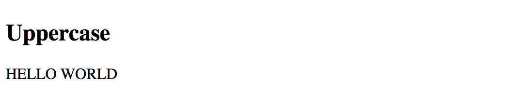

# Pipes

Pipes transform template data into display values at runtime.

There are many cases when you may want to perform minor changes to the values that users see when the application is running.
Text transformation is an excellent example.

Imagine that you need to display a text label or field in the upper case, regardless of how the user originally typed it.
You can do that with the help of CSS by wrapping the text into some HTML element with style or class applied.

Alternatively, you can use the `UpperCasePipe`, a built-in Angular pipe that transforms text values to upper case.

Pipes have the following usage formats:

```html
<element>{{ <expression> | <pipe> }}</element>
<element [propertyName]="<expression> | <pipe>"></element>
```

You append the name of the pipe to the expression separating them with the **pipe operator** ( | ).

Let's now build a quick example to see the `UpperCasePipe` in action:

```html
<h2>Uppercase</h2>
<div>
  {{'Hello world' | uppercase }}
</div>
```

The `Hello world` example above renders to the following result at runtime:



No matter how you define the text value, for instance, "hEllo worlD" or "hello WOLRD",
it is going to be `uppercased` when the application runs.

> **Source Code**
>
> You can find the source code in the **[angular/pipes/standard-pipes](https://github.com/DenysVuika/developing-with-angular/tree/master/angular/pipes/standard-pipes)** folder.
