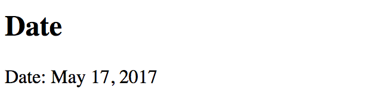
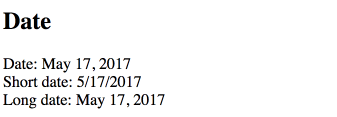

## Pipes with Parameters

The pipes in Angular can also have input parameters. That allows passing options to pipes is they support multiple output transformations.
You define pipe parameters by appending a **colon** (**:**) symbol to the pipe name followed by the parameter value:

```html
<element>{{ <expression> | <pipe>:<parameter> }}</element>
```

It is also possible to provide multiple parameters given the pipe supports that.
In this case you are going to separate all values by a **colon** ( **:** ) symbol, for example:

```html
<element>
  {{ <expression> | <pipe>:<parameter-1>:<parameter-2>:<parameter-N> }}
</element>
```

The simplest example is date value conversion.
There are many different formats you can choose to display a date on the HTML page.

Angular provides a `DatePipe` pipe out of the box that helps you converting dates to various string representations.

Add the following `currentDate` property to the `AppComponent` class in the `app.component.ts`:

```ts
// ...

export class AppComponent {
    // ...

    currentDate: number = Date.now();
}
```

The property holds the current date value evaluated with the `Date.now()` function.
You can take the next HTML template to display the date:

```html
<h2>Date</h2>
<div>
    Date: {{ currentDate | date }}
</div>
```

We transform `currentDate` value with a `DatePipe` pipe using default parameters.
If you run the application right now the output should be similar to the following one:



Note that the value of the date depends on your current date.

Typically you may want to render dates in short or long forms, or even with a custom format.
For that purpose the `DatePipe` in Angular supports `format` parameter to fine-tune the resulting output.

Let's add two more examples to the page:

```html
<div>
  Short date: {{ currentDate | date:'shortDate' }}
</div>

<div>
  Long date: {{ currentDate | date:'longDate' }}
</div>
```


