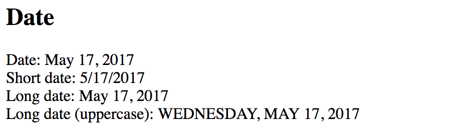

## Chaining Pipes

You can use multiple value transformations by chaining pipes together.
The pipes are combined by utilizing the same **pipe operator** ( **|** ),
and every pipe can optionally have own properties to alter its behavior.

```html
<element>{{ <expression> | <pipe-1> | <pipe-2> | <pipe-N> }}</element>
```

The simple use case to demonstrate the chaining is using `Date` and `Uppercase` pipes at the same time.

Append the following code to the main application template:

```html
<div>
  Long date (uppercase): {{ currentDate | date:'fullDate' | uppercase }}
</div>
```

The main page now looks like below:



So you can have quite powerful combinations of pipes transforming your data values as you need them to be.
