## Built-in Pipes

Angular provides a set of handy pipes out of the box.
All of them can save your time and significantly reduce coding efforts related to values transformation and formatting.

You can notice that many pipes have similar usage format, so it should be pretty easy to remember most of the use cases.
Let's start with simple pipes and proceed to more complex by the end of this chapter.

### UpperCase

The `UpperCasePipe` pipe transforms text to upper case and has the following usage format:

```html
<element>
  {{ <string_expression> | uppercase }}
</element>
```

You can use it with text expressions inside HTML element body or property binding:

```html
<h2>Uppercase</h2>
<ul>
  <li>'Hello world' => {{ 'Hellow world' | uppercase }}</li>
</ul>
```

You can see the result of the rendering below:

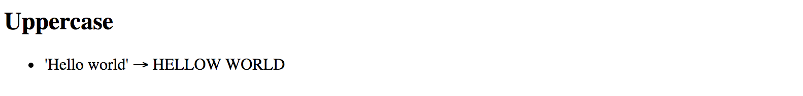

This pipe does not have any additional parameters.

### LowerCase

The `LowerCasePipe` pipe transforms text to lower case and has the following usage format:

```html
<element>
  {{ <string_expression> | lowercase }}
</element>
```

Here's the basic example of using `LowerCasePipe` in practice:

```html
<h2>Lowercase</h2>
<ul>
  <li>'hELLO wORLD' => {{ 'hELLO wORLD' | lowercase }}</li>
</ul>
```

Which gives you the following result once application runs:

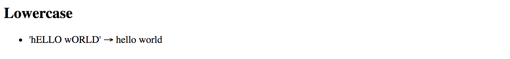

This pipe does not have any additional parameters.

### TitleCase

The `TitleCasePipe` converts input text to the title case.
That means that first character gets converted to upper case while the rest of the string becomes lowercased.

```html
<element>
  {{ <text_expression> | titlecase }}
</element>
```

Converting to title case becomes handy when dealing with usernames.

Your application may have an input form, like a personal profile, where users can enter their first and last names for instance.
Regardless of the actual value, whether it is "john" or "jOHN", you can render it like a "John" at run time:

```html
<h2>Titlecase</h2>
<ul>
  <li>'jOHN' => {{ 'jOHN' | titlecase }}</li>
</ul>
```

That turns into the following once your application runs:

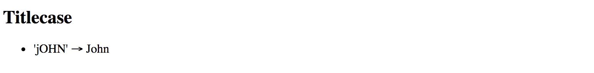

This pipe does not have any additional parameters.

### Date

You have already seen the `DatePipe` usage earlier in this chapter.
This pipe allows you to format a date value using a custom or one of the predefined locale rules.

```html
<element>
  {{ <date_expression> | date[:format] }}
</element>
```

Where `date_expression` is date represented by an `object`, a `number` holding amount of milliseconds since UTC epoch,
an [ISO string](https://www.w3.org/TR/NOTE-datetime), or a function or method call evaluating to these values at run time.

#### Custom formatting rules

According to the Angular documentation you can provide a custom date format based on the following rules:

| Component | Symbol | Narrow | Short | Long | Numeric | 2-digit |
| :--- | :---: | :---: | :---: | :---: | :---: | :---: |
| era | G | G (A) | GGG (AD) | GGGG (Anno Domini) | --- | --- |
| year | y | --- | --- | --- | y (2015) | yy (15) |
| month | M | L (S) | MMM (Sep) | MMMM (September) | M (9) | MM (09) |
| day | d | --- | --- | --- | d (3) | dd (03) |
| weekday | E | E (S) | EEE (Sun) | EEEE (Sunday) | --- | --- |
| hour | j | --- | --- | --- | j (13) | jj (13) |
| hour12 | h | --- | --- | --- | h (1 PM) | hh (01 PM) |
| hour24 | H | --- | --- | --- | H (13) | HH (13) |
| minute | m | --- | --- | --- | m (5) | mm (05) |
| second | s | --- | --- | --- | s (9) | ss (09) |
| timezone | z | --- | --- | z (Pacific Standard Time) | --- | --- |
| timezone | Z | --- | Z (GMT-8:00) | --- | --- | --- |
| timezone | a | --- | a (PM) | --- | --- | --- |

As you can see from the table above, there may be plenty of different combinations depending on how you want a date and time presented.
If you want to get a year portion as a full 4-digit value you are going to take `y` symbol (`2017`), or `yy` for a 2-digit only (`17`).
Some of the date components support multiple presentations.

Assuming your browser is set to `en-UK` locale, for example,
you can display `September` month as `S` using its narrow form via `L` symbol,
short form `Sep` using `MMM` symbol, long `September` form with `MMMM`, or numeric forms `9`
and double-digit `09` by means of `M` and `MM` symbols respectively.

Note that you can use any other symbol as a date component separator, for instance:

- dd/MM/yy => 13/04/79
- dd-MM-yy => 13-04-79
- dd=MM=yy => 13=04=79

Here's a basic example you can try with the main application component:

```ts
export class AppComponent {
  // ...
  
  birthday = new Date(1879, 3, 14);
}
```

```html
<h2>Date (custom formats)</h2>
<ul>
  <li>{{'1879-03-14' | date:'yMMMdjms'}}</li>
  <li>dd/MM/yy: {{ birthday | date:'dd/MM/yy' }}</li>
  <li>EEE, MMMM dd, yyyy: {{ birthday | date:'EEE, MMMM dd, yyyy' }}</li>
</ul>
```

The result should be something like the following:

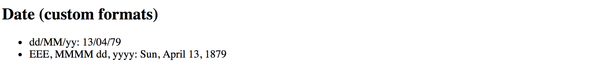

The `Date` pipe is going to use the end user's locale when formatting time zones.
Note that when you use an [ISO string](https://www.w3.org/TR/NOTE-datetime) with no time portion,
for example, `1879-03-14`, the pipe does not apply time zone offset.

```html
<element{{'1879-03-14' | date:'yMMMdjms'}}</element>
<!-- Mar 14, 1879, 12:00:00 AM -->
```

> **Internationalisation API**
>
> This pipe is using Internationalisation API that may not be fully supported by all modern browsers.
> You can use [Polyfill.io](https://cdn.polyfill.io/v2/docs/) service
> to get the `Intl` polyfill only if your user's current browser needs it.
>
> Also, you can see details and additional options at the project side: [Intl.js](https://github.com/andyearnshaw/Intl.js/)

#### Predefined formatting rules

The `DatePipe` pipe comes with the following predefined rules to help you formatting the dates:

| Name | Value | Example output (`en-UK`) |
| --- | --- | --- |
| medium | yMMMdjms | `Apr 13, 1879, 11:00:00 PM` |
| short | yMdjm | `4/13/1879, 11:00 PM` |
| fullDate | yMMMMEEEEd | `Sunday, April 13, 1879` |
| longDate | yMMMMd | `April 13, 1879` |
| mediumDate | yMMMd | `Apr 13, 1879` |
| shortDate | yMd | `4/13/1879` |
| mediumTime | jms | `11:00:00 PM` |
| shortTime | jm | `11:00 PM` |

You can use the following HTML template and corresponding component property `birthday` to test all the rules:

```html
<h2>Date (predefined formats)</h2>
<ul>
  <li>medium: {{ birthday | date:'medium' }}</li>
  <li>short: {{ birthday | date:'short' }}</li>
  <li>fullDate: {{ birthday | date:'fullDate' }}</li>
  <li>longDate: {{ birthday | date:'longDate' }}</li>
  <li>mediumDate: {{ birthday | date:'mediumDate' }}</li>
  <li>shortDate: {{ birthday | date:'shortDate' }}</li>
  <li>mediumTime: {{ birthday | date:'mediumTime'}}</li>
  <li>shortTime: {{ birthday | date:'shortTime' }}</li>
</ul>
```

```ts
export class AppComponent {
  // ...
  
  birthday = new Date(1879, 3, 14);
}
```

So that should give you the following result at run time:

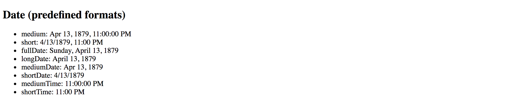

## Decimal

The `DecimalPipe` pipe formats a number as text, taking into account user's locale and optionally custom display format.

The usage format of the pipe is as follows:

```html
<element>
  {{ <number_expression> | number[:digitFormat] }}
</element>
```

Where the `digitFormat` value is represented by the following formatting rule:

```text
minIntegerDigits.minFractionDigits-maxFractionDigits
```

| Component | Default Value | Description |
| --- | :---: | --- |
| minIntegerDigits | 1 | Minimum number of digits to use when converting to text. |
| minFractionDigits | 0 | Minimum number of digits after fraction. |
| maxFractionDigits | 3 | Maximum number of digits after fraction. |

> **Minimum Numbers**
>
> By setting the minimum numbers like `minIntegerDigits` and `minFractionDigits`, you enforce resulting value to have a certain size.
> The pipe automatically adds leading or trailing zeros if the actual value is less than expected.
>
> For example applying a minimum number of `3` to the value `1` results in `003` text rendered by the pipe.

Let's now see how this pipe works in practice.
Open existing or create a new Angular application and put the following block to the main application component template:

```html
<h2>Decimal (12.123456)</h2>
<ul>
  <li>number => {{ 12.123456 | number }}</li>
  <li>number:'2.1-2' => {{ 12.123456 | number:'2.1-2' }}</li>
  <li>number:'3.0-0' => {{ 12.123456 | number:'3.0-0' }}</li>
  <li>number:'3.10-15' => {{ 12.123456 | number:'3.10-15' }}</li>
</ul>
```

The example above renders to the following:

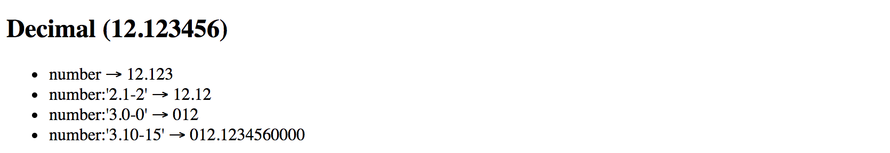

Please note the last case in the example above.
It demonstrates how leading, and trailing zeros get added to the output based on conditions.

> **Internationalization API**
>
> This pipe is using Internationalization API that may not be fully supported by all modern browsers.
> You can use [Polyfill.io](https://cdn.polyfill.io/v2/docs/) service to get the `Intl` polyfill only if your user's current browser needs it.
>
> Also, you can see details and additional options at the project side: [Intl.js](https://github.com/andyearnshaw/Intl.js/)

### Currency

The `CurrencyPipe` pipe formats a number as a currency text, taking into account user's locale and optionally custom display format.

You can use this pipe with three optional parameters by utilizing the following format:

```html
<element>
  {{ <number_expression> | currency[:code[:symbol[:digitFormat]]] }}
</element>
```

The `code` is a parameter of `string` type that refers to [ISO 4217](https://en.wikipedia.org/wiki/ISO_4217) currency code.
For example, you can use `GBP` for the Great Britain Pound Sterling, or `USD` for United States Dollar.

The `symbol` parameter holds `boolean` value to indicate whether pipe needs to render currency symbol like £ or just use the currency code value, in this case, `GBP`.
This parameter defaults to `false` and `CurrencyPipe` is going to use currency codes if `symbol` parameter is not defined explicitly.

Finally, the `digitFormat` value is the same as of the `DecimalPipe`, and is represented by the following formatting rule:

```text
minIntegerDigits.minFractionDigits-maxFractionDigits
```

| Component | Default Value | Description |
| --- | :---: | --- |
| minIntegerDigits | 1 | Minimum number of digits to use when converting to text. |
| minFractionDigits | 0 | Minimum number of digits after fraction. |
| maxFractionDigits | 3 | Maximum number of digits after fraction. |

> **Minimum Numbers**
>
> By setting the minimum numbers like `minIntegerDigits` and `minFractionDigits`, you enforce resulting value to have a certain size.
> The pipe automatically adds leading or trailing zeros if the actual value is less than expected.
>
> For example applying a minimum number of `3` to the value `1` results in `003` text rendered by the pipe.

Below is a set of examples to demonstrate the pipe in action:

```html
<h2>Currency</h2>
<ul>
  <li>GBP (code): {{ 150 | currency:'GBP' }}</li>
  <li>GBP (symbol): {{ 150 | currency:'GBP':true }}</li>
  <li>USD: {{ 0.9876 | currency:'USD':true:'2.2-2' }}</li>
</ul>
```

Once your application starts you should see the following output:

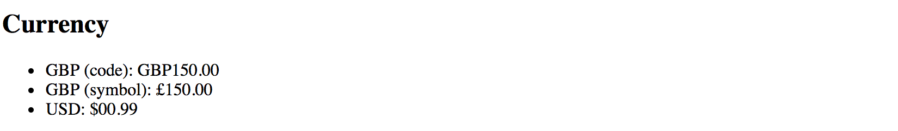

> **Internationalization API**
>
> This pipe is using Internationalization API that may not be fully supported by all modern browsers.
> You can use [Polyfill.io](https://cdn.polyfill.io/v2/docs/) service to get the `Intl` polyfill only if your user's current browser needs it.
>
> Also, you can see details and additional options at the project side: [Intl.js](https://github.com/andyearnshaw/Intl.js/)

### Percent

The `PercentPipe` formats a number input as a percentage, where "1" corresponds to "100%",
and "0.5" for instance corresponds to "50%".
This pipe also takes into account user's locale and allows you to customize resulting numeric format if needed.

The usage format is similar to that of the `DecimalPipe`, `CurrencyPipe`
and many other number-based pipes Angular provides out of the box:

```html
<element>
  {{ <number_expression> | percent[:digitFormat] }}
</element>
```

Where the `digitFormat` value is represented by the following formatting rule:

```text
minIntegerDigits.minFractionDigits-maxFractionDigits
```

| Component | Default Value | Description |
| --- | :---: | --- |
| minIntegerDigits | 1 | Minimum number of digits to use when converting to text. |
| minFractionDigits | 0 | Minimum number of digits after fraction. |
| maxFractionDigits | 3 | Maximum number of digits after fraction. |

> **Minimum Numbers**
>
> By setting the minimum numbers like `minIntegerDigits` and `minFractionDigits`, you enforce resulting value to have a certain size.
> The pipe automatically adds leading or trailing zeros if the actual value is less than expected.
>
> For example applying a minimum number of `3` to the value `1` results in `003` text rendered by the pipe.

Now create a new Angular project or open an existing one and append the following block to the main application component template:

```html
<h2>Percent</h2>
<ul>
  <li>1.0 equals to {{ 1.0 | percent }}</li>
  <li>0.5 equals to {{ 0.5 | percent }}</li>
  <li>0.123456 equals to {{ 0.123456 | percent }}</li>
</ul>
```

If you run the application with the code above you should see the following output:


Notice that by default `PercentPipe` displays three digits after the fraction, so `0.123456` gets rounded and shown as `12.346`.

As with other number conversion pipes, you are also able to control how `PercentPipe` displays digits after fraction.
For example, let's make the transformed output more precise and render five numbers instead of the default three:

```html
<h2>Percent</h2>
<ul>
  <li>0.123456 corresponds to {{ 0.123456 | percent:'1.1-5' }}</li>
</ul>
```

This time we should see the full number as we define it initially, and without rounding:

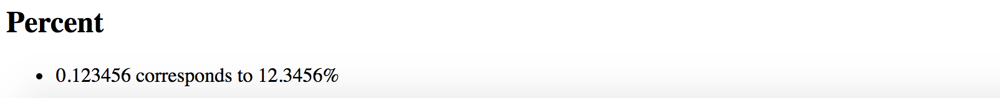

It is also possible to add leading zero to the final output by putting a minimum threshold for the number of digits:

```html
<h2>Percent</h2>
<ul>
  <li>0.025 corresponds to {{ 0.025 | percent:'2.1' }}</li>
</ul>
```

The example above shows how to force `PercentPipe` always to use two numbers during conversion,
so you are going to get a leading zero for small values.

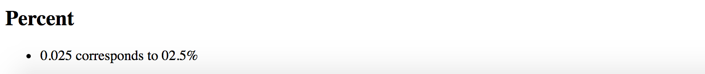

> ## Internationalization API
>
> This pipe is using Internationalization API that may not be fully supported by all modern browsers.
> You can use [Polyfill.io](https://cdn.polyfill.io/v2/docs/) service to get the `Intl` polyfill only if your user's current browser needs it.
>
> Also, you can see details and additional options at the project side: [Intl.js](https://github.com/andyearnshaw/Intl.js/)

### Json

The `JsonPipe` pipe often helps with debugging your Angular code.
Its main purpose is converting JavaScript objects into JSON strings.

```html
<element>
  {{ <object_expression> | json }}
</element>
```

You are going to use this pipe if you want to peek inside a payload or response object coming from HTTP service call for instance.
Let's start by adding a `complexObject` property to the main application component:

```ts
export class AppComponent {
  // ...

  complexObject = {
    name: {
      firstName: 'Joan',
      lastName: 'Doe'
    },
    email: 'joan.doe@mail.com'
  };
  
}
```

As you see the property holds a User object with some nested properties. You can now render it using the `JsonPipe` pipe as below:

```html
<h2>Json</h2>
<pre>{{ complexObject | json }}</pre>
```

That gives you the following output once application reloads:

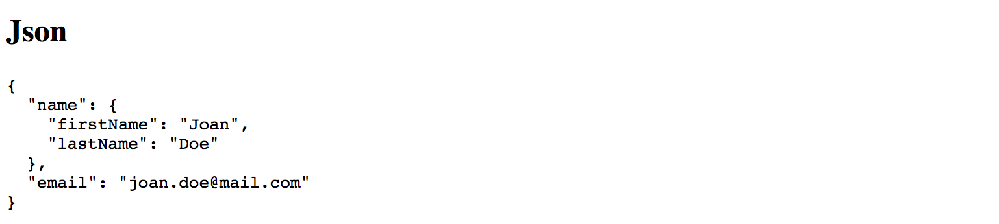

This pipe does not have any additional parameters.

### Slice

The `SlicePipe` pipe extracts a section of a string or array into a new object.
It performs a selection from a "begin" to an `end` index where the `end` does not get included in the resulting set.
Note that the original string or array is not modified.

> **Slice Behavior**
>
> The implementation of this pipe is based on the standard [Array.prototype.slice()](https://developer.mozilla.org/en/docs/Web/JavaScript/Reference/Global_Objects/Array/slice)
> method for JavaScript Arrays, and [String.prototype.slice()](https://developer.mozilla.org/en/docs/Web/JavaScript/Reference/Global_Objects/String/slice) method for
> JavaScript Strings.
>
> If needed, please refer to the corresponding API documentation for more details on how `slice` gets performed.

#### Using with Arrays

The format when using the pipe with arrays and collections is the following:

```html
<element>
  {{ array_expression | slice:begin[:end] }}
</element>
```

First, add an initial collection of numbers to the main application component class, to be able testing the pipe:

```ts
// ...
export class AppComponent {
  // ...
  
  numberCollection = [0, 1, 2, 3, 4, 5, 6];
}
```

As the next, try displaying first three items from the array by setting `begin` index to `0`
to point to the start of the collection, and the `end` index to 3.

```html
<h2>Slice (arrays)</h2>
<ul>
  <li>
    First 3 items:
    <ul>
      <li *ngFor="let num of numberCollection | slice:0:3">{{num}}</li>
    </ul>
  </li>
</ul>
```

Given the ending index is not included, the resulting subset should have the following items rendered: 0, 1, 2

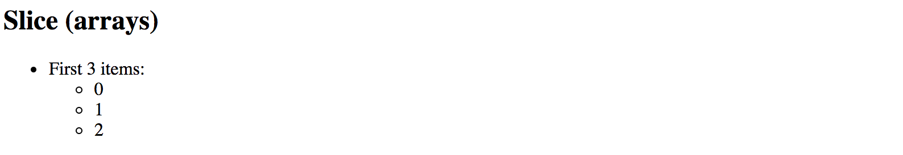

You can also count items from the end of the array. For this purpose, you are going to use negative values for the `start` option.
For example value `3` signals the pipe to start taking items from the third position from the beginning. 
Using value `-3` makes the pipe count items from the end of the array. 

Let's now try negative values in action and display last 3 items from the numbers collection:

```html
<h2>Slice (arrays)</h2>
<ul>
  <li>
    Last 3 items:
    <ul>
      <li *ngFor="let num of numberCollection | slice:-3">{{num}}</li>
    </ul>
  </li>
</ul>
```

This time we do not need to specify the `end` index as we are going to take
all array values starting with the third one from the end.

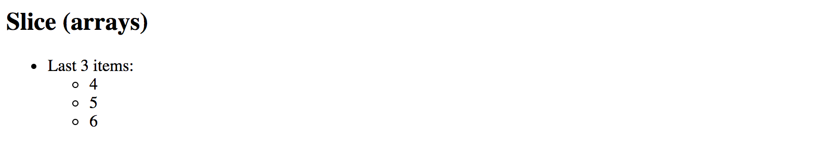

Feel free to experiment with `start` and `end` index values more
to see how `SlicePipe` works with arrays depending on your conditions.

#### Using with Strings

The format when using the pipe with strings is identical to that of the arrays.
The `SlicePipe` pipe treats strings as arrays of characters,
so you can apply the same `begin` and `end` parameters as you did earlier.

```html
<element>
  {{ string_expression | slice:begin[:end] }}
</element>
```

Let's test this pipe with the "Hello world!" string and extract the first word:

```html
<h2>Slice (strings)</h2>
<ul>
  <li>
    First word of 'Hello world!':
    {{ 'Hello world!' | slice:0:5 }}
  </li>
</ul>
```

Upon application start, you should see that pipe successfully transformed the string value and rendered only the word "Hello".

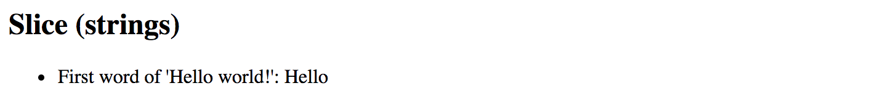

We can also take the last word by using negative number for the `begin` parameter value:

```html
<h2>Slice (strings)</h2>
<ul>
  <li>
    Last word of 'Hello world!':
    {{ 'Hello world!' | slice:-6:-1 }}
  </li>
</ul>
```

You should see the word "world" rendered by the pipe as soon as your application reloads.

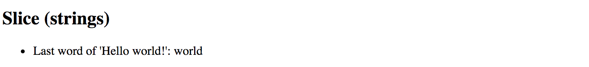

Note that we use `-1` for the `end` value because sentence ends with an exclamation mark
that we want to exclude from the final output.
Otherwise, you can omit the `end` setting entirely and leave just `-6` for the `start` value.

### I18nSelect

For the time being the `I18nSelectPipe` is an experimental pipe that allows you
to render different strings from the object depending on the input value.

> **Experimental**
>
> Please note that this pipe is an experimental one and its functionality may change.
> We are going to update this section with new features for the `I18nSelectPipe` if they appear,
> or remove this warning if the pipe gets updated to the stable state.

The usage format for this pipe is the following:

```html
<element>
  {{ <expression> | i18nSelect:mapping }}
</element>
```

The `mapping` is an object literal with properties.

To see that in action you need to create two properties `titleMode` and `titleValues`.
The `titleMode` property should be responsible for different title rendering modes,
while `titleValues` contains different values for title content.

```ts
export class AppComponent {
  titleMode = 'primary';
  titleValues = {
    primary: 'This is a primary title',
    secondary: 'This is a secondary title',
    other: 'This is an alternative title'
  };
}
```

Now we can wire both properties together in the component HTML template as below:

```html
<h2>I18nSelect</h2>
<ul>
  <li>{{ titleMode | i18nSelect:titleValues }}</li>
</ul>
```

Based on settings above there are four different values you can see on the screen at runtime:

- `titleValues.primary` if `titleMode` property value equals to `primary`;
- `titleValues.secondary` if `titleMode` property value equals to `secondary`;
- `titleValues.other` as a fallback value if `titleMode` does not contain any of the values above;
- empty string, if `titleValues` object literal does not have `other` property defined, and `titleMode` contains "unknown" value;

Given that by default `titleMode` property value is set to `primary`,
you should see the following content once the application starts:

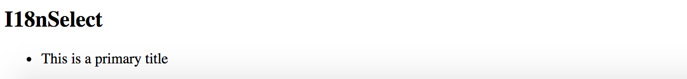

Now try changing the value of the `titleMode` property to `secondary` like in the example below:

```ts
export class AppComponent {
  
  titleMode = 'secondary';
  
  // ...
}
```

This time `I18nSelectPipe` is going to select and display `titleValues.secondary` value:

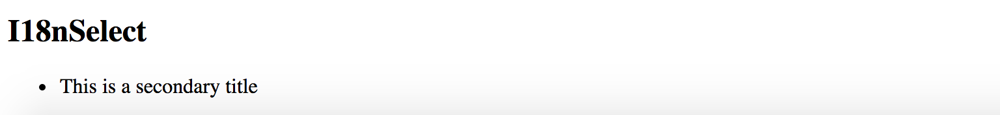

For the next experiment, let's try setting `titleMode` to something `titleValues` does not contain a property for.
For example, change the value to a "something else" string.

```ts
export class AppComponent {
  
  titleMode = 'something else';
  
  //...
}
```

As soon as your page reloads you can see that `I18nSelectPipe` this time takes the `titleMode.other` content as a fallback value.

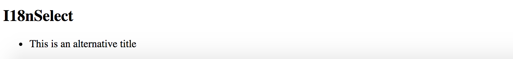

Another good scenario for `I18nSelectPipe` is rendering text that gets adopted to some input criteria,
for instance, `gender` value of the current user can be a good example:

```ts
export class AppComponent {
  gender: string = 'male';
  inviteMap: any = {
    'male': 'Invite him.', 
    'female': 'Invite her.', 
    'other': 'Invite them.'
  };
}
```

Your component may display different user interface and content based on the `gender` value at run time.

Finally, you an use the `I18nSelectPipe` pipe for localising text, the `i18n` prefix in its name stands for `internationalization`.
Imagine you are implementing a colour picker button component, and you need to support multiple languages.
You can easily split the translation support into two pieces: `currentLanguage` property holding currently used language code
and a `buttonLabels` object containing all supported translations.

Let's see that in practice by providing tree "Pick colour" labels translated into
British English (`en-GB`), American English (`en-US`) and Ukrainian (`uk`).
For all other languages that our component does not support out of the box,
we are going to use `en-GB` locale via `other` property as a fallback option.

```ts
export class AppComponent {
  currentLanguage = 'en-GB';
  buttonLabels = {
    'en-US': 'Pick a color',
    'en-GB': 'Pick a colour',
    'uk': 'Вибрати колiр',
    'other': 'Pick a colour'
  };
}
```

Now switch to the HTML template of your application component or any other component
you are using for testing purposes, and add the following content:

```html
<h2>I18nSelect</h2>
<ul>
  <li>
    <button>{{ currentLanguage | i18nSelect:buttonLabels }}</button>
  </li>
</ul>
```

You should see the `en-GB` translation by default as per `currentLanguage` property value we set earlier:

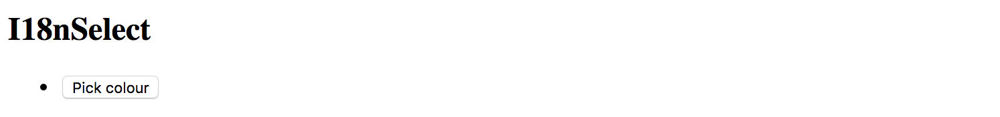

Now if you change the `currentLanguage` to "uk" code the button should have the following content rendered by `I18nSelectPipe`:

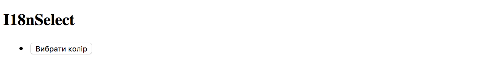

Finally, if you change your `currentLanguage` property value to something
that is not supported by default, like "fr" or "it" for instance,
the pipe is going to switch to the "other" value at run time.

### I18nPlural

This pipe helps you with pluralizing your string values based on a number input value and optionally taking into account the current user's locale.

> **Experimental**
>
> Please note that this pipe is an experimental one and its functionality may change.
> We are going to update this section with new features for the `I18nPluralPipe` if they appear,
> or remove this warning if the pipe gets updated to the stable state.

The usage format for the `I18nPluralPipe` is as following:

```html
<element>
  {{ <number_expression> | i18nPlural:mapping }}
</element>
```

The `mapping` is an object literal with properties, represented in TypeScript
by a dictionary containing key/value pairs of a string type.

Let's imagine we have a list of posts to render on the page.
Each post may also contain comments, so we are also going to show a list of comment instances in a user-friendly manner.

Create a new application with Angular CLI or open an existing one,
and append the following content to the main application controller:

```ts
export class AppComponent {
  // ...
  
  posts = [
    {
      content: 'Post 1 content',
      commentsCount: 0,
    },
    {
      content: 'Post 2 content',
      commentsCount: 1
    },
    {
      content: 'Post 3 content',
      commentsCount: 10
    }
  ];
}
```

We have a collection of three simple posts with comment counters as `commentsCount` properties holding different number values.

There are at least three different cases for display value formatting in our case:

- 0 comments: special message for zero values
- 1 comment: singular form of the message
- 2+ comments: plural form of the message

Now let's create a mapping dictionary to hold string values for all the use cases above:

```ts
export class AppComponent {
  // ...

  commentLabels: { [key: string]: string } = {
    '=0': 'There are no comments for this post.',
    '=1': 'There is one comment for this post.',
    'other': 'There are # comments for this post.'
  };
}
```

Finally we are ready to see `I18nPluralPipe` in action.
Append the following HTML to the component template:

```html
<h2>I18nPluralPipe</h2>
<ul>
  <li *ngFor="let post of posts">
    {{ post.content }}
    <ul>
      <li>{{ post.commentsCount | i18nPlural: commentLabels }}</li>
    </ul>
  </li>
</ul>
```

So this is how the output result should look like when the application starts:

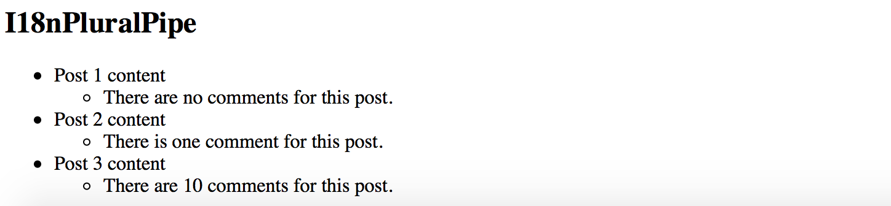

### Async

The `AsyncPipe` pipe subscribes to an instance of a `Promise` or `Observable`
and transforms the underlying value upon every change.

```html
<element>
  {{ <expression> | async }}
</element>
```

The `expression` can take a value of either `Observable` or a `Promise` type.

> **Unsubscribing**
>
> When the component gets destroyed, the async pipe unsubscribes automatically to avoid potential memory leaks.

#### Using with NgFor directive

Let's try to display a list of comments based on an `Observable`.
First, create a `comments` property in your application component class:

```ts
export class AppComponent {
  // ...
  
  comments: Observable<string[]>;
}
```

We are going to render an unordered list of comments; we also need a button to fetch comments from the server
and update `comments` observable with new values.

Open the HTML template of the main application component and append the following:

```html
<h2>Async</h2>
<ul>
  <li *ngFor="let comment of comments | async">
    {{ comment }}
  </li>
</ul>
<button (click)="checkComments()">Check comments</button>
```

For the sake of simplicity, we are not going to make any HTTP calls on the `checkComments` call.
Let's just return a predefined set of comments after a short delay to emulate delays with a response.

```ts
export class AppComponent {
  // ...
  
  comments: Observable<string[]>;

  checkComments() {
    this.comments = new Observable(observer => {
      observer.next([
        'Comment 1',
        'Comment 2',
        'Comment 3'
      ]);
    }).delay(1000);
  }
}
```

The `checkComments` method sets `comments` variable value to an observable that evaluates with 1-second delay
and returns a set of sample comments.

For testing purposes you can also add a button to reset comments:

```html
<button (click)="resetComments()">Reset comments</button>
```

The corresponding `resetComments` method is going to just set the `comments` value to `null`.

```ts
export class AppComponent {
  // ...
  
  resetComments() {
    this.comments = null;
  }
}
```

If you now run the application the main page should look like the following:

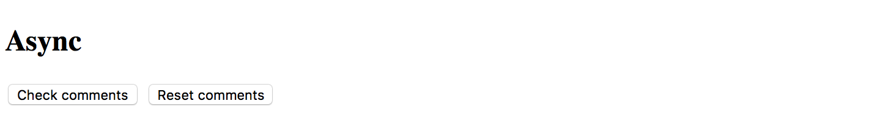

Try clicking the `Check comments` button and the results should get displayed in 1 second:

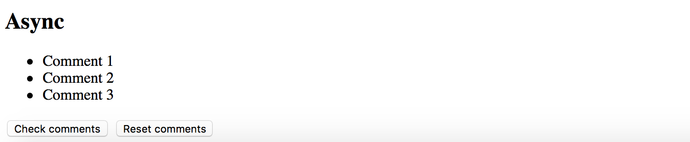

#### Using with Date object

Another good example to demonstrate the `AsyncPipe` in action is  displaying current time on the page.
Our component needs to implement standard `OnInit` interface to setup `currentTime` observable once it is ready.

```ts
import { /*...,*/ OnInit } from '@angular/core';

export class AppComponent implements OnInit {
  // ...

  currentTime: Observable<Date>;

  ngOnInit() {
    this.currentTime = new Observable<Date>(observer => {
      setInterval(_ => observer.next(new Date()), 1000);
    });
  }
}
```

Upon initialization, the component assigns an `Observable` of `Date` type to the `currentTime` property.
The Observable instance updates the underlying value to a new `Date` object every second,
that causes `AsyncPipe` to render new date automatically.

As Angular allows chaining multiple pipes together, you can also use a `DatePipe` to format resulting output
to display only the time portion of the date.

You can get the basic HTML template for the application component below:

```html
<h2>Async (date/time)</h2>
<ul>
  <li>
    Current time: {{ currentTime | async | date:'mediumTime' }}
  </li>
</ul>
```

Once application compiles and starts you should get a time value updated every second:

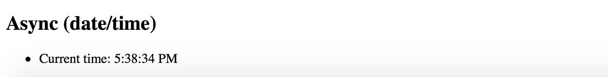

> **Source Code**
>
> You can find the source code in the
> **[angular/pipes/standard-pipes](https://github.com/DenysVuika/developing-with-angular/tree/master/angular/pipes/standard-pipes)** folder.
