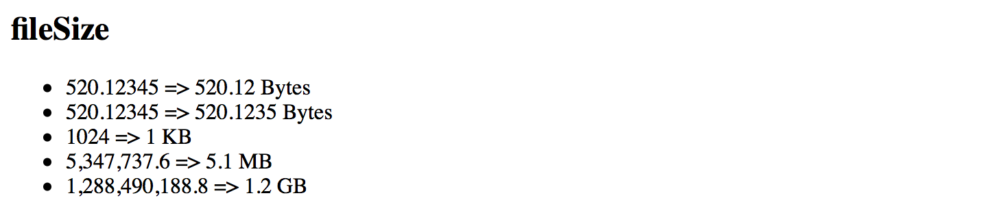

## Custom Pipes

Besides providing a set of standard out-of-box pipes the Angular framework provides support for creating your custom ones.

To create a custom pipe you need to import the `@Pipe` decorator and apply it to your class.

```ts
import { Pipe } from '@angular/core';

@Pipe({
  name: 'customDate'
})
export class CustomDatePipe {
  // ...
}
```

You can give your class any name you want.
The Angular is going to use the `@Pipe` decorator metadata when parsing component templates, in our case the pipe gets used as `customDate`:

```html
<element>
  {{ <expression> | customDate }}
</element>
```

Also, your class should implement a `PipeTransform` interface with a `transform` method:

```ts
interface PipeTransform {
  transform(value: any, ...args: any[]) : any
}
```

At runtime, the Angular calls your pipe's transform method providing original input value together with optional pipe parameters.
For example, if your `myPipe` pipe expects to receive 3 additional parameters you can declare your `transform` method like the following:

```ts
transform(value: string, p1: number, p2: number, p3: number) : string {
  return value;
}
```

To get type checking support from TypeScript, you can also provide type definitions for your parameters and method return type.

You can now use your pipe in HTML templates like in the example below:

```html
<element>
  {{ 'hello world' | myPipe:1:2:3 }}
</element>
```

### Implementing Custom Pipe

We are going to create a simple pipe that takes a numeric input value for a size of the file in bytes 
and produces a user-friendly output by transforming it to Kilobytes, Megabytes or greater units.

Let's start creating a custom pipe with a new project `custom-pipes` by utilizing the Angular CLI tool.

```sh
ng new custom-pipes
```

You can use Angular CLI to generate the `file-size` pipe scaffold.

```sh
ng g pipe pipes/file-size
```

The command above generates a pipe, basic unit test and updates main application module
so that you can use this pipe across all the application components.

```text
installing pipe
  create src/app/pipes/file-size.pipe.spec.ts
  create src/app/pipes/file-size.pipe.ts
  update src/app/app.module.ts
```

The default pipe scaffold already contains a `@Pipe` decorator applied and inherits the `PipeTransform` interface:

```ts
// src/app/pipes/file-size.pipe.ts

import { Pipe, PipeTransform } from '@angular/core';

@Pipe({
  name: 'fileSize'
})
export class FileSizePipe implements PipeTransform {

  transform(value: any, args?: any): any {
    return null;
  }

}
```

First, let's change the signature of the `transform` method to accept `bytes` and `decimals` parameters of a `number` type.
We also make both of them optional by providing default values and change the return type of the method to a `string`.

```ts
// src/app/pipes/file-size.pipe.ts

@Pipe({
  name: 'fileSize'
})
export class FileSizePipe implements PipeTransform {

  transform(bytes: number = 0, decimals: number = 2): string {
    return null;
  }

}
```

> **Converting Bytes**
>
> There are many different ways to convert a file size from bytes to other units of measurement.
>
> For this example we are going to take the accepted answer from the following Stackoverflow question:
> [Correct way to convert size in bytes to KB, MB, GB in Javascript](https://stackoverflow.com/questions/15900485/correct-way-to-convert-size-in-bytes-to-kb-mb-gb-in-javascript)

You can see the final implementation of the pipe below:

```ts
@Pipe({
  name: 'fileSize'
})
export class FileSizePipe implements PipeTransform {

  transform(bytes: number = 0, decimals: number = 2): string {
    if (bytes === 0) {
      return '0 Bytes';
    }
    const k = 1024,
       dm = decimals || 2,
       sizes = ['Bytes', 'KB', 'MB', 'GB', 'TB', 'PB', 'EB', 'ZB', 'YB'],
       i = Math.floor(Math.log(bytes) / Math.log(k));
    return parseFloat((bytes / Math.pow(k, i)).toFixed(dm)) + ' ' + sizes[i];
  }

}
```

If no `bytes` value provided the pipe returns a "0 Bytes" string,
for all other cases if converts input number to the most appropriate measuring unit.
The `transform` method also takes into account the number of decimals to use after the point,
provided within the second `decimals` parameter.
By default, it is going to take two numbers.

In order to see the pipe in action open the main application component template and append the following HTML block:

```html
<h2>fileSize</h2>
<ul>
  <li>520.12345 => {{ 520.12345 | fileSize }}</li>
  <li>520.12345 => {{ 520.12345 | fileSize:4 }}</li>
  <li>1024 => {{ 1024 | fileSize }}</li>
  <li>5,347,737.6 => {{ 5347737.6 | fileSize }}</li>
  <li>1,288,490,188.8 => {{ 1288490188.8 | fileSize }}</li>
</ul>
```

Now run the application with `ng serve --open` command and you should see the following output:


