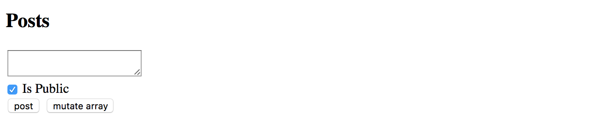

## Pure And Impure Pipes

Angular supports two different categories of pipes - "pure" and "impure".
Every custom pipe is `pure` by default, but you can change that when using the `@Pipe` decorator:

```ts
@Pipe({
  name: 'myCustomPipe',
  pure: false
})
```

Before diving into details on category differences, let's prepare the testing project.

We are going to display a list of short blog posts filtered by a `pure` or `impure` pipe
and allow creating a new simple blog post entry with various properties like creation date, content or public state.

### Preparing Project

Use Angular CLI to generate a new project called "pure-impure".

```sh
ng new pure-impure
cd pure-impure
```

As we are going to filter and display Posts let's create a `Post` interface that defines the main attributes of a Post instance.
You can do that by utilizing Angular CLI that supports generating interface classes as well.

```sh
ng g interface post
```

The Angular CLI puts interfaces classes to the `src/app` folder by default:

```text
installing interface
  create src/app/post.ts
```

The bare minimum of properties we need to visualize a post is:

- the text content of the post
- creation date
- a flag indicating whether the post is public or private

Open the newly generated `post.ts` file and update it according to the list above:

```ts
// src/app/post.ts

export interface Post {
  created: Date;
  content: string;
  isPublic: boolean;
}
```

For the next step let's update the main application component class.
We need a `posts` property to hold a collection of created `Post` instances.
Also, the `newPostContent` and `newPostPublic` properties of `string` and `boolean`
types are going to power our simple post editor.

```ts
// src/app/app.component.ts

import { Post } from './post';

@Component({/*...*/})
export class AppComponent {
  // ... 

  posts: Post[] = [];

  newPostContent = '';
  newPostPublic = true;

  createPost(): void {
    if (this.newPostContent) {
      const newPost = <Post> {
        content: this.newPostContent,
        isPublic: this.newPostPublic,
        created: new Date()
      };
      this.posts.push(newPost);
      this.newPostContent = '';
    }
  }
}
```

The `createPost` method performs some basic validation for content to be defined and creates a new post.
The creation date is assigned automatically to current date and time.
Upon pushing the new post to the `posts` collection, our `createPost` method also clears the input field.

Note that `posts` collection is defined and initialized with an empty array by default.
We add items to it via `createPost` method, but the initial collection is always the same.
To better demonstrate capabilities of both pipes we also need to change the object reference for the `posts` collection,
for example creating a new collection of Post instances, or resetting it by assigning an empty array value.

For the sake of simplicity let's just be making a copy of the existing collection and reassigning `posts` property,
all we need so far is changing the object reference.
Append the following `mutateArray` method to the main application component class:

```ts
@Component({ /*...*/ })
export class AppComponent {
  // ...

  mutateArray() {
    this.posts = this.posts.concat();
  }
}
```

Finally edit the component template and add the following HTML content:

```html
<!-- src/app/app.component.html -->

<h2>Posts</h2>
<div>
  <textarea [(ngModel)]="newPostContent"></textarea>
</div>
<div>
  <label>
    <input type="checkbox" [(ngModel)]="newPostPublic">
    Is Public
  </label>
</div>
<div>
  <button (click)="createPost()">post</button>
  <button (click)="mutateArray()">mutate array</button>
</div>

<ul>
  <li *ngFor="let post of posts">
    {{ post.content }} ({{ post.created | date:'short' }})
  </li>
</ul>
```

The layout above is pretty simple.
You get a text area element to enter a content for a new post, a checkbox to toggle the public state,
and two buttons `post` and `mutate array`.
Under the post editor there is a list of previously created posts, by default it is empty.

Once you compile and start the application you should see the following:

```sh
ng serve --open
```



Now you are ready testing `pure` and `impure` pipes in action.

### Pure Pipes

A "pure pipe" is a pipe that gets executed by Angular only when a "pure change" happens to the underlying input value, for example:

- a "primitive" value changes, for example of a `String`, `Number`, `Boolean` or other `primitive` types;
- object reference changes, for instance an entire `Array`, `Date`, `Object` and other reference-based types;

When you use a "pure pipe", the Angular ignores all changes to the complex objects it gets as input parameters for the pipe.
For example, when using with arrays, the pipe renders data if your component class initializes default collection of items.
However, the pipe does not update the view if you add new items to the collection at run time.

> **Object Reference Checks**
>
> Concerning performance and memory consumption, it is much faster for Angular to perform an object reference check
> rather than initiating a deep check for complex object differences.
>
> So "pure" pipes are extremely fast if you deal with primitives or change entire input value in your component.
> Angular change detection mechanisms take care of values and execute pipes when needed.

Let's use Angular CLI to generate our simple pure pipe and call it "public-posts".

```sh
ng g pipe pipes/public-posts
```

You should get your pipe scaffold and a basic unit test in the `src/app/pipes` folder:

```text
installing pipe
  create src/app/pipes/public-posts.pipe.spec.ts
  create src/app/pipes/public-posts.pipe.ts
  update src/app/app.module.ts
```

Edit the `public-posts.pipe.ts` according to the following example:

```ts
// src/app/pipes/public-posts.pipe.ts

import { Pipe, PipeTransform } from '@angular/core';
import { Post } from '../post';

@Pipe({
  name: 'publicPosts'
})
export class PublicPostsPipe implements PipeTransform {

  transform(posts: Post[]): any {
    return posts.filter(p => p.isPublic);
  }

}
```

Essentially the pipe takes a collection of `Post` instances as an input parameter `posts`
and returns a filtered result using `isPublic` property.

> **Pipe Name**
>
> Note that your pipe's public name is going to be `publicPosts`.
> You can give the component class any name you want, in our case, it is `PublicPostsPipe`,
> but Angular is going to use `@Pipe` metadata when parsing component templates.

Now let's add a couple of initial posts for our pipe to filter at run time:

```ts
@Component({ /*...*/ })
export class AppComponent {

  posts: Post[] = [
    <Post> { 
      content: 'default public post', 
      isPublic: true, 
      created: new Date() 
    },
    <Post> { 
      content: 'default private post', 
      isPublic: false, 
      created: new Date() 
    }
  ];

}
```

The first post is going to be public while the second one is configured to be private by default.

For the next step, please update the application component template to show the `posts` collection,
filtered by our `publicPosts` pipe, in a separate unstructured list element.

```html
<h3>Public posts (pure)</h3>
<ul>
  <li *ngFor="let post of posts | publicPosts">
    {{ post.content }} ({{ post.created | date:'short' }})
  </li>
</ul>

<h3>All posts</h3>
<ul>
  <li *ngFor="let post of posts">
    {{ post.content }} ({{ post.created | date:'short' }})
  </li>
</ul>
```

If you run your application right now, you should see one entry in the "Public posts" list and two entries in the "All posts" one.


So the pipe is working with predefined data as we expect it.
Now try adding couple more posts by entering content into the input area and clicking the "post" button.
Please ensure that "Is Public" checkbox element is set to "checked" state.

You should see the "All posts" list is getting updated, while "Public posts" one remains the same.
That is the expected behavior as we are modifying a complex object, in this case, an array of Post instances,
without actually changing object reference for the pipe.


The "All posts" list uses the `ngFor` directive, so Angular detects the change and updates it accordingly.
During the preparation phase, we have created a "mutate array" button that modifies `posts`
by replacing the collection with its copy.

If you click this button right now the "Public posts" should instantly update the view with new values:


### Impure Pipes

An "impure pipe" is a pipe that gets executed by Angular during every component change detection cycle.
All custom pipes are "pure" by default, in order to change its state to "impure"
you need to explicitly define that in the `@Pipe` decorator metadata:

```ts
@Pipe({
  name: 'myCustomPipe',
  pure: false
})
```

> **Performance**
>
> A single component may cause many change detection cycles based on various factors,
> for example, user interaction, keyboard or mouse events.
>
> Keep in mind that you pipe may affect overall application performance if it is slow,
> or not optimized for frequent runs (data caching for instance).

Let's create another pipe scaffold called "public-posts-impure" in the same project using Angular CLI:

```sh
ng g pipe pipes/public-posts-impure
```

The command above should produce a new pipe next to the existing one in the `src/app/pipes` folder.

```text
installing pipe
  create src/app/pipes/public-posts-impure.pipe.spec.ts
  create src/app/pipes/public-posts-impure.pipe.ts
  update src/app/app.module.ts
```

Next, update the pipe code like in the example below:

```ts
// src/app/pipes/public-posts-impure.pipe.ts

import { Pipe, PipeTransform } from '@angular/core';
import { Post } from '../post';

@Pipe({
  name: 'publicPostsImpure',
  pure: false
})
export class PublicPostsImpurePipe implements PipeTransform {

  transform(posts: Post[]): any {
    return posts.filter(p => p.isPublic);
  }

}
```

The implementation of the pipe is pretty much the same we used before.
It takes a collection of posts as an input and returns a filtered result based on public state via `isPublic` property values.

We are going to use this pipe as "publicPostsImpure" in the HTML templates,
and we also explicitly set the `pure` property value in the `@Pipe` decorator metadata to false:

```ts
@Pipe({
  name: 'publicPostsImpure',
  pure: false
})
```

Finally extend the main application component template with the list showing all public posts
filtered by the `publicPostsImpure` pipe:

```html
<h3>Public posts (impure)</h3>
<ul>
  <li *ngFor="let post of posts | publicPostsImpure">
    {{ post.content }} ({{ post.created | date:'short' }})
  </li>
</ul>
```

This time if you run the application and add several posts with "Is Public" element checked,
you should see the "Public posts (impure)" list gets updated at real-time.
That happens because our custom `publicPostsImpure` pipe gets executed by Angular during each change detection cycle.


