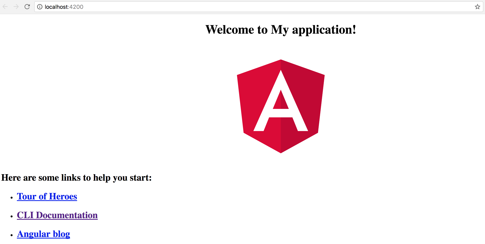

## Using Configuration Settings

It is now time to see the application configuration service in action.
Let's use the `title` value to update the similar property in the main application component.

We get the following controller class generated by the Angular CLI:

```ts
// src/app/app.component.ts

import { Component } from '@angular/core';

@Component({
  selector: 'app-root',
  templateUrl: './app.component.html',
  styleUrls: ['./app.component.css']
})
export class AppComponent {
  title = 'app';
}
```

All we need at this point is to inject the `AppConfigService` as an `appConfig` parameter
and assign the title property to the `appConfig.data.title` value.

> Don't forget that at this point the JSON file is already loaded and configuration properties are ready for use.

```ts
import { AppConfigService } from './app-config.service';

@Component({/*...*/})
export class AppComponent {
  title = 'app';

  constructor(appConfig: AppConfigService) {
    this.title = appConfig.data.title;
  }
}
```

If you run the web application now, the main page should contain the title value fetched from the external file.

Try editing the `title` value in the `app.config.json` and you should see the Angular CLI automatically reload the page.
The page automatically reflects new values.



We just got a working example of the configuration service.
We have also checked the external settings being successfully fetched and applied to component properties.
The examples in the chapter should help you building configuration support for your applications.

> **Source Code**
>
> You can find the source code as an Angular CLI project in the
> **[angular/app-settings](https://github.com/DenysVuika/developing-with-angular/tree/master/angular/app-settings)** folder.
