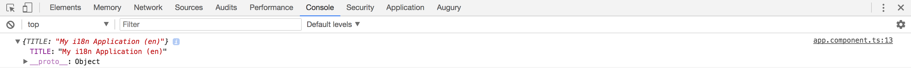

## Creating Translate Service

As a second step, we need to make our `TranslateService` load the language file.

We are going to implement a `use` method that performs the loading process over the HTTP.
It takes the `lang` parameter holding the name of the locale and falls back to the `en` value.

```ts
// src/app/translate.service.ts

import { Injectable } from '@angular/core';
import { HttpClient } from '@angular/common/http';

@Injectable({ providedIn: 'root' })
export class TranslateService {

  data: any = {};

  constructor(private http: HttpClient) {}

  use(lang: string): Promise<{}> {
    return new Promise<{}>(resolve => {
      const langPath = `assets/i18n/${lang || 'en'}`;

      this.http.get(langPath).subscribe(
        response => {
          this.data = response || {};
          resolve(this.data);
        },
        err => {
          this.data = {};
          resolve(this.data);
        }
      );
    });
  }
}
```

> **Loading server-side files**
>
> The process of loading of the translation file is very similar to that of the global configuration files we have used earlier in this book.
>
> Please refer to the [Global Application Configuration](ch10-00-global-application-configuration.md) chapter for more details and examples.

Next, let's register our service provider and a custom factory that triggers the `TranslateService`
to load default or predefined locale file before all other services and components get created.
That helps us ensure that all other elements of the application get access to translation feature at startup.

```ts
// src/app/app.module.ts

export function setupTranslateServiceFactory(
    service: TranslateService): Function {
  return () => service.use('en');
}

@NgModule({
  providers: [
    TranslateService,
    {
      provide: APP_INITIALIZER,
      useFactory: setupTranslateServiceFactory,
      deps: [
        TranslateService
      ],
      multi: true
    }
  ]
})
export class AppModule { }
```

Now we can have a quick test to ensure the file got loaded and translation service has the data preserved.
Inject the service into the main application component and dump the entire data set to the browser console output.

```ts
// src/app/app.component.ts

import { TranslateService } from './translate.service';

@Component({/*...*/})
export class AppComponent {
  title = 'app';

  constructor(translateService: TranslateService) {
    console.log(translateService.data);
  }
}
```

Once you run the web application and head to the browser console, you should see the following output:



We got the translation service working as expected; now we can proceed to create the corresponding pipe.
