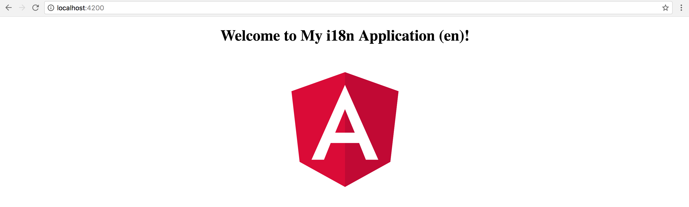

## Using Translate Pipe

It is time to see our translation pipe in action.
Let's update the main application controller class and set the `title` property value to the `TITLE` resource key like below:

```ts
// src/app/app.component.ts

@Component({/*...*/})
export class AppComponent {

  title = 'TITLE';

  // ...
}
```

If you open the `app.component.html` template file, you should see the `title` property referenced in the welcome message:

```html
<!-- src/app/app.component.html -->

<h1>
    Welcome to {{ title }}!
</h1>
```

We can just append the pipe to the `title` value to enable automatic translation of the value
based on the resource strings in the translation file.

```html
<!-- src/app/app.component.html -->

<h1>
    Welcome to {{ title | translate }}!
</h1>
```

Once you compile and run the web application, you should see the welcome message getting the text directly from the language file.


