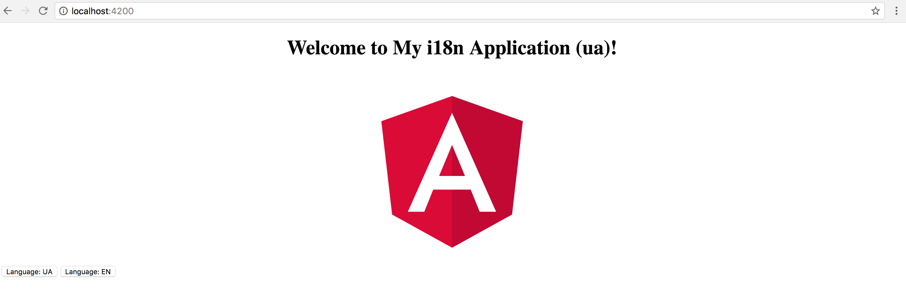

## Switching Languages

We have the default locale working so far, but switching languages at runtime require some extra configuration steps.

First, let's create an additional file `ua.json` in the `assets/i18n` folder.
For testing purposes, you can just copy the contents of the `en.json` file
and slightly modify the strings to be able to see the difference at runtime.

**src/assets/i18n/ua.json**:

```json
{
  "TITLE": "My i18n Application (ua)"
}
```

The main application controller class needs a new `setLang` method
so that we can switch to a different language with, for instance, a button click.

With our current `TranslateService` implementation, we need just the name of the locale:

```ts
// src/app/app.component.ts

@Component({/*...*/})
export class AppComponent {
  title = 'TITLE';

  constructor(private translateService: TranslateService) {
    console.log(translateService.data);
  }

  setLang(lang: string) {
    this.translateService.use(lang);
  }
}
```

Get back to the application component template and add a couple of buttons
to switch between the languages like in the example below:

```html
<!-- src/app/app.component.html -->

<div>
  <button (click)="setLang('ua')">Language: UA</button>
  <button (click)="setLang('en')">Language: EN</button>
</div>
```

If you try running the application right now, you should notice that buttons do not work.
If you run the Dev Tools and inspect the Network tab, you are going to see that a corresponding language file is,
in fact, fetched every time you click the buttons.

You do not see the changes on the page because of how the pipes in Angular work by default.
For the performance reasons, they cache the result once the value is transformed and always use evaluated values in subsequent calls.

In our particular case, we need the pipe to refresh, so the caching needs to be switched off.
You can achieve that by setting the "pure" attribute of the `@Pipe` decorator metadata to "false".

```ts
// src/app/translate.pipe.ts

@Pipe({
  name: 'translate',
  pure: false
})
export class TranslatePipe implements PipeTransform {

 // ...

}
```

> **Pure and Impure Pipes**
>
> You can get more details in the **[Pipes](ch09-00-pipes.md)** chapter,
> specifically in the **[Pure And Impure Pipes](ch09-05-pure-and-impure-pipes.md)** section.

Try rerunning your web application, and clicking the buttons to switch between languages.
You should see the label text getting updated each time the button gets clicked.


