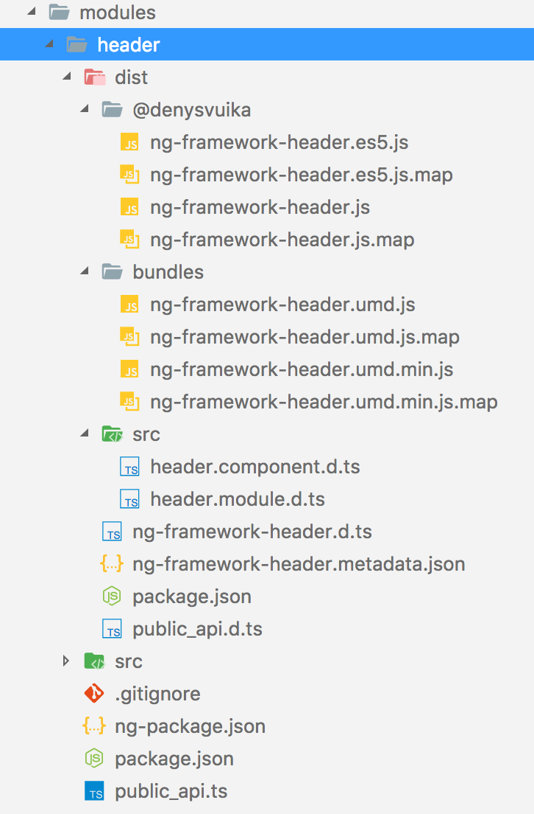

## Building the Packages

To build the project and produce bundles we need to create a `ng-package.json` file for the `ng-packagr`.
The file should live next to the `package.json` in the library root folder.

**modules/header/ng-package.json**:

```json
{
  "$schema": "../../node_modules/ng-packagr/ng-package.schema.json",
  "lib": {
    "entryFile": "public_api.ts"
  }
}
```

Note that the same file should be present in both our library root folders.
Feel free to copy and paste it, since the file does not contain any project-specific content at this point.

To build a project with `ng-packagr`, we can provide a path to the configuration file.
That also allows us to build more than one project from the NPM scripts.

You can refer to the example below, with only the change needed for the build, for the sake of simplicity.

**package.json**:

```json
{
    "scripts": {
        "build:modules": "ng-packagr -p ./modules/header/ng-package.json && ng-packagr -p ./modules/sidebar/ng-package.json"
    }
}
```

Now go to the root folder and execute the following command to build our libraries:

```sh
npm run build:modules
```

You should see the output similar to the following:

```text
$ ng-packagr -p ./modules/header/ng-package.json
Building Angular library
Generating bundle for @denysvuika/ng-framework-header
Cleaning bundle build directory
Processing assets
Running ngc
Compiling to FESM15
Compiling to FESM5
Compiling to UMD
Minifying UMD bundle
Remapping source maps
Copying staged files
Writing package metadata
Built Angular bundle for @denysvuika/ng-framework-header

Building Angular library
Generating bundle for @denysvuika/ng-framework-sidebar
Cleaning bundle build directory
Processing assets
Running ngc
Compiling to FESM15
Compiling to FESM5
Compiling to UMD
Minifying UMD bundle
Remapping source maps
Copying staged files
Writing package metadata
```

The resulting bundles are in the `dist` folder for every compiled project.
Try expanding the one for the `header` component, and you should see the structure similar to that in the screenshot below:


