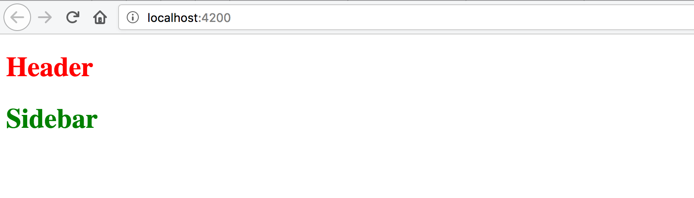

## Publishing to NPM

You need to have an [NPM](https://www.npmjs.com/) account to publish libraries.
Once you get it, the process is relatively simple.

You need to run the `npm publish` command from within every `dist` folder the `ng-packagr` creates.
If you publish the very first version of the library, the `access` attribute needs to be present as well, for example:

```sh
cd modules/header/dist
npm publish --access public
```

> **Package Scope**
>
> You will need to change the scope of your package to be able to publish the project under your account.

## Integrating with the Application

Developing components can take time, and you also need to test them
and get running in some demo application before publishing to NPM.
For this case, we need to link the projects as if they got installed from the public source.

First, we modify the root `tsconfig.json` file to map component namespaces to the corresponding `dist` folders.
That should also enable code completion support and type checking in your IDE.

**tsconfig.json**:

```json
{
    "compileOnSave": false,
    "compilerOptions": {
        ...,

        "baseUrl": ".",
        "paths": {
            "@denysvuika/ng-framework-header": [ "modules/header/dist" ],
            "@denysvuika/ng-framework-sidebar": [ "modules/sidebar/dist" ]
        }
    }
}
```

So now, every time you reference the `@denysvuika/ng-framework-header` namespace,
the application is going to fetch the code from the `modules/header/dist` folder instead of the `node_modules` one.

Similar behavior is going to be for the `sidebar` component as well. You can map as many paths as you need.

For the second step, you need to update the `tsconfig.app.json` file
and map the namespaces to the corresponding `public_api.ts` files.
We define the mappings for both `compilerOptions` and `angularCompilerOptions` as in the next example:

**src/tsconfig.app.json**:

```json
{
  "extends": "../tsconfig.json",
  "compilerOptions": {
    "outDir": "../out-tsc/app",
    "baseUrl": "./",
    "module": "es2015",
    "types": [],
    "paths": {
      "@denysvuika/ng-framework-header": [ "../modules/header/public_api.ts" ],
      "@denysvuika/ng-framework-sidebar": [ "../modules/sidebar/public_api.ts" ]
    }
  },
  "exclude": [
    "test.ts",
    "**/*.spec.ts"
  ],
  "angularCompilerOptions": {
    "paths": {
      "@denysvuika/ng-framework-header": [ "../modules/header/public_api.ts" ],
      "@denysvuika/ng-framework-sidebar": [ "../modules/sidebar/public_api.ts" ]
    }
  }
}
```

Finally, let's use our libraries in the application as if they got installed from the NPM.
Import the `HeaderModule` and `SidebarModule` from the corresponding namespaces into the main application module.

```ts
// src/app/app.module.ts

import { BrowserModule } from '@angular/platform-browser';
import { NgModule } from '@angular/core';

import { HeaderModule } from '@denysvuika/ng-framework-header';
import { SidebarModule } from '@denysvuika/ng-framework-sidebar';

import { AppComponent } from './app.component';

@NgModule({
  declarations: [
    AppComponent
  ],
  imports: [
    BrowserModule,
    HeaderModule,
    SidebarModule
  ],
  providers: [],
  bootstrap: [AppComponent]
})
export class AppModule { }
```

Replace the content of the main application component template with the next markup:

```html
<!-- src/app/app.component.html -->

<ngfw-header>Header</ngfw-header>
<ngfw-sidebar>Sidebar</ngfw-sidebar>
```

Serve the application with "npm start", and you should see the following output:



The configuration is complete. You are now ready to build, test and publish component libraries.
