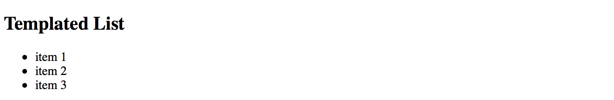
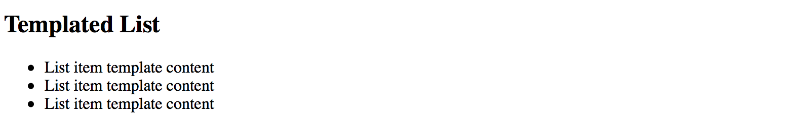
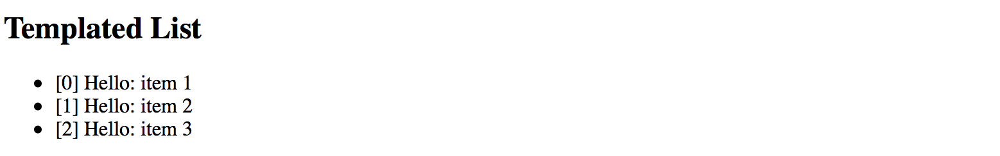
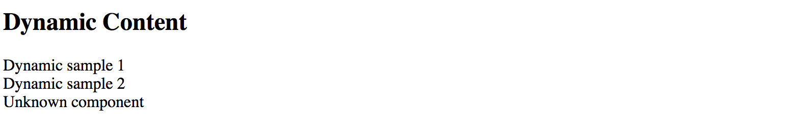
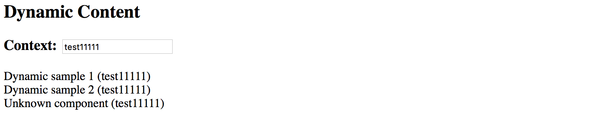
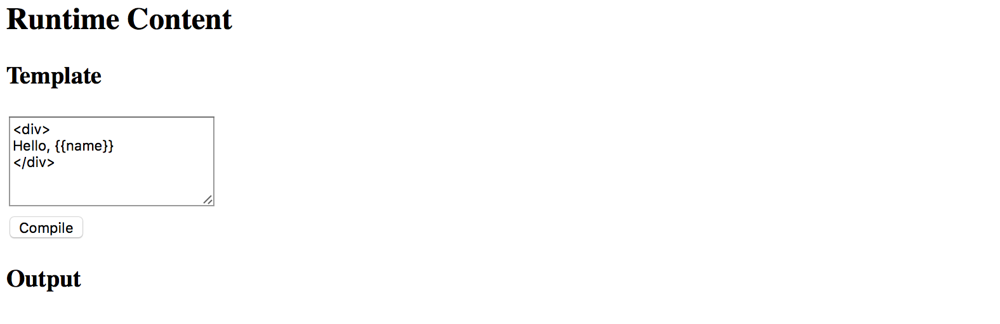
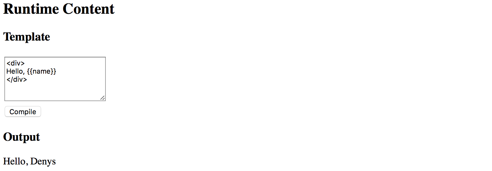
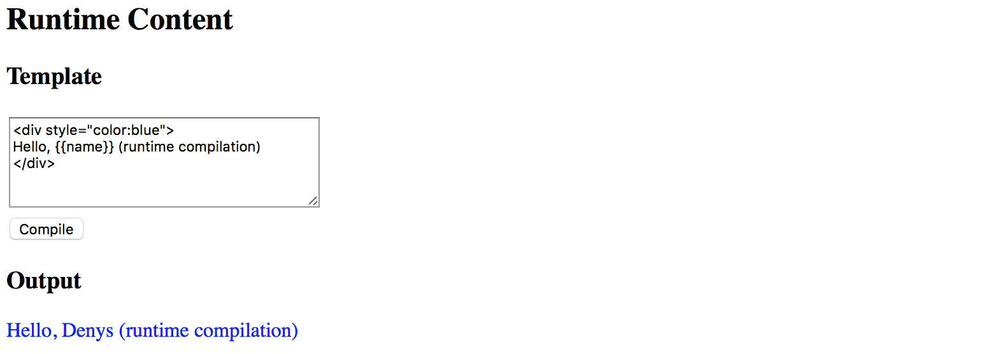
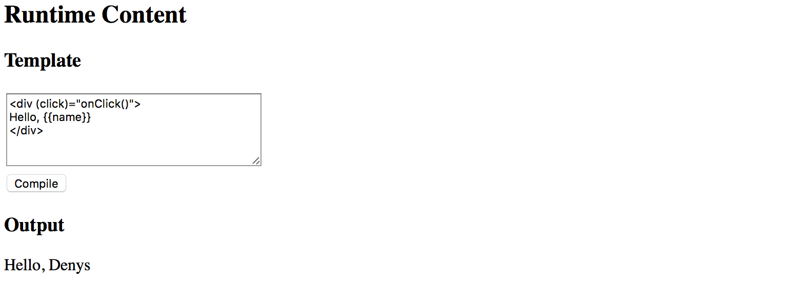
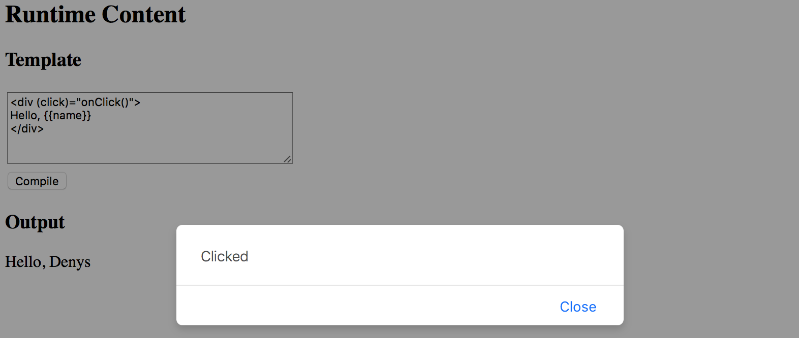

# Dynamic Content in Angular

> Warning, this chapter was written for the earlier versions of Angular and needs review.

In this section, we are going to see in practice different ways
of dynamically creating and modifying content in Angular at runtime.

You are about to get examples of custom entry templates in a List component,
see how `Component` and `Module` compilation works.

## List Item Templates

In this part, we are going to see how you can enrich Angular components with custom templating support.
We start by building a simple List component that supports external entry templates
that a developer defines as part of the application.

### List component

First, let's create a simple component to render an unordered list of bound items, and call it `TemplatedListComponent`.

With the Angular CLI the command should look like the following:

```text
ng g component templated-list
```

The Angular CLI generates all required scaffold for your component and updates main application module,
so you are strongly recommended using it to save your time.

As you can remember from the [Angular CLI](ch04-00-angular-cli.md) chapter,
all generated artifacts should have prefixes to avoid conflicts with standard HTML elements or third party components.
In our case, the Angular CLI tool automatically prepends the default `app-` prefix to the component selector value:

```ts
// src/app/templated-list/templated-list.component.ts

@Component({
  selector: 'app-templated-list',
  templateUrl: './templated-list.component.html',
  styleUrls: ['./templated-list.component.css']
})
export class TemplatedListComponent { ... }
```

For now, the only property that our newly created list needs is an array of items to display.
Every item must have at least a `title` property, so we use a generic Array type with the corresponding constraints.

```ts
// src/app/templated-list/templated-list.component.ts

@Component({/*...*/})
export class TemplatedListComponent {

  @Input()
  items: Array<{title: string}> = [];

}
```

Note that array is empty by default.
By our design, the items are not hard coded into the component and should be coming from the application instead.

For the template part, a simple unordered list with `ngFor` directive should be more than enough to demonstrate the content:

```html
<!-- src/app/templated-list/templated-list.component.html -->

<ul>
  <li *ngFor="let item of items">
    {{ item.title }}
  </li>
</ul>
```

Next, let's provide our List with some data and see it working.
Edit your main application component class and add the `listItems` property with some basic entries:

```ts
// src/app/app.component.ts

@Component({/*...*/})
export class AppComponent {
    // ...

    listItems: Array<{title: string}> = [
        { title: 'item 1' },
        { title: 'item 2' },
        { title: 'item 3' }
    ]
}
```

Don't forget to modify the HTML template of the component and declare the `<app-templated-list>` component
with the corresponding bindings:

```html
<!-- src/app/app.component.html -->

<h2>Templated List</h2>
<app-templated-list [items]="listItems">
</app-templated-list>
```

If you run your web application right now you should see the HTML unordered list element
with three entries like on the picture below:



### Row Templates

So we got a simple list component that binds to an array of objects and renders standard unordered HTML element
where every entry binds its content to the `title` property of the underlying object.

Now let's update the code to provide support for external templates.

First, you need a property to hold custom template reference.
That requires importing a `@ContentChild` decorator and `TemplateRef` type.

```ts
// src/app/templated-list/templated-list.component.ts

import { /*...,*/ ContentChild, TemplateRef } from '@angular/core';

@Component({/*...*/})
export class TemplatedListComponent {

    @ContentChild(TemplateRef)
    template: TemplateRef<any>;

    @Input()
    items: Array<{title: string}> = [];

}
```

The @ContentChild decorator helps you to bind the property value to the first child element
of the specific type in out List component at run time.
In our particular case, we are instructing decorator to look for the first `<ng-template>` instance
exposed via TemplateRef reference.

For example:

```html
<app-templated-list>
  <ng-template>
    <!-- ... -->
  </ng-template>
</app-templated-list>
```

For the next step, let's update our List component template to use provided template property value for each entry.

```html
<!-- src/app/templated-list/templated-list.component.html -->

<ul>
    <ng-template ngFor [ngForOf]="items" [ngForTemplate]="template">
    </ng-template>
</ul>
```

Now the `TemplatedListComponent` expects a `template` instance as its child element in the form of `<ng-template>`.

It then takes the content of the template and applies to each `*ngFor` entry.
So application developers can define entire row template like the following:

```html
<!-- src/app/app.component.html -->

<h2>Templated List</h2>
<app-templated-list [items]="listItems">
    <ng-template>
        <li>
            List item template content
        </li>
    </ng-template>
</app-templated-list>
```

If you now run your web app you should see the following output:



As you can see on the picture above the template works as expected.
We define a static content and see it rendered three times.
Now to see the data change across the list entries update component template like in the next example:

```html
<h2>Templated List</h2>
<app-templated-list [items]="listItems">
    <ng-template let-item="$implicit" let-i="index">
        <li>[{{i}}] Hello: {{item.title}}</li>
    </ng-template>
</app-templated-list>
```

Upon building the elements, the "ngFor" directive takes each object in the collection
and uses it as a data context for every corresponding list item and its custom template.
To get direct access to this object we are using the `let-item="$implicit"` attribute.
That reads as "bind the object to the template variable called 'item'".

You can omit the "$implicit" value and use just the `let-item` attribute if you like.
You can also give the template variable any name; it can be `let-data`, `let-context` or any name of your choice.

The `ngFor` directive provides us with the numeric index for each item in the collection.
We bind it inside the template to the `i` variable using the `let-i="index"` syntax.

So to demonstrate both data context bindings, we used the following list item template:

```html
<ng-template let-item="$implicit" let-i="index">
    <li>[{{i}}] Hello: {{item.title}}</li>
</ng-template>
```

Once your web application runs you should see the following result:



We are now able to see index value, static "Hello" text and "title" property of the underlying object.

### Typical use cases

You are going to use the above approach when building list-like or grid-like components
that hide all complexity from the developers but at the same time allow customizing entries or rows using templates.

> **Source Code**
>
> You can find the source code in the
> **[angular/components/dynamic-content](https://github.com/DenysVuika/developing-with-angular/tree/master/angular/components/dynamic-content)** folder.

## Dynamic Components

Another interesting scenario involves changing the content of the component based on some condition evaluation result.
For example, rendering different child component depending on the value of the `type` property:

```html
<component type="my-type-1"></component>
<component type="my-type-2"></component>
```

Let's start with a component scaffold generated by the Angular CLI using the following command:

```text
ng g component dynamic-content
```

For the first step, update the HTML template of the newly generated component with the following one:

```html
<!-- src/app/dynamic-content/dynamic-content.component.html -->

<div>
  <div #container></div>
</div>
```

Note how we declare a separate `<div>` element with the `#container` id.

We are going to use it as the injection point. All dynamic content should get inserted in the DOM below this element.
The component maps it to the `container` property of the `ViewContainerRef` type
to allow you access container element from the code.

```ts
import { /*...,*/ Input, ViewChild, ViewContainerRef } from '@angular/core';

@Component({/*...*/})
export class DynamicContentComponent {

  @ViewChild('container', { read: ViewContainerRef })
  container: ViewContainerRef;

  @Input()
  type: string;

}
```

Later on, you should be able to use this component similar to the following example:

```html
<dynamic-content type="some-value"></dynamic-type>
```

Now let's introduce two more components to display depending on the `type` property value.
We also are going to need an additional `fallback` component to use for all the `unknown` types.

For the sake of simplicity, you can append new components to the same `dynamic-content` component file.

```ts
// src/app/dynamic-content/dynamic-content.component.ts

@Component({
  selector: 'app-dynamic-sample-1',
  template: `<div>Dynamic sample 1</div>`
})
export class DynamicSample1Component {}

@Component({
  selector: 'app-dynamic-sample-2',
  template: `<div>Dynamic sample 2</div>`
})
export class DynamicSample2Component {}

@Component({
  selector: 'app-unknown-component',
  template: `<div>Unknown component</div>`
})
export class UnknownDynamicComponent {}
```

Developers are going to use the "type" property that has the type of `string`
and gets used as an alias for real component types.

You are going to need some mapping of string values to types,
either in the form of separate injectable service (recommended approach)
or just a part of the component implementation like in the example below:

```ts
@Component({/*...*/})
export class DynamicContentComponent {
  // ...

  private mappings = {
    'sample1': DynamicSample1Component,
    'sample2': DynamicSample2Component
  };

  getComponentType(typeName: string) {
    const type = this.mappings[typeName];
    return type || UnknownDynamicComponent;
  }

}
```

As you can see from the code above, for `sample1` and `sample2` values the newly introduced components
`DynamicSample1Component` and `DynamicSample2Component` are returned.

For all other cases, we are going to take the `UnknownDynamicComponent` component.

Finally, we are ready to create components dynamically.
Below is the simplified version of component class implementation that shows the main blocks of interest:

```ts
import {
    // ...,
    OnInit, OnDestroy,
    ComponentRef, ComponentFactoryResolver
} from '@angular/core';

@Component({/*...*/})
export class DynamicContentComponent implements OnInit, OnDestroy {
  // ...

  private componentRef: ComponentRef<{}>;

  constructor(private resolver: ComponentFactoryResolver) { }

  ngOnInit() {
    if (this.type) {
      const componentType = this.getComponentType(this.type);
      const factory = this.resolver.resolveComponentFactory(componentType);
      
      this.componentRef = this.container.createComponent(factory);
    }
  }

  ngOnDestroy() {
    if (this.componentRef) {
      this.componentRef.destroy();
      this.componentRef = null;
    }
  }

}
```

We inject the `ComponentFactoryResolver` into the component at runtime
and use it to build the dynamic content upon initialization,
and tear down when our parent component gets destroyed.

The process of content creation is quite straightforward.
First, we resolve the component type by the string value.
Second, we resolve a component factory for the given component type.
Finally, we use that factory to build a component.
Newly created content gets automatically appended to the DOM after the `#container` element.

Please note that you must register every component you create dynamically within the `entryComponents` section of your module.
That instructs the Angular framework to maintain corresponding factories at runtime.

```ts
// src/app.module.ts

@NgModule({
  imports: [ /*...*/ ],
  declarations: [ /*...*/ ],
  entryComponents: [
    DynamicSample1Component,
    DynamicSample2Component,
    UnknownDynamicComponent
  ],
  bootstrap: [AppComponent]
})
export class AppModule { }
```

You can now test all three cases with the following layout:

```html
<!-- src/app/app.component.html -->

<h2>Dynamic Content</h2>
<app-dynamic-content type="sample1"></app-dynamic-content>
<app-dynamic-content type="sample2"></app-dynamic-content>
<app-dynamic-content type="some-other-type"></app-dynamic-content>
```

The main application page should look like the following:



### Runtime context

The easiest way to maintain different types of dynamic components in the code
is to build a common interface or an abstract class with a shared API.
For example:

```ts
abstract class DynamicComponent {
  
  context: any;

}
```

Note that for the sake of simplicity we are declaring `context` property of `any` type.

> In real-life scenarios, however, you may want to use some particular type
to benefit from the static checks the Typescript compiler provides.

Now you can update all previously created components to expose the `DynamicComponent` class and take `context` into account.

```ts
@Component({
  selector: 'app-dynamic-sample-1',
  template: `<div>Dynamic sample 1 ({{context?.text}})</div>`
})
export class DynamicSample1Component extends DynamicComponent {}

@Component({
  selector: 'app-dynamic-sample-2',
  template: `<div>Dynamic sample 2 ({{context?.text}})</div>`
})
export class DynamicSample2Component extends DynamicComponent {}

@Component({
  selector: 'app-unknown-component',
  template: `<div>Unknown component ({{context?.text}})</div>`
})
export class UnknownDynamicComponent extends DynamicComponent {}
```

Next, the `DynamicContentComponent` needs updates to receive the value of the `context` from the outside using bindings,
and pass it to the underlying child component.

```ts
export class DynamicContentComponent implements OnInit, OnDestroy {
    // ...

    @Input()
    context: any;

    ngOnInit() {
        if (this.type) {
            // ...
            
            let instance = <DynamicComponent> this.componentRef.instance;
            instance.context = this.context;
        }
    }
}
```

That is it, and we are ready to test the whole flow.
Add a simple object to the main application component class to use as a `context` value for the dynamic elements:

```ts
// src/app.component.ts

export class AppComponent {

  context: { text: string } = {
    text: 'test'
  }

}
```

Now bind this context to all three components we declared earlier in the template:

```html
<!-- src/app.component.html -->

<h3>Context: <input type="text" [(ngModel)]="context.text"></h3>
<app-dynamic-content type="sample1" [context]="context"></app-dynamic-content>
<app-dynamic-content type="sample2" [context]="context"></app-dynamic-content>
<app-dynamic-content type="some-other-type" [context]="context"></app-dynamic-content>
```

To demonstrate "live updates" feature, we add an input element to the page.
The element is using "two-way" binding to the `context.text` property.
According to our setup, all dynamically created components should automatically reflect the new value as we type.

Note that to use `ngModel` directive you need to import and reference the `FormModule`
within your main application module like in the example below:

```ts
// src/app/app.module.ts
// ...

import { FormsModule } from '@angular/forms';

@NgModule({
  // ...
  
  imports: [
    BrowserModule,
    FormsModule
  ],
  
  // ...
})
export class AppModule { }
```

The setup is ready, and you can run your web application to see it in action.
By default, it should be displaying the `test` value within each dynamically created component.

Try typing some text in the `context` input to see all of those components' titles change on the fly.



### Typical use cases

Dynamic forms and form persistence is the best example of where you might need the features we tried above.

If you need displaying a form or a complex component based on some definition file (JSON, XML, or other),
you may end up creating a dynamic component that builds final content based on the schema and/or persisted state,
and a form component built from multiple dynamic content containers.

> **Source Code**
>
> You can find the source code in the
> **[angular/components/dynamic-content](https://github.com/DenysVuika/developing-with-angular/tree/master/angular/components/dynamic-content)** folder.

## Runtime Compilation

For some advanced scenarios, you might want to take full control over Angular component and template compilation.

In this part, we are going to implement the following features:

- allow a user to define the component template
- compile a `Component` on the fly  with user defined template and the underlying class
- compile a `NgModule` on the fly with the component created in the previous step
- display newly created component on the page

Let's start by generating a separate scaffold for the component by utilizing the Angular CLI tools:

```sh
ng g component runtime-content
```

You can take initial implementation from the `DynamicContentComponent` we created in previous chapters.

The component template needs a predefined injection point:

```html
<!-- src/app/runtime-content/runtime-content.component.html -->

<div>
  <div #container></div>
</div>
```

Also, we map `#container` element to the underlying `container` property of the component class.

```ts
// src/app/runtime-content/runtime-content.component.ts

import { /*...,*/ ViewChild, ViewContainerRef } from '@angular/core';

@Component({/*...*/})
export class RuntimeContentComponent {

  @ViewChild('container', { read: ViewContainerRef })
  container: ViewContainerRef;

}
```

The main idea behind the new component we introduce is to allow a user to define HTML template on the fly.
So let's add a basic UI for editing:

```html
<!-- src/app/runtime-content/runtime-content.component.html -->

<div>
  <h3>Template</h3>
  <div>
    <textarea rows="5" [(ngModel)]="template"></textarea>
  </div>
  <button (click)="compileTemplate()">Compile</button>

  <h3>Output</h3>
  <div #container></div>
</div>
```

Note that to use `ngModel` directive you must import a `FormsModule` into your main application module.
You should have it already configured from the previous part of the chapter where we created the `DynamicContent` component.

Set the default template value to something the user can compile without typing beforehand.
That should help us testing the flow as well:

```ts
@Component({/*...*/})
export class RuntimeContentComponent {
  // ...

  template = '<div>\nHello, {{name}}\n</div>';

}
```

When the main page gets rendered it should look similar to the following:



Now the most important part of the component implementation, the runtime compilation:

```ts
// src/app/runtime-content/runtime-content.component.ts

import { /*...,*/ Compiler, ComponentFactory, NgModule } from '@angular/core';
import { CommonModule } from '@angular/common';

@Component({/*...*/})
export class RuntimeContentComponent {
  // ...

  private createComponentFactorySync(
    compiler: Compiler,
    metadata: Component,
    componentClass: any
  ): ComponentFactory<any> {

    const cmpClass = componentClass || class RuntimeComponent {
      name = 'Denys'
    };
    const decoratedCmp = Component(metadata)(cmpClass);

    @NgModule({
      imports: [CommonModule],
      declarations: [decoratedCmp] }
    )
    class RuntimeComponentModule { }

    const module = compiler.compileModuleAndAllComponentsSync(
      RuntimeComponentModule
    );

    return module.componentFactories.find(
      f => f.componentType === decoratedCmp
    );
  }

}
```

The code above takes custom metadata and optionally a component class reference via the `componentClass` parameter.

If you do not provide the class as part of the `createComponentFactorySync` call,
the fallback `RuntimeComponent` one gets used instead.

The fallback class also has a `name` property predefined.
That is what we are going to use for testing.

```ts
const cmpClass = componentClass || class RuntimeComponent {
    name = 'Denys'
};
```

The resulting component also gets decorated with the metadata we provide:

```ts
const decoratedCmp = Component(metadata)(cmpClass);
```

Next, a component gets created with the predefined `CommonModule` import.

You may extend the list if you want to support more functionality.
We also put our component as part of the module's `declarations` section as per Angular requirements.

Finally, the function uses Angular `Compiler` service to compile the module and all included components.
Compiled module provides access to the underlying component factories, and this is exactly the feature we need.

For the last step, we need to wire the `Compile` button with the following method:

```ts
@Component({/*...*/})
export class RuntimeContentComponent {
  // ...

  compileTemplate() {

    const metadata = {
      selector: `runtime-component-sample`,
      template: this.template
    };

    const factory = this.createComponentFactorySync(
      this.compiler,
      metadata,
      null
    );

    if (this.componentRef) {
      this.componentRef.destroy();
      this.componentRef = null;
    }
    
    this.componentRef = this.container.createComponent(factory);

  }
}
```

Every time the user clicks the `Compile` button our `RuntimeContentComponent` component takes the template value,
compiles it to a new component backed by the `RuntimeComponent` class (with the predefined `name` property), and renders:



To fully test the flow in action now change the default HTML template value and provide some custom content,
for example changing the colour style of the root `div` element to `blue`.
Modify the text content as well.

Click `Compile` button once again, and you should see the following result now:



### Binding events

Your component users are not limited to user property bindings.
The template supports event binding as well.

All event handlers have to be defined in the underlying class or be present
in the `RuntimeComponent` class we use as a fallback value.

To see events in action let's modify the fallback class and add the `onClick` method like in the following example:

```ts
@Component({/*...*/})
export class RuntimeContentComponent {
  // ...

  private createComponentFactorySync(/*...*/): ComponentFactory<any> {

    const cmpClass = componentClass || class RuntimeComponent {
      name = 'Denys';

      onClick() {
        alert('Clicked');
      }
    };

      // ...
  }
}
```

Now you can wire the click events in the template with the `onClick` method like in the next picture:



If you press the `Compile` button once again and then click the `div` element you should see the browser alert dialogue:



### Typical use cases

The best scenario for this feature is when you want to store component templates somewhere in the external storage,
and then build components on the fly, similar to how it gets performed in various RAD environments,
online layout builders, and other design tools.

> **Source Code**
>
> You can find the source code in the
> **[angular/components/dynamic-content](https://github.com/DenysVuika/developing-with-angular/tree/master/angular/components/dynamic-content)** folder.
