# Plugins

> Warning: this chapter was written using the earlier versions of Angular and needs review.

Plugins are used to allow third-party developers extend your application
by utilizing the redistributable extensions that provide new features for the application
without recompiling its code.

In this section, we are going to use multiple ways to extend your application,
starting from the string-based configurations to build and compose components at runtime,
and finishing with the complete drop-in plugins you can put into the folder
to add new features to the running application.

## Preparing new project

Use the following Angular CLI command to generate a project with initial Routing support.

```sh
ng new plugins --routing
```

It is essential to have Routing enabled as later in this section
we are also going to see how to create new routes dynamically at runtime,
and how a plugin can contribute new application routes with external content presented to a user.

Edit the main application component template and replace the HTML markup
that Angular CLI generates by default with the following one:

```html
<!-- src/app/app.component.html -->

<h1>Plugins</h1>

<router-outlet></router-outlet>
```

That is pretty much all to get started with extensibility.
You can test the project by running the `ng start --open` command,
to see that everything compiles and runs fine.
After that, proceed to the next section below.

> **Source Code**
>
> You can find the source code in the
> **[angular/plugins](https://github.com/DenysVuika/developing-with-angular/tree/master/angular/plugins)** folder.

## Building components based on string names

The first thing we are going to start with is related to creating components
based on their string names, either types or aliases.

This feature allows to you have configurable configuration files or custom layout definitions
that instruct your application what components to use for the particular scenarios.

A good example is a dynamic sidebar that can contain various components
or mini-widgets based on the configuration file.
Users or developers can change the settings to display only individual components,
like a "weather widget" or "notification panel", can provide a different order of rendering,
and many other options.

The example above is not a fully-fledged plugin approach,
as our application still "knows" about all possible component types,
and all components and templates get compiled and bundled as part of the application.
However, we are taking that scenario as a simplified case to see how to use the Angular compiler at runtime.
That should give us a base experience for more advanced scenarios
that we are going to implement later in this chapter.

I strongly recommend creating a separate module that contains all the configurable components that you plan to create at runtime.
That should significantly simplify future maintenance and discovery of such components,
and you are going to see that shortly in practice.

Let's use Angular CLI once again to generate a new flat module and call it `plugins`:

```sh
ng g module plugins --flat --module=app
```

Note the `--module=app` switch we are using in this case.
It instructs Angular CLI to also include our newly generated module into the main application module.

The `--flat` switch forces the CLI to generate module file in the application source folder,
without creating a separate subfolder as it does for components, directives and other Angular entities.

The console output in your case should look similar to the next example:

```text
create src/app/plugins.module.ts (191 bytes)
update src/app/app.module.ts (465 bytes)
```

While we are at the command line, let's also create two components `page1` and `page2`.
These are the components we would like to create dynamically.
Moreover, you can save some time by using the `--module` switch
to include both components into the "plugins" module like in the code below:

```sh
ng g component page1 --module=plugins
ng g component page2 --module=plugins
```

Now, feel free to inspect what you have as a result in the `plugins` module
that should reside in the `src/app` folder and contain references to both
`Page1Component` and `Page2Component` components.

The Angular CLI also imports the most frequently used `CommonModule` module for you:

```ts
// src/app/plugins.module.ts

import { NgModule } from '@angular/core';
import { CommonModule } from '@angular/common';
import { Page1Component } from './page1/page1.component';
import { Page2Component } from './page2/page2.component';

@NgModule({
  imports: [
    CommonModule
  ],
  declarations: [Page1Component, Page2Component]
})
export class PluginsModule { }
```

Both `page` component classes should be almost identical and look similar to the following:

```ts
// src/app/page1/page1.component.ts

import { Component, OnInit } from '@angular/core';

@Component({
  selector: 'app-page1',
  templateUrl: './page1.component.html',
  styleUrls: ['./page1.component.css']
})
export class Page1Component implements OnInit {

  constructor() { }

  ngOnInit() {
  }

}
```

The Angular CLI provides dummy HTML templates in the form of `<component-name> works!` for every component it generates.
That saves much time when you are preparing project structure or have a quick prototyping phase.

As we focus on the architecture and dynamic compilation, it is not very important what templates component have.
Let's leave the default values for now, and you can revisit that later.

Next, we need to create a couple of buttons to trigger component creation,
and a placeholder to insert the newly compiled content.

Update the main application component template like in the example below.

```html
<!-- src/app/app.component.html -->

<h1>Plugins</h1>

<ul>
  <li>
    <button (click)="createView('app-page1')">page 1</button>
  </li>
  <li>
    <button (click)="createView('app-page2')">page 2</button>
  </li>
</ul>

<div #content></div>

<router-outlet></router-outlet>
```

Pay attention to the empty `div` element: `<div #content></div>`.
That is the place we are going put our dynamic components.

You can put this element to any other places, as long as it has the `content` Angular reference name,
the component controller is going to find it.

Now, if you run the application, the main page should look like in the next picture:

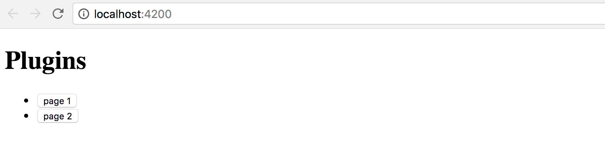

We also need to finish the component controller preparation.
The class should get the reference to the `content` placeholder and have the `createView` handler for the buttons:

```ts
// src/app/app.component.ts

import { Component, Compiler, ViewChild, ViewContainerRef } from '@angular/core';
import { PluginsModule } from './plugins.module';

@Component({
  selector: 'app-root',
  templateUrl: './app.component.html',
  styleUrls: ['./app.component.css']
})
export class AppComponent {

  @ViewChild('content', { read: ViewContainerRef })
  content: ViewContainerRef;

  constructor(private compiler: Compiler) {
  }

  createView(name: string) {
  }
}
```

Note that we also import the `PluginsModule`, as it contains all the components
we would like to find and create according to our initial scenario.

We inject the instance of the `Compiler` class into the component constructor
and use it to compile the `PluginsModule` on the fly.
The private `module` variable is going to hold the resulting instance
so that we do not compile the module more times than it is needed.

```ts
// src/app/app.component.ts

import { Component, Compiler, ViewChild, ViewContainerRef } from '@angular/core';
import { PluginsModule } from './plugins.module';

@Component({/*...*/})
export class AppComponent {

  @ViewChild('content', { read: ViewContainerRef })
  content: ViewContainerRef;

  private module;

  constructor(private compiler: Compiler) {
    this.module = this.compiler.compileModuleAndAllComponentsSync(
      PluginsModule
    );
  }

  createView(name: string) {
    const factory = this.module.componentFactories.find(
      f => f.selector === name
    );

    this.content.clear();
    this.content.createComponent(factory);
  }
}
```

As you can see above, as long as we have the compiled module instance,
we can perform searches to find a component factory based on specific metadata.
In the particular case, we are interested in the selector names.

As soon as factory got found, we can clear the `content` placeholder,
and create a new instance of the component in that place.

Run the application and click the first button `page 1` on the main page.
You should see the `page1 works!` label immediately appear at the bottom of the page.

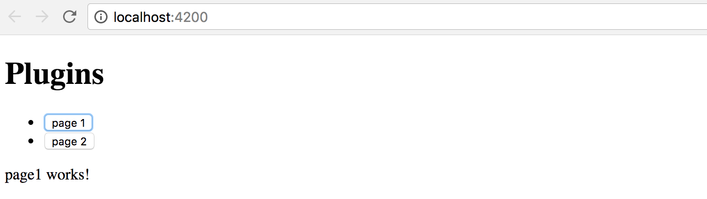

Now click the second button, and this time the placeholder content
is replaced with the `page2 works!` text that comes with the `Page2Component`
instance our application component creates on the fly.

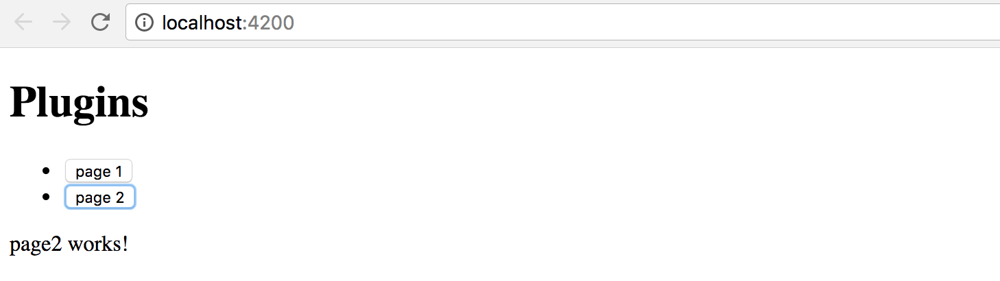

Congratulations on having the first step complete.

You are now able to take a string, map it to the component selector,
and build the corresponding component at runtime.

### Loading configuration from external sources

The whole idea of string to component type mapping usually arises
when the exact values are coming from the external sources, like configuration files.
Otherwise, you could just declare the needed component tags in the HTML template without any compilation.

As we have started this chapter with the example of the configurable Sidebar component,
let's go ahead and introduce a base implementation that takes external
`plugins.config.json` file as a configuration, and builds a set of components.

Below is our configuration file that is going to reside in the `src/assets` folder.
Upon startup, the Angular server automatically exposes this folder to the application access
and also copies its content to the output directory during production builds.

**src/assets/plugins.config.json**:

```json
{
  "sidebar": {
    "components": [
      "app-page1",
      "app-page2"
    ]
  }
}
```

So we got the `sidebar` with two components `app-page1` and `app-page2` defined by default.
Let's now generate the corresponding component by utilizing the following command:

```sh
ng g component sidebar --module=app
```

As we now have more than one module, we need to tell Angular CLI where to put the resulting component.
In our case, it is `app` that corresponds to the `app.module.ts` file.

In the main application template, append the `Configurable Sidebar` header element
together with the newly introduced `app-sidebar` tag:

```html
<!-- src/app/app.component.html -->
<!-- ... -->

<h1>Configurable Sidebar</h1>
<app-sidebar></app-sidebar>
```

You also need to import the `HttpClientModule` to allow your application components
and services make Http calls with the help of the `HttpClient` instance.

```ts
// src/app/app.module.ts
//...

import { HttpClientModule } from '@angular/common/http';

@NgModule({
  declarations: [
    /*...,*/
    
    SidebarComponent
  ],
  imports: [
    /*...,*/
    
    HttpClientModule
  ],
  entryComponents: [/*...*/],
  providers: [],
  bootstrap: [AppComponent]
})
export class AppModule { }
```

Next, edit the `SidebarComponent` template, and update the default auto-generated content with the following snippet:

```html
<!-- src/app/sidebar/sidebar.component.html -->

<p>
  Sidebar
</p>

<div #content></div>
```

Similar to previous examples, we have the placeholder `div` element that we reference as `content`,
and we compile the `PluginsModule` module to get access to all its factories at the runtime:

```ts
// src/app/sidebar/sidebar.component.ts

import {
  /*...,*/
  ViewChild, ViewContainerRef, AfterViewInit, Compiler
} from '@angular/core';
import { HttpClient } from '@angular/common/http';
import { PluginsModule } from '../plugins.module';

@Component({/*...*/})
export class SidebarComponent implements AfterViewInit {

  @ViewChild('content', { read: ViewContainerRef })
  content: ViewContainerRef;

  private module;

  constructor(private http: HttpClient,
              private compiler: Compiler) {
    this.module = compiler.compileModuleAndAllComponentsSync(
      PluginsModule
    );
  }

  ngAfterViewInit() {
  }

}
```

We use the `ngAfterViewInit` lifecycle hook as we need access to the `content` placeholder.
You can also mark the handler as `async` to get the benefits of the `async / await` support that Typescript provides:

```ts
// src/app/sidebar/sidebar.component.ts

export class SidebarComponent implements AfterViewInit {
    /*...*/

    async ngAfterViewInit() {
        const url = '/assets/plugins.config.json';
        const config = await this.http.get(url).toPromise();

        console.log(config);
    }
}
```

> **Optimization**
>
> Typically you should be aiming to have a separate application service to deal with HTTP and configuration loading.
>
> In that case, you do not repeat the same calls in every component,
> get a better separation of concerns and improved unit testing support.

If you now switch to the browser tab with your application and run the developer tools,
the console output should be similar to the next one:

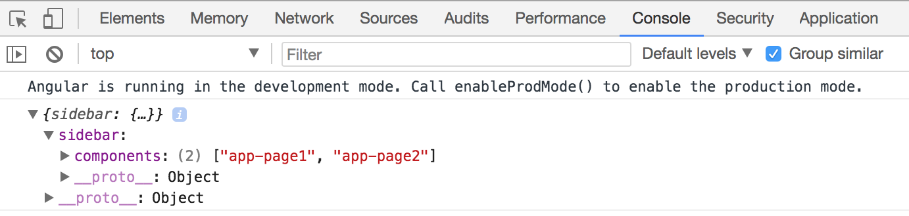

I strongly recommend introducing a separate interface that describes the content of the configuration file.
In the long run, it is going to help you with type checks, addresses typos and errors at early stages.

For the sake of simplicity, let's create an interface called `AppConfig` in the same `sidebar.component.ts` file.
You can later extract it to a separate file if there's more than one place to use it.

```ts
interface AppConfig {

  sidebar: {
    components: string[]
  };

}
```

Now you can use this interface with `HttpClient` like this:

```ts
export class SidebarComponent implements AfterViewInit {
    // ...

    async ngAfterViewInit() {
        const url = '/assets/plugins.config.json';
        const config = await this.http.get<AppConfig>(url).toPromise();

        console.log(config);
    }
}
```

As a bonus, you are going to get automatic completion for your configuration files when working with typed variables:

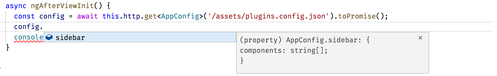

We have already covered how to search for the component factories using selector values;
this can be easily used now with the external configuration to build multiple components
and inject them into the placeholder in the specific order:

```ts
export class SidebarComponent implements AfterViewInit {
    // ...

    async ngAfterViewInit() {
        const url = '/assets/plugins.config.json';
        const config = await this.http.get<AppConfig>(url).toPromise();

        this.createSidebarComponents(config.sidebar.components);
    }

    private createSidebarComponents(selectors: string[]) {
        this.content.clear();

        for (let i = 0; i < selectors.length; i++) {
            const factory = this.module.componentFactories.find(
                f => f.selector === selectors[i]
            );
            this.content.createComponent(factory, i);
        }
    }
}
```

The `ViewContainerRef.createComponent` method handles the correct positioning of all generated instances.
It accepts the exact index of the entry as the second parameter.

Run or reload the project and you are going to see the following content on the main page:

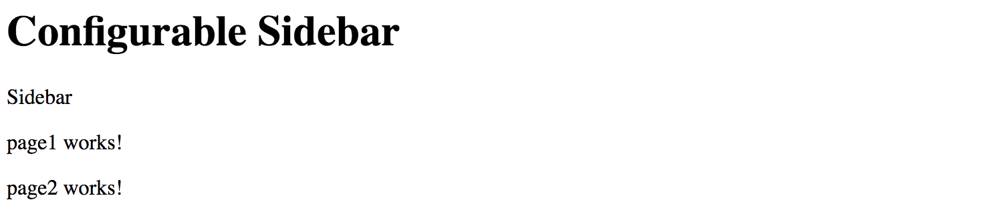

Let's try to test the configuration is indeed dynamic.
Edit the JSON file and change the order of the components like in the following example:

```json
{
  "sidebar": {
    "components": [
      "app-page2",
      "app-page1"
    ]
  }
}
```

Next, reload the application page or wait till the Angular CLI web server automatically reloads.
You should now see components created in the order we configured:

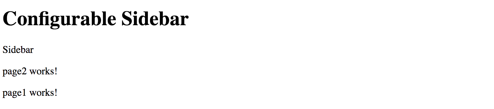

That means you are now ready to build composite components driven by the external configuration.
With the approach above, you can quickly create applications that change the layout without rebuilding and re-deploying new version to the server.

> **Source Code**
>
> You can find the source code in the
> **[angular/plugins](https://github.com/DenysVuika/developing-with-angular/tree/master/angular/plugins)** folder.

## Dynamically changing application routes

If you are building a scalable web application, then you are most probably
already using routing feature and application Router that Angular provides.

Besides the navigation patterns, Angular Router provides a way to partition your application into smaller chunks,
load them on demand using Lazy Loading feature. We are going to dwell on Lazy Loading in the separate chapter,
and meanwhile, let's see how you can extend the router on the fly, and inject new,
or modify existing routes in the running application.

If you remember, at the beginning of the chapter, we have enabled the routing support via the `--routing` switch.
With that switch, Angular CLI automatically generates a separate `AppRoutingModule` module file
with the necessary scaffold, stored in the `app-routing.module.ts` file.

Let's generate a couple of components to use for navigation. We are going to call them `Home` and `About`:

```sh
ng g component home --module=app
ng g component about --module=app
```

Now edit the `app-routing.module.ts` file and introduce new routes backed by the components we have just generated.
The `about` route corresponds to the `/about` URL and displays the `AboutComponent` component.

By default, when the application starts, it is going to render the `HomeComponent`.

```ts
// src/app/app-routing.module.ts

import { NgModule } from '@angular/core';
import { Routes, RouterModule } from '@angular/router';

import { HomeComponent } from './home/home.component';
import { AboutComponent } from './about/about.component';

const routes: Routes = [
  {
    path: '',
    component: HomeComponent
  },
  {
    path: 'about',
    component: AboutComponent
  }
];

@NgModule({
  imports: [RouterModule.forRoot(routes)],
  exports: [RouterModule]
})
export class AppRoutingModule { }
```

Next, we create the links on the home page to allow the users navigate to the corresponding pages.
Find the `router-outlet` tag on the main application template, and replace it with the following snippet:

```html
<!-- src/app/app.component.html -->
<!-- ... -->

<h1>Routes</h1>

<ul>
  <li>
    <a routerLink="/">Home</a>
  </li>
  <li>
      <a routerLink="/about">About</a>
  </li>
</ul>

<router-outlet></router-outlet>
```

Start the application, and you should see two links together with the label `home works!` underneath.
That is our default `Home` component already loaded in the router outlet area.

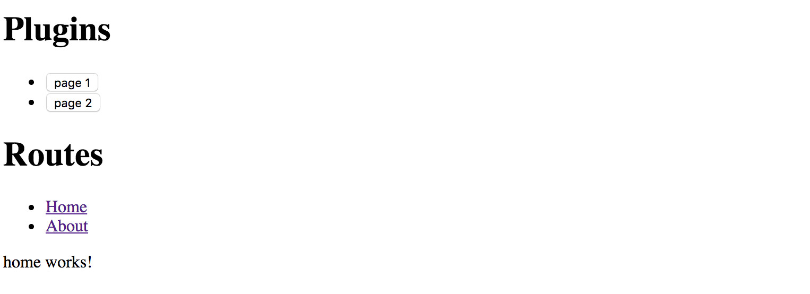

Click the `About` link to see the `AboutComponent`, that proves the router is up and running,
and ready for our further customizations.

For the next step, we need one more component that we are going to create dynamically at runtime.
Let's imagine that we have a configuration switch or settings that allows us to enable the `Settings` feature for our application.

Use Angular CLI to create a new `SettingsComponent` and automatically declare it within the `App` module:

```sh
ng g component settings --module=app
```

Note that `Settings` component is part of the application, but it gets created dynamically.

According to Angular rules we need to register in the module's `entryComponents` section
all the components that we are going to create dynamically by using their factories.

Update the main application module according to the example of the code below:

```ts
// src/app/app.module.ts
// ...

import { SettingsComponent } from './settings/settings.component';

@NgModule({
  declarations: [
    /*...,*/
    SettingsComponent
  ],
  imports: [ /*...*/ ],
  entryComponents: [
    SettingsComponent
  ],
  providers: [],
  bootstrap: [AppComponent]
})
export class AppModule { }
```

We also need a way to render and test all dynamic routes.

Let's create the collection variable to hold the information we need to create the list of links on the main page,
similar to the `Home` and `About` that we have created earlier.

Our main component class also needs importing and injecting the Router instance.

```ts
// src/app/app.component.ts
// ...

import { Router } from '@angular/router';

@Component({/*...*/})
export class AppComponent {

  // ...

  links: { text: string, path: string }[] = [];

  constructor(/*...,*/ private router: Router) {
    // ...
  }

  // ...
}
```

To display a link, we need a title and a route path value.

For a minimal Router entry, we also need the type of the component to associate with the given route.
That means we can create the following method to register a new route and also fill the `links` collection:

```ts
// src/app/app.component.ts

createRoute(text: string, path: string, componentType: any) {
    this.router.config.unshift({
        path: path,
        component: componentType
    });

    this.links.push({ text, path });
}
```

The main point of interest for us, in this case, is the `router.config` property
that holds a collection of all registered routes available to the application and Router.
The "createRoute" method inserts a new record containing a path and the component Type.

Why is it essential to use `unshift` instead of the `push`  method for the routes array?
Very often the last route in the collection is a `catch-all` fallback path
that handles missing pages and redirects to some error or `page not found` component,
like in the following example:

```ts
const appRoutes: Routes = [
  {
    path: '',
    component: HomeComponent
  },
  { path: '**', component: PageNotFoundComponent }
];
```

By pushing new content to the routes collection we risk adding it after the `catch-all` path,
and so the routes are not going to be available at runtime.

That is why we `prepend` new routes by using `Array.prototype.unshift`
rather than appending them with `Array.prototype.push` function.

Let's try the route generator out with the SettingsComponent we have recently created.

Update the main application component class with the necessary imports,
and call the `createRoute` method in the class constructor
to prepend the `Settings` route pointing to the `/settings` URL like in the next snippet:

```ts
// src/app/app.component.ts
// ...

import { SettingsComponent } from './settings/settings.component';

@Component({/*...*/})
export class AppComponent {
  // ...

  constructor(private compiler: Compiler, private router: Router) {
    // ...
    this.createRoute('Settings', 'settings', SettingsComponent);
  }

  createView(name: string) {
    // ...
  }

  createRoute(text: string, path: string, componentType: any) {
    this.router.config.unshift({
      path: path,
      component: componentType
    });

    this.links.push({ text, path });
  }
}
```

Finally, we need to create a list of new routes on the main page.

You should already have an unordered list with the `Home` and `About` links,
let's update it with the dynamic portion now:

```html
<!-- src/app/app.component.html -->
<!-- ... -->

<h1>Routes</h1>

<ul>
  <li><a routerLink="/">Home</a></li>
  <li><a routerLink="/about">About</a></li>

  <li *ngFor="let link of links">
    <a [routerLink]="link.path">
      {{ link.text }}
    </a>
  </li>
</ul>

<router-outlet></router-outlet>
```

As soon as you reload the page, you are going to see three links in the `Routes` section:
`Home`, `About` and the newly introduced `Settings`.

Click on the `Settings` one, and you are going to see the `setting works!` label in the router outlet area.
That means your application successfully renders the content you provide at runtime, congratulations!

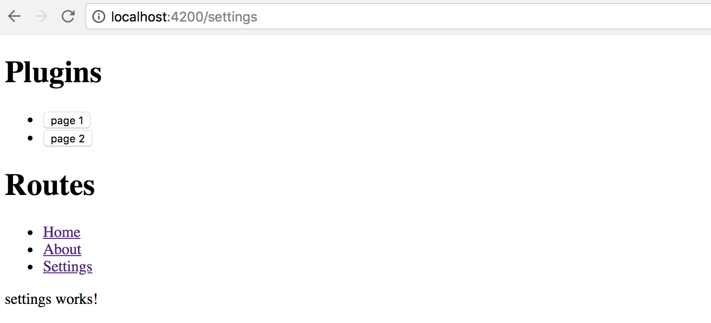

We have walked through a simplified scenario for route creation.

As you can now imagine, that approach can be used in more sophisticated cases,
when you store route names, paths and component aliases in the external configuration files,
and load them on demand together with new route generation, as we did earlier in this chapter.

> **Source Code**
>
> You can find the source code in the
> **[angular/plugins](https://github.com/DenysVuika/developing-with-angular/tree/master/angular/plugins)** folder.

## External plugins

We have finally approached the most advanced and the most valuable area -
plugins that are loaded by the application at runtime from external sources,
and provide new features based on specific extension points.

For generic plugin capabilities we need to have application support at least for the following items:

- defining an extension point in the application
- essential plugin registration and management APIs
- loading external modules at runtime
- executing or instantiating external components

Traditionally, application or framework developers provide a set of extension points
that third-party developers can use to build plugins or extensions.
Let's take the Routing example we used across this chapter as a perfect scenario for extensibility.

We are going to enable other developers to build extra components and register new routes in our application.
Ultimately it should be possible to drop the JavaScript file in some specialized `modules` folder
and register the module in the application configuration file.
The application should not "know" about loaded types, and the whole plugin integration should happen dynamically,
without recompiling the application or even restarting the web server.

### Extension decorator

It is essential to keep the plugin feature as simple as possible
so that your third-party developers do not study a new programming language
or the practices and patterns that are relevant only to your particular implementation.
The ES2016 `decorator` pattern might be the best choice, as Angular developers
are already familiar with decorators and annotations.

Let's imagine we have a unique `@Extension` decorator to mark all the components
we want the target application to discover and use.
We could also provide some extra metadata for such a decorator,
for example, public alias to use in the configuration files,
maybe an icon or even a list of dependencies on other plugins or modules.

For example, it can look like the following when applied to a class:

```js
@Extension('my-extension')
class MyExtension {
  // ...
}
```

Decorators can be chained, so that means we can use them with Angular components like this as well:

```ts
@Extension('my-button')
@Component({
  selector: 'my-button,
  templateUrl: 'my-button.html'
})
export class MyButtonComponent {
  // ...
}
```

As you can see, we need at least one project to hold the Extension and other APIs
that we share across all plugin implementations, let's call it `Plugins Core`.
It can also contain some management services, like `Plugin Manager`
to help the end application maintain plugins easily.

Finally, we are going to extend the main application to allow adding new routes and components via the configuration file.
For the current scenario, our simple extension point is a Router extension and new pages for the application,
but there can be many different extension points in the future.

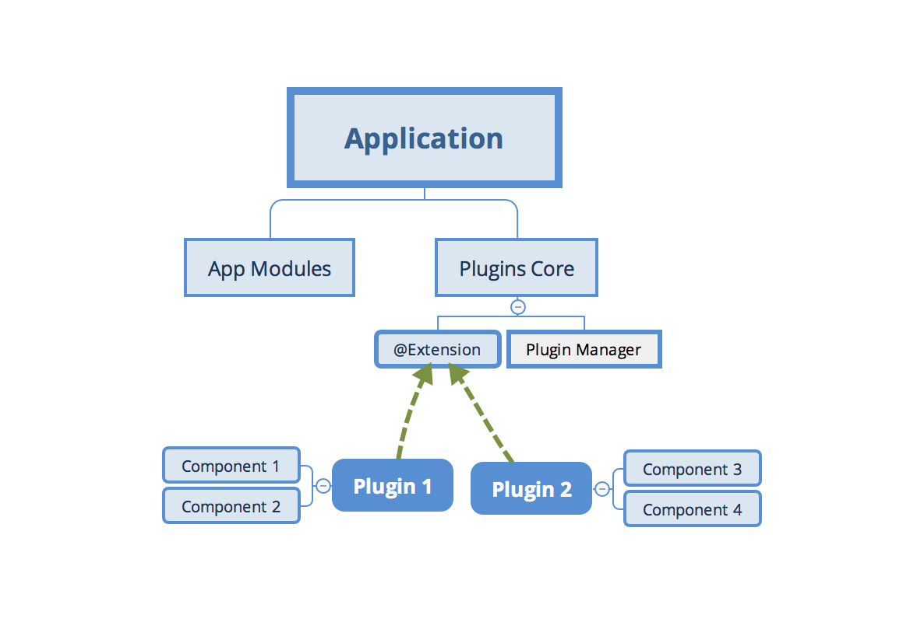

### Creating a Plugins Core library

Create a separate `plugins-core` folder for the shared Extension APIs to use with all new plugins.
I am going to use the [Rollup.js](https://rollupjs.org/) to build and bundle the code.
However, you can use any other means to create a redistributable Angular library.

You can refer to the **[Reusable component libraries](ch12-00-reusable-component-libraries.md)** chapter for more details.

> **Rollup.js**
>
> Rollup is a module bundler for JavaScript which compiles small pieces of code
> into something larger and more complex, such as a library or application.
>
> To get more information about Rollup, please refer to the official documentation:
> [https://rollupjs.org](https://rollupjs.org)

Note, however, that `Rollup` is not the only option for building redistributable libraries. You can also check the following alternatives:

- [ng-packagr](http://spektrakel.de/ng-packagr)
- [Nx extensions for Angular](https://nrwl.io/nx)

Create a new `package.json` file with the following content to configure dependencies for the new project:

**package.json**:

```json
{
    "name": "plugins-core",
    "version": "1.0.0",
    "main": "dist/bundle.js",
    "license": "MIT",
    "scripts": {
      "build": "rimraf dist/bundle.js && rollup -c"
    },
    "devDependencies": {
      "babel-core": "^6.26.0",
      "babel-plugin-external-helpers": "^6.22.0",
      "babel-plugin-transform-decorators-legacy": "^1.3.4",
      "babel-preset-env": "^1.6.1",
      "rimraf": "^2.6.2",
      "rollup-plugin-babel": "^3.0.3",
      "rollup-plugin-json": "^2.3.0",
      "rollup-plugin-node-resolve": "^3.0.2"
    }
}
```

Note the `scripts` section and the "build" command.
You are going to need it later to produce the bundle to use with the main application.

Run the following command now to install all dependencies:

```sh
npm install
```

The Rollup is using Babel libraries under the hood.
We need to provide the following configuration to enable support for decorators:

**.babelrc**:

```json
{
    "presets": [
      ["env", {
        "modules": false
      }]
    ],
    "plugins": [
      "external-helpers",
      "transform-decorators-legacy"
    ]
}
```

The last project preparation step is the configuration file for the Rollup itself.
Use the following source code for the minimal working configuration that takes `src/main.js` file as an input,
and produces the `dist/bundle.js` file as the bundled output.

```js
// rollup.config.js

import json from 'rollup-plugin-json';
import resolve from 'rollup-plugin-node-resolve';
import babel from 'rollup-plugin-babel';

export default {
    input: 'src/main.js',
    output: {
        file: 'dist/bundle.js',
        format: 'system'
    },
    plugins: [
        json(),
        resolve({
            // pass custom options to the resolve plugin
            customResolveOptions: {
                moduleDirectory: 'node_modules'
            }
        }),
        babel({
            exclude: 'node_modules/**' // only transpile our source code
        })
    ]
}
```

Finally, we are ready to start implementing our `Extension` decorator.
The code is pretty simple, given that decorators are JavaScript functions:

```js
// src/extension.js

export function Extension(name, deps) {
    return (constructor) => {
        Extension.prototype.registry[name] = {
            ctor: constructor,
            deps: deps || []
        };
    };
}

Extension.prototype.registry = {};
```

As per our design, the `Extension` decorator is going to keep a registry of all the classes it has decorated.
That enables quick access to all the `registered` extensions at runtime
without extra initialization overhead for each decorated class or component.

Our decorator requires a public name of the decorated element, to use within application configurations.
We also reserve an optional array of dependencies that our plugin requires when loaded into the application.
Feel free to add more properties later on when your plugin architecture evolves.

While we are here, let's also provide a couple of utility functions to generate a list of providers.

One is `getProviders`, to be able using it within the Angular Injectors and modules.
Another one is `getExtensionType` to allow us quickly resolving extension type (or constructor) based on the public name.
You are going to see both of them in action shortly.

```js
// src/extension.js
// ...

Extension.prototype.getProviders = function () {
    var registry = this.registry;
    return Object.keys(registry).map(function (key) {
        return {
            provide: key,
            useClass: registry[key].ctor,
            deps: registry[key].deps
        };
    });
};

Extension.prototype.getExtensionType = function (name) {
    return this.registry[name].ctor;
}
```

For the next step, we introduce a `PluginManager` class to provide a single place
for controlling and using our plugins at runtime.

Typically it is the end application that calls these methods when setting up the extension points
or resolving and compiling components coming from the plugin library.

```js
// src/plugin-manager.js

import { Extension } from './extension';

export class PluginManager {

  getType(name) {
    return Extension.prototype.getExtensionType(name);
  }

  getProviders() {
    return Extension.prototype.getProviders();
  }

}
```

Finally, create the `main` library entry point and export the classes and functions we have created.

Note that we export the instance of the PluginManager as a singleton.
That is not mandatory but saves time for creating new instances at the application level,
especially when accessing plugins from multiple places and files in the code.

```js
// src/main.js

import { PluginManager } from './plugin-manager';

export { Extension } from './extension';
export const pluginManager = new PluginManager();
```

That is pretty much all. You can now build the redistributable bundle with the `build` script:

```sh
npm run build
```

The console output should be similar to the following one:

```text
src/main.js => dist/bundle.js...
created dist/bundle.js in 369ms
```

For real-life scenarios, you may probably want to publish your redistributable library to NPM,
so that developers can install it as part of the application and use as a third party addon.

For demonstration and quick testing purposes let's emulate the NPM deployment behavior
by running the `npm link` command in the root project folder:

```sh
npm link
```

Now you can run `npm link plugins-core` in any of your local projects folders,
and emulate the process of installing from NPM.

The main benefit is that you can keep working on the library code, all applications
and libraries that link it are going to get updates automatically.

Once you are have finished with the development, you can, of course,
use the real publishing via `npm publish` commands, but this is out of our current scope.

You shall see the linking example later in this chapter.

> **Source Code**
>
> You can find the source code in the
> **[angular/plugins-core](https://github.com/DenysVuika/developing-with-angular/tree/master/angular/plugins-core)** folder.

### Creating an example Plugin library

We have created a shared Plugins Core library with the previous steps.
It is now time to build our first plugin library.

Create a separate `plugins-example` folder and place the following `package.json` file there:

**package.json**:

```json
{
  "name": "plugins-example",
  "version": "1.0.0",
  "main": "dist/bundle.js",
  "license": "MIT",
  "scripts": {
    "build": "rimraf dist && rollup -c"
  },
  "devDependencies": {
    "rimraf": "^2.6.2",
    "rollup-plugin-node-resolve": "^3.0.2",
    "rollup-plugin-typescript": "^0.8.1",
    "rollup-plugin-typescript2": "^0.10.0",
    "typescript": "^2.6.2"
  },
  "dependencies": {
    "@angular/core": "^5.2.2",
    "rollup": "^0.55.1"
  }
}
```

As with the previous project, install the dependencies running the command below:

```sh
npm install
```

Our project needs to depend on the `plugins-core` library.

Typically we should be adding it to the package file and installing with all other dependencies,
however for the sake of simplicity we are going to use "npm link" feature to provide a live link to the library.
That helps to work on both projects at the same time without publishing to NPM.

Run the following command in the project root to establish a link:

```sh
npm link plugins-core
```

As we are going to create Angular components, we need to setup the TypeScript integration for the Rollup.
Put the following `tsconfig.json` file in the project root to enable basic support we need right now:

**tsconfig.json**:

```json
{
    "compilerOptions": {
        "target": "es5",
        "module": "system",
        "lib": ["es2017", "dom"],
        "declaration": true,
        "sourceMap": true,
        "removeComments": true,
        "moduleResolution": "node",
        "typeRoots": [ "node_modules/@types" ],
        "experimentalDecorators": true,
        "emitDecoratorMetadata": true
    }
}
```

> **TypeScript Configuration**
>
> You can always generate a recommended configuration file by running the `tsc --init` command in any folder.
>
> That requires, however, a TypeScript to be installed globally via `npm install -g typescript` command.

Now finish the project scaffold setup by also adding the Rollup configuration file like below:

```js
// rollup.config.js

import resolve from 'rollup-plugin-node-resolve';
import typescript from 'rollup-plugin-typescript2';

export default {
    input: 'src/main.ts',
    output: {
        file: 'dist/bundle.js',
        format: 'system'
    },
    plugins: [
        resolve({
            // pass custom options to the resolve plugin
            customResolveOptions: {
                moduleDirectory: 'node_modules'
            }
        }),
        typescript({
            typescript: require('typescript')
        })
    ],
    external: [
        'plugins-core',
        '@angular/core'
    ]
}
```

Please pay attention to the `external` section of the Rollup configuration.

It contains references to the libraries in your `package.json` that should never get bundled into the resulting output.
That means that every plugin library is not going to contain the full copy of the Angular or another version of the `plugins-core`.
Having such dependencies marked as `external`, however, requires the main application to import them alongside our plugins.

If your library depends on other Angular libraries, like `@angular/forms` or `@angular/http`,
include those in the `external` section too.

Let's now create the first plugin component marked with our `Extension` decorator.
It is going to be a dummy button element that we reference as `my-button` extension.

```ts
// src/my-button/my-button.component.ts

import { Component, OnInit, NgModule } from '@angular/core';
import { Extension } from 'plugins-core';

@Extension('my-button', [])
@Component({
    selector: 'my-button',
    template: `<button>My Button</button>`
})
export class MyButtonComponent implements OnInit {

    ngOnInit() {
        console.log('My Button Init');
    }

}
```

Create one more component with a label element and called `my-label`:

```ts
// src/my-label/my-label.component.ts

import { Component, OnInit, NgModule } from '@angular/core';
import { Extension } from 'plugins-core';

@Extension('my-label', [])
@Component({
    selector: 'my-label',
    template: `<h1>My Label</h1>`
})
export class MyLabelComponent implements OnInit {

    ngOnInit() {
        console.log('My Label Init');
    }

}
```

Both components also produce log messages to the browser console for testing purposes.
The only thing that is now left is to export both components in the `main` class.

```ts
// src/main.ts

export { MyLabelComponent } from './my-label/my-label.component';
export { MyButtonComponent } from './my-button/my-button.component';
```

Now run the `build` script to create a redistributable bundle:

```sh
npm run build
```

Once the compilation completes, the console output should be as follows:

```text
src/main.ts => dist/bundle.js...
created dist/bundle.js in 980ms
```

Finally, you should also create a link to this project to test the library
without publishing to NPM every time you make changes to the project.

```sh
npm link
```

We now got the `plugins-core` and `plugins-example` libraries compiled
and ready for use with an Angular application as external plugins.

> **Source Code**
>
> You can find the source code in the
> **[angular/plugins-example](https://github.com/DenysVuika/developing-with-angular/tree/master/angular/plugins-example)** folder.

### Extra libraries and dependencies

Your component library does not restrict you to a particular set of dependencies.
You can add many additional libraries to the `rollup` configuration,
and plugin components can also have own `providers` sections to get additional services imported.

For example, you can add a FormBuilder integration using the following steps.

First, update the `rollup.config.js` file and add `@angular/forms` to the exclusion list.
That prevents entire forms library from getting bundled into your library output.

```js
export default {
  // ...,

  external: [
      'plugins-core',
      '@angular/core',
      '@angular/forms'
  ]
}
```

Next, import the Forms related types, and update your component decorator to include the `FormBuilder` provider:

```ts
// src/my-label/my-label.component.ts

import { Component, OnInit, NgModule } from '@angular/core';
import { FormBuilder, FormGroup, Validators } from '@angular/forms';
import { Extension } from 'plugins-core';

@Extension('my-label', [])
@Component({
    selector: 'my-label',
    template: `<h1>My Label</h1>`,
    providers: [ FormBuilder ]
})
export class MyLabelComponent implements OnInit {

    ngOnInit() {
        console.log('My Label Init');
    }

}
```

Once you have component configuration set, you can import the `FormBuilder` and use its APIs from within the plugin component.

```ts
// src/my-label/my-label.component.ts

export class MyLabelComponent implements OnInit {

    form: FormGroup;

    constructor(private fb: FormBuilder) {
        this.form = fb.group({
            name: fb.group({
                first: ['Nancy', Validators.minLength(2)],
                last: 'Drew'
            }),
            email: ''
        });
    }

    ngOnInit() {
        console.log('My Label Init');
        console.log('FB:', this.fb);
        console.log('Form:', this.form);
    }

}
```

Finally, you need updating the `SystemJS` settings of the main application to include extra libraries to use for plugins.

In the example below I am adding `@angular/common`, `@angular/forms` and `@angular/platform-browser` to the list.
Those libraries will get available for all the loaded plugins.

**src/assets/plugins.config.json**:

```json
{
  ...,

  "system": {
    "baseURL": "/assets/modules",
    "paths": {
      "npm:": "https://unpkg.com/"
    },
    "map": {
      "@angular/core": "npm:@angular/core/bundles/core.umd.js",
      "@angular/common": "npm:@angular/common/bundles/common.umd.js",
      "@angular/forms": "npm:@angular/forms/bundles/forms.umd.js",
      "@angular/platform-browser": "npm:@angular/platform-browser/bundles/platform-browser.umd.js",
      "rxjs": "npm:rxjs",

      "plugins-core": "/modules/plugins-core/bundle.js",
      "plugins-example": "/modules/plugins-example/bundle.js"
    }
  },
}
```

You might need to import `FormsModule` and `ReactiveFormsModule` also to the root application module.

```ts
// src/app/app.component.ts

import { FormsModule, ReactiveFormsModule } from '@angular/forms';

@NgModule({
  // ...,

  imports: [
    BrowserModule,
    HttpModule,
    FormsModule, ReactiveFormsModule
  ],

  // ...
})
export class AppModule { }
```

### Providing dependencies for your plugins

As I have mentioned earlier, you have full control over what the dynamic module contains.
This opens the door to at least two great scenarios for injecting external content into your plugins at run-time.

We have already touched the first one.
That is the `imports` section and extra libs you can provide for every plugin you construct.
That can be Forms modules, Material modules, you custom or third-party libraries.

Every time we create an instance of the plugin component of the `componentType`,
the component templates can use form fields, and material buttons provided with the `MatButtonModule` module.

```ts
const RuntimeModule = NgModule({
  imports: [
    CommonModule,
    FormsModule,
    ReactiveFormsModule,
    MatButtonModule
  ],
  declarations: [
    componentType
  ]
})(class {})
```

Another way to inject data into the plugin components is by utilizing "providers" section.
You can create and pre-configure the services prior to exposing them to components and other services
that you resolve and create on the fly.

```ts
const RuntimeModule = NgModule({
  declarations: [
    componentType
  ],
  providers: [
    { provide: Injector, useValue: this.injector },
    { provide: FormBuilder, useValue: this.fb },
    { ... }
  ]
})(class {})
```

That is a powerful feature that allows you having complete control
over the dependency resolution process for external components.

### Loading plugins into the Application

Switch to the `plugins` application we earlier in this chapter.
Use the following commands to link both `plugins-core` and `plugins-example` libraries to emulate installation from NPM:

```sh
npm link plugins-core
npm link plugins-example
```

Also, you need to install a `systemjs` library.
That is a module loader we are going to use to get our plugins into the running application.

```sh
npm install systemjs
```

> **SystemJS**
>
> Configurable module loader enabling dynamic ES module workflows in browsers and NodeJS.
> Built with the ES Module Loader project, which is based on principles and APIs
> from the WhatWG Loader specification, modules in HTML and NodeJS.
>
> For more details please refer to the official **[project page](https://github.com/systemjs/systemjs/blob/master/README.md)**.

As we are using Angular CLI for the application, the `systemjs` library needs to be present
within the `scripts` section of the `angular.json` configuration file.

**angular.json**:

```json
{
  "$schema": "./node_modules/@angular/cli/lib/config/schema.json",
  "project": {
    "name": "plugins"
  },
  "apps": [
    {
      ...,
      "scripts": [
        "../node_modules/systemjs/dist/system.js"
      ],
      ...
    }
  ],
  ...
}
```

It would be much easier if we also automate plugin bundle copying process.

According to our design, all external plugins need to reside in the `modules` folder
of the application, either local or running at the server side.
As we continuously develop our plugin libraries, it is much easier
if Angular CLI automatically copies resulting bundles into appropriate places.

We already linked the libraries via the `npm link` command, the only thing
that is left is to add extra rules for the `assets` folder:

**angular.json**:

```json
{
  "$schema": "./node_modules/@angular/cli/lib/config/schema.json",
  "project": {
    "name": "plugins"
  },
  "apps": [
    {
      ...,
      "assets": [
        ...,
        {
          "glob": "bundle.js",
          "input": "../node_modules/plugins-core/dist",
          "output": "./modules/plugins-core"
        },
        {
          "glob": "bundle.js",
          "input": "../node_modules/plugins-example/dist",
          "output": "./modules/plugins-example"
        }
      ],
      ...,
      "scripts": [
        "../node_modules/systemjs/dist/system.js"
      ],
      ...
    }
  ],
  ...
}
```

For the next step, we need to provide some basic configuration for SystemJS loader.

The best way would be to re-use the same `plugins.config.json` configuration file we have created earlier.
In this case, you can manage both the loader and the plugin configuration in the same place,
and also without rebuilding the application.

To keep the configuration short, we are going to load all missing dependencies
directly from the `[UNPKG](https://unpkg.com/)`, a fast CDN for NPM libraries.

The `plugins-core` and `plugins-example` point to the local bundle files we copy with the Angular CLI.

**src/assets/plugins.config.json**:

```json
{
  "system": {
    "baseURL": "/assets/modules",
    "paths": {
      "npm:": "https://unpkg.com/"
    },
    "map": {
      "@angular/core": "npm:@angular/core/bundles/core.umd.js",
      "rxjs": "npm:rxjs",

      "plugins-core": "/modules/plugins-core/bundle.js",
      "plugins-example": "/modules/plugins-example/bundle.js"
    }
  },
  "sidebar": {
    "components": [
      "app-page2",
      "app-page1"
    ]
  }
}
```

Update the application component imports section with the `SystemJS` type declaration.
That allows us using auto-completion and type checking for the SystemJS APIs:

```ts
// src/app/app.component.ts

import {/*...,*/ AfterViewInit} from '@angular/core';
import { HttpClient } from '@angular/common/http';

import { System } from 'systemjs';
declare var SystemJS: System;
```

As you remember, we can load configuration using HttpClient, and use a TypeScript interface
to enable static type checks and IDE support. Let's start with the basic one:

```ts
interface PluginsConfig {
  system: any;
}
```

To finish the preparations, add the `HttpClient` and mark the `ngAfterViewInit` handler as `async`,
like in the next example:

```ts
// src/app/app.component.ts

@Component({/*...*/})
export class AppComponent implements AfterViewInit {
  // ...

  constructor(/*...,*/ private http: HttpClient) {
    // ...
  }

  async ngAfterViewInit() {
  }
}
```

Let's try to load the configuration and log its content to the browser console to ensure the file loads fine:

```ts
// src/app/app.component.ts

@Component({/*...*/})
export class AppComponent implements AfterViewInit {
  // ...

  constructor(/*...,*/ private http: HttpClient) {
    // ...
  }

  async ngAfterViewInit() {
    const url = '/assets/plugins.config.json';
    const config = <PluginsConfig> await this.http.get(url).toPromise();
    console.log(config);
  }
}
```

Run the application or reload the page. The developer tools console should look similar to the one below:


Before we load a plugin, the SystemJS loader needs to get configured.
We load and apply settings using the `config` method like in the next example:

```ts
SystemJS.config(config.system);
```

You can test the loader by importing the `plugins-core` library:

```ts
// src/app/app.component.ts

export class AppComponent implements AfterViewInit {

  async ngAfterViewInit() {
    const url = '/assets/plugins.config.json';
    const config = <PluginsConfig> await this.http.get(url).toPromise();
    console.log(config);

    SystemJS.config(config.system);

    const core = await SystemJS.import('plugins-core');
    console.log(core);
  }

}
```

This time the browser console output should contain the `plugins-core` library content:

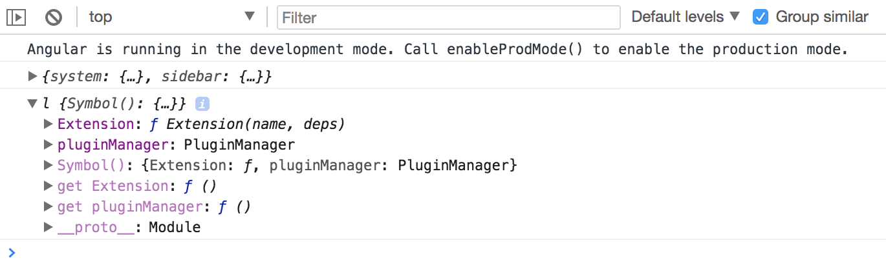

Try expanding the `Extension` and `prototype` sections in the console to check the `registry` content.
It should be an empty object like this:

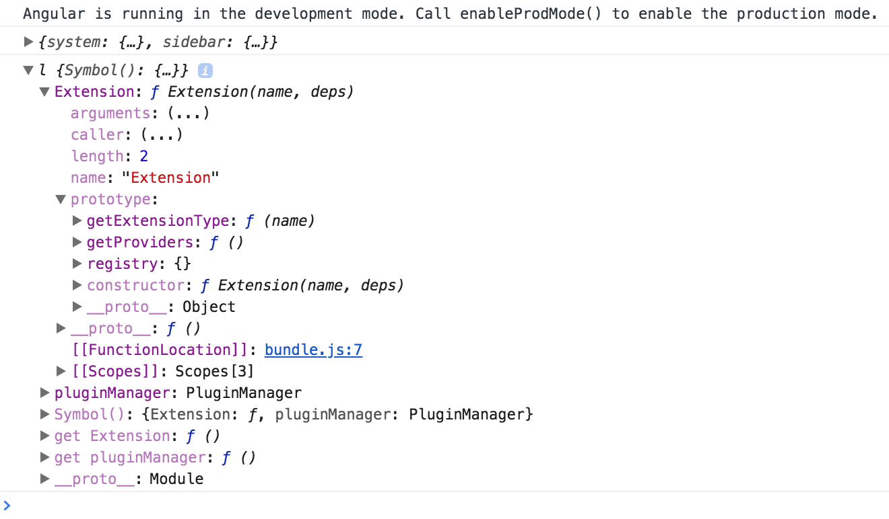

Next, import the `plugins-example` right after the `plugins-core`:

```ts
// src/app/app.component.ts

const core = await SystemJS.import('plugins-core');
const pluginExample = await SystemJS.import('plugins-example');
console.log(core);
```

Now, the Extension decorator should contain two entries in the registry.
As you can see from the console output they are `my-button` and `my-label`:

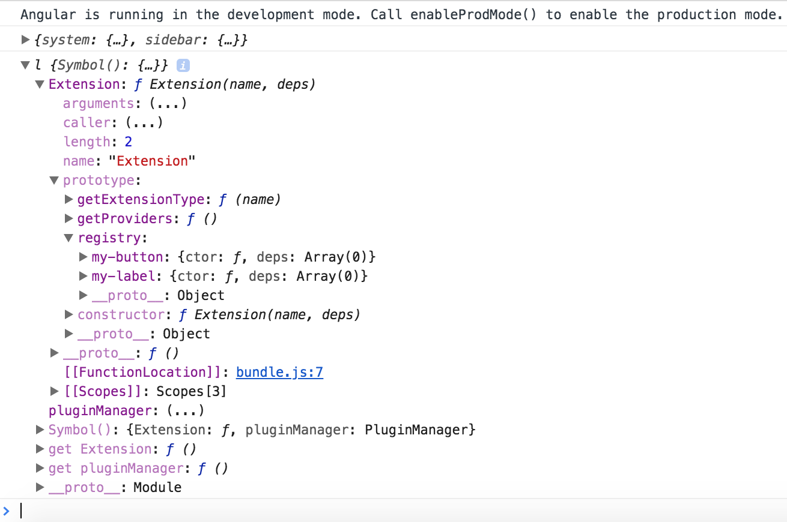

You already know the names of the extensions, because you have defined them in the decorators for each component.
Also, you have the corresponding libraries loaded into the application at runtime.

It is now possible to use the same technique for dynamic module compilation
with the component constructors, fetched using Plugin Manager APIs.

The code below demonstrates the `my-label` plugin compiled and rendered within the `content` element,
similar to what we did earlier in this chapter.

```ts
// src/app/app.component.ts

export class AppComponent implements AfterViewInit {

  async ngAfterViewInit() {
    // ...

    SystemJS.config(config.system);

    const core = await SystemJS.import('plugins-core');
    const pluginExample = await SystemJS.import('plugins-example');
    console.log(core);

    const componentType = core.pluginManager.getType('my-label');

    const RuntimeModule = NgModule({
      imports: [
        // extra modules if needed by your plugins
        // for example: FormsModule, HttpClientModule, etc
      ],
      declarations: [componentType]
    })(class {});

    const module = this.compiler.compileModuleAndAllComponentsSync(
      RuntimeModule
    );

    const factory = module.componentFactories.find(
      f => f.componentType === componentType
    );

    this.content.clear();
    this.content.createComponent(factory, 0);
  }

}
```

> **Dynamic modules and NgModule decorator**
>
> Please keep in mind that with the "RuntimeModule" you are creating a real Angular module.
>
> Besides "declarations" section you can reuse all other metadata properties exposed by the "NgModule" decorator.
>
> For example, you can use "imports" to store a set of extra dependencies for your plugins.
> Or "providers" where you add new, redefine or configure existing providers.

Switch to the running application and reload the page, if you do not have live reloading enabled.
The main page now contains the `My Label` element.
That is the content of the plugin we have just dynamically loaded.

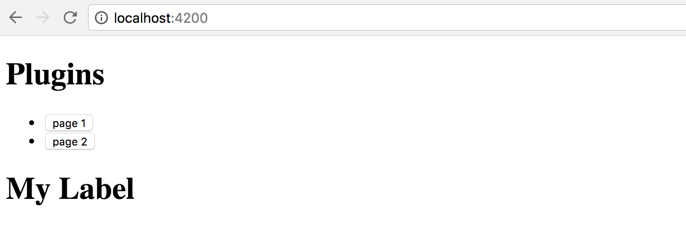

Another challenge to address - dependencies for your plugins.

In most common scenarios the plugin branch needs to be attached to the running application tree,
and have access to all the shared infrastructure.

The perfect examples are Authentication layer, Translation services, User Preferences, Application Configuration.
Every loaded plugin should not create a new copy, but reuse already configured instances of the services.

You can achieve tight integration of the plugins by using custom Injector instances.
It is possible to create the Injector that inherits the main application tree of Injectors,
and at the same time contains custom settings that a plugin brings if you need that level of control.

```ts
// src/app/app.component.ts

import { /*...,*/ Injector } from '@angular/core';

export class AppComponent implements AfterViewInit {

  constructor(private compiler: Compiler,
              private router: Router,
              private http: HttpClient,
              private injector: Injector) {
    // ...
  }

  async ngAfterViewInit() {
    // ...

    const pluginInjector = Injector.create([
      ...core.pluginManager.getProviders()
    ], this.injector);

    this.content.clear();
    this.content.createComponent(factory, 0, pluginInjector);
  }

}
```

First of all, we import an instance of the Injector into the component class constructor.

That is the same Injector that provides all other dependencies for the given class by the way.
It is created for every component and resolves all the required dependencies.

If there are no values registered with the component Injector, the Angular goes up the component tree
to the parent component and checks its Injector.
It repeats the same procedure until it reaches the top of the application tree and its module.

We take the component injector and create a new instance based on it.
Moreover, we populate the `providers` section of the current plugin.
That allows a plugin to register new or override existing providers if needed,
and allows Angular traverse the whole injector tree.

```ts
const pluginInjector = Injector.create([
  ...core.pluginManager.getProviders()
], this.injector);
```

As soon as you have your custom injector, it becomes trivial to create a new component
with the factory, corresponding element position and injector instance:

```ts
this.content.clear();
this.content.createComponent(factory, 0, pluginInjector);
```

Note the usage of the `Extension.prototype.getProviders` that we have created earlier.

That method allows us to collect all components marked with the `Extension` decorator,
and produce a list of `providers` and their `dependencies`, to attach to any custom injector or dynamic module:

```js
// plugins-core:/src/extension.js

Extension.prototype.getProviders = function () {
    var registry = this.registry;

    return Object.keys(registry).map(function (key) {
        return {
            provide: key,
            useClass: registry[key].ctor,
            deps: registry[key].deps
        };
    });
};
```

Visually the hierarchy of dependencies and injectors should look like the following:

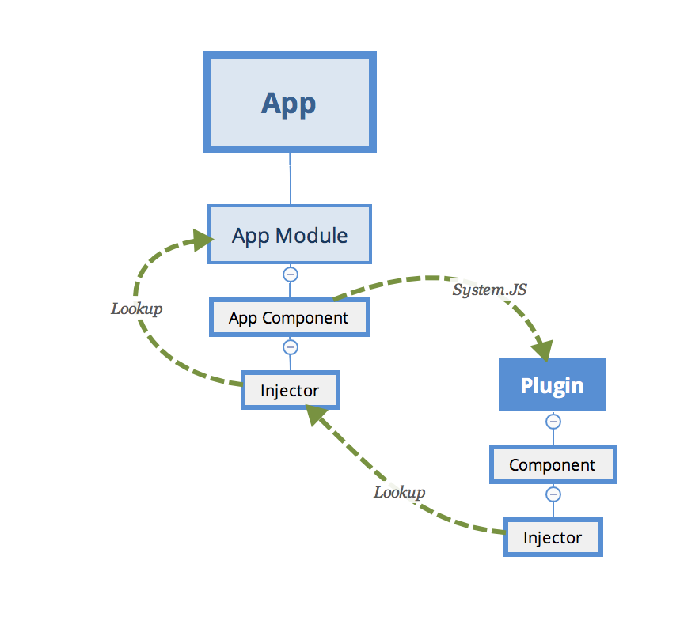

### Setting plugin properties at runtime

We have already used a few times the `ViewContainerRef.createContent` method to create and inject content.

```ts
this.content.clear();
this.content.createComponent(factory, 0, pluginInjector);
```

The biggest feature of this method is that it returns the instance of the `ComponentRef` type.
That allows you accessing the real instance of the component you have just created, and setting its properties, or calling methods.

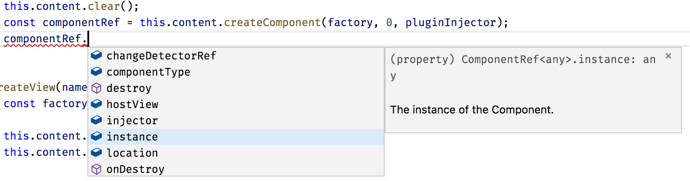

You can try to check how it works by logging the value of one property the plugin defines, for example a `form`:

```ts
console.log(componentRef.instance.form);
```

Use this technique to set up dynamic components after they get created.
You can set any properties and call any methods to provide post-constructor setup,
or prime your component with extra infrastructure references.

Sometimes it might be easier for you to set the corresponding properties at run time than piping all injectors and dependencies.

As plugins can be of many types unknown at compile time,
you can create a set of interfaces to provide a contract for the external developers.
For example, you may want all plugin developers to inherit a `PluginComponent` interface
with a set of properties your application can rely at run-time.

### Dynamic Routes with plugin content

We have been using manual import of the plugins by their names so far.
In real life, you are most probably going to make the application fully automatic,
based on multiple extension points and configuration settings that are coming either from the file or RESTful service call.

Let's introduce an application Router extension point similar to the one we have been using before.

This time, however, the application is going to load routes from the configuration file.
Every route now should be powered by the content exposed by the plugin, and not known to the application at compile time.

There may be many ways to express plugins setup in the configuration.
Here's a simple example for you to get started:

```json
{
  "system": {...},
  "sidebar": {...},

  "plugins": {
    "modules": {
      "plugins-core": "/modules/plugins-core/bundle.js" ,
      "plugins-example": "/modules/plugins-example/bundle.js"
    },
    "routes": [
      {
        "name": "Plugin 1 (label)",
        "path": "plugin1",
        "component": {
          "module": "plugins-example",
          "componentType": "my-label"
        }
      },
      {
        "name": "Plugin 2",
        "path": "plugin2 (button)",
        "component": {
          "module": "plugins-example",
          "componentType": "my-button"
        }
      }
    ]
  }
}
```

In our case, we introduce an extra section `plugins` to our existing `plugin.config.json` file.
It contains the list of available modules and a couple of routes that we want to create when the application starts.

Each route instance consists of the name, route path, and component information:
module and alias that we used within the `Extension` decorator.

To enable static checks, let's also extend the `PluginsConfig` interface:

```ts
interface PluginsConfig {
  system: any;
  plugins: {
    modules: any,
    routes: Array<{
      name: string,
      path: string,
      component: {
        module: string,
        componentType: string
      }
    }>
  };
}
```

Next, edit the `ngAfterViewInit` hook for the main application component class,
and add the `loadExternalRoutes` call right after the SystemJS configuration:

```ts
// src/app/app.component.ts

export class AppComponent implements AfterViewInit {
  // ...

  async ngAfterViewInit() {
    const url = '/assets/plugins.config.json';
    const config = <PluginsConfig> await this.http.get(url).toPromise();

    SystemJS.config(config.system);
    this.loadExternalRoutes(config);

    // ...
  }

}
```

At runtime, we can now quickly get a list of the plugins, their modules and custom routes.
Also, you can now get the corresponding component type using its alias and calling the `pluginManager.getType` method.

We have already implemented a way to create a dynamic route and display it on the page.
The challenging part is that Angular requires the route component to be a `known` type.
Due to some architectural reasons, it does not allow us to put an entirely dynamic component type as the `route.componentType` value.

You can solve the difficulty with the route components by introducing a statically known
to the application component, that has dynamic content.

Let's imagine we have a `DynamicPageComponent` component that has an empty template
and serves as a wrapper for the dynamic content exported by the external plugin.
We already know it is technically feasible, given the dynamic sidebar component we have previously created.

The `loadExternalRoutes` implementation may look like the following one:

```ts
// src/app/app.component.ts
// ...

import { DynamicPageComponent } from './dynamic-page/dynamic-page.component';

export class AppComponent implements AfterViewInit {
  // ...

  private async loadExternalRoutes(config: PluginsConfig) {
    const core = await SystemJS.import('plugins-core');

    for (const route of config.plugins.routes) {
      const module = await SystemJS.import(route.component.module);
      const componentType = core.pluginManager.getType(
        route.component.componentType
      );

      this.createRoute(
        route.name,
        route.path,
        DynamicPageComponent,
        componentType
      );
    }
  }

}
```

Let's now adopt the `createRoute` to match our scenario:

```ts
// src/app/app.component.ts

export class AppComponent implements AfterViewInit {
  // ...

  createRoute(text: string,
              path: string,
              componentType: any,
              factoryType?: any) {
    this.router.config.unshift({
      path: path,
      component: componentType,
      data: {
        factory: factoryType
      }
    });

    this.links.push({ text, path });
  }
}
```

As you can see from the example above, we use a known `DynamicPageComponent` for the route,
and also provide the required factory from the `Extension` decorator.

The `data` value contains a property bag with arbitrary data that any other component can access,
a handy way passing different optional configurations.
In our case, the dynamic page component is going to build its content using the factory provided in the property bag.

Next, you can generate the `DynamicPageComponent` by running the next Angular CLI command:

```sh
ng g component dynamic-page --module=app
```

The component must also be declared as "dynamically created" by putting it
to the `entryComponents` section of the top-level module:

```ts
// src/app/app.module.ts

@NgModule({
  // ...,

  entryComponents: [
    // ...,
    
    DynamicPageComponent
  ],
  
  //...
})
export class AppModule { }
```

According to our design, the only thing that we need in the component's template is the container element:

```html
<!-- src/app/dynamic-page/dynamic-page.component.html -->

<div #content></div>
```

Similar to the dynamic sidebar, the component class implementation needs to get a reference
to the corresponding DOM element, and import injector and compile services, alongside the current route data:

```ts
// src/app/dynamic-page/dynamic-page.component.ts

import {
  Component, OnInit, OnDestroy,
  Injector, ViewChild, ViewContainerRef,
  Compiler, NgModule, ComponentRef
} from '@angular/core';
import { ActivatedRoute } from '@angular/router';

@Component({/*...*/})
export class DynamicPageComponent implements OnInit, OnDestroy {

  @ViewChild('content',  { read: ViewContainerRef })
  content: ViewContainerRef;

  component: ComponentRef<any>;

  constructor(
    private route: ActivatedRoute,
    private injector: Injector,
    private compiler: Compiler) {
  }

  ngOnInit() {
  }

  ngOnDestroy() {
  }

}
```

The `ActivatedRoute` represents the current route.

We can import it to get access to the underlying details, including the property bag defined earlier,
by using the `route.snapshot.data` property value.

The code to create and render a dynamic component should already be familiar to you:

```ts
// src/app/dynamic-page/dynamic-page.component.ts

@Component({/*...*/})
export class DynamicPageComponent implements OnInit, OnDestroy {
  // ...

  ngOnInit() {
    const componentType = this.route.snapshot.data['factory'];

    if (componentType) {
      this.compiler.clearCacheFor(componentType);

      const RuntimeModule = NgModule({
        imports: [/* extra libs */],
        providers: [/* extra providers */],
        declarations: [componentType]
      })(class {});

      const module = this.compiler.compileModuleAndAllComponentsSync(
        RuntimeModule
      );

      const factory = module.componentFactories.find(
        f => f.componentType === componentType
      );

      this.content.clear();
      this.component = this.content.createComponent(
        factory, 0, this.injector
      );
    }
  }

  ngOnDestroy() {
  }

}
```

A critical thing to keep in mind - users might visit the route multiple times,
so we need to manage all dynamically created resources and clean them up as soon as possible.

That is why we call the following code every time we build a new component:

```ts
this.compiler.clearCacheFor(componentType);
```

As soon as the user leaves the page, the component needs to be released from memory as well:

```ts
// src/app/dynamic-page/dynamic-page.component.ts

@Component({/*...*/})
export class DynamicPageComponent implements OnInit, OnDestroy {
  // ...

  ngOnDestroy() {
     if (this.component) {
      this.component.destroy();
      this.component = null;
    }
  }

}
```

Now start the application and take a look at the main page.

The `Routes` section now contains 5 links - the `Home`, `About` and `Settings` we created earlier,
and two more links created with the plugins:

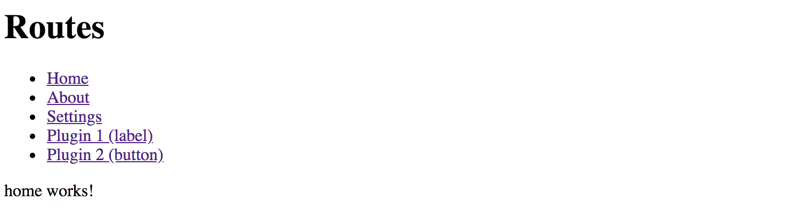

Now click the `Plugin 1 (label)` link, and you should see the `My Label` component automatically created underneath.
That content is coming from the plugin, and our application has just compiled and created it on demand!

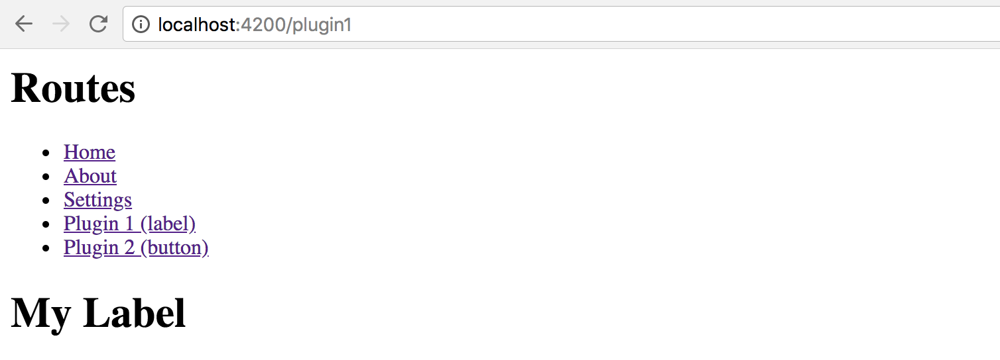

Next, click the second link to see another component provided by the plugin:

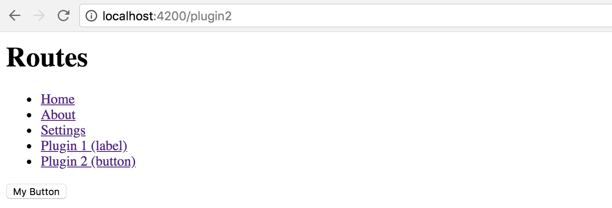

## Summary

We have successfully finished the most advanced application setup with fully dynamic external plugins in action.

Feel free to enhance your applications with extension points,
and plugins that other developers can create and run with your apps.

> **Source Code**
>
> You can find the source code in the
> **[angular/plugins](https://github.com/DenysVuika/developing-with-angular/tree/master/angular/plugins)** folder.
