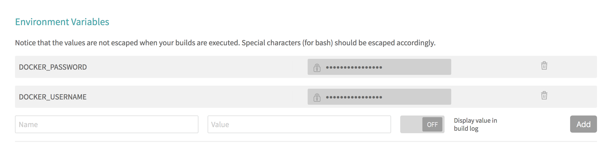
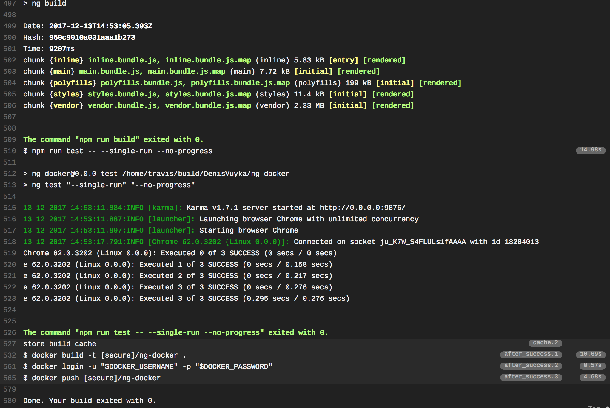

## Automating with Travis

If you use [Travis CI](https://travis-ci.org/) for your development and testing,
you can set it up to automatically build and deploy images to the Docker Hub.

You can refer to the following ".travis.yml" template as an example:

**.travis.yml**:

```yml
sudo: required

language: node_js
node_js:
  - "8"

cache:
  directories:
    - ./node_modules

services:
  - docker

before_install:
  - "export DISPLAY=:99.0"
  - "sh -e /etc/init.d/xvfb start"

script:
  - npm install
  - npm run build
  - npm run test -- --single-run --no-progress

after_success:
  - docker build -t account/ng-docker .
  - docker login -u "$DOCKER_USERNAME" -p "$DOCKER_PASSWORD"
  - docker push account/ng-docker
```

The configuration file allows to build your Angular application and run unit tests.

```yml
script:
  - npm install
  - npm run build
  - npm run test -- --single-run --no-progress
```

As soon as test run is successful, we instruct Travis to build a new Docker image,
log in to Docker Hub and push the image to your account.

```yml
after_success:
  - docker build -t account/ng-docker .
  - docker login -u "$DOCKER_USERNAME" -p "$DOCKER_PASSWORD"
  - docker push account/ng-docker
```

Note that we store credentials as encrypted environment variables, and refer to as `$DOCKER_USERNAME` and `$DOCKER_PASSWORD`.

Also, you can either provide the correct `account` prefix or use the `$DOCKER_USERNAME` value there as well.



Now, if you push the code and switch to the Travis output, you are going to see something like the following:


